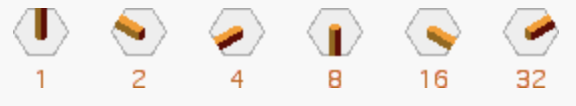

+++
title = "Dominions with Odin"
draft = true
+++

In an escape from the worries of life, I have been reading recently into the [Odin programming language](https://odin-lang.org). I wanted to learn something that's closer to the metal than Rust, and Odin seems nice.

For a project to do with the language, I figured I would build a library of sorts for the abstract boqard game [Domnions, by Christian Freeling](https://mindsports.nl/index.php/the-pit/526-dominions). ([Sensei's Library link](https://senseis.xmp.net/?Dominions)). The game can be described as a Go variant with distinct pieces (as opposed to Go itself where every "piece" is identical.

The game is weird. It is much less known than Freeling's other games like Havannah (for which I wrote [an implementation for in Rust](https://github.com/asibahi/w9l)) and Grand Chess (which I built a physical board for). Even Freeling himself does not put much stock into it, and is more interested in the tile set itself (which he calls [the China Labyrinth](https://mindsports.nl/index.php/puzzles/tilings/china-labyrinth/), even though they have nothing to do with China) than the game. He made other games with the tile set which you can find by browsing his site.

I am writing this post first as a way to organize my thoughts on how to represent the game in code. I will not be explaining the rules of the game, see the above links for that, but I will be talking about to represent the game in code form.

## Tiles

The most intriguing feature of Dominions, for me, is the tiles. There are many tile sets and game piece sets in the world of games: chess, dominoes, mahjong, playing cards, tarot. Dominions tiles are such a set.


Each tile defines how it connects to its neighbors. They do not rotate, but they can be flipped to change controller (which is how capture happens in the game). A full set of tiles, pictured above, has 64 shapes.

A clever Id/numbering scheme for the tiles is described by Freeling.



Each side is assigned a power of two. So each piece unique id is simply the sum of which sides it connects. Binary system! 

Each player starts the game with the full set of tiles, minus the Blank, the Zero-Tile, as it does not have a role in the game. So each tile has also, an owner.

During the game, control of tiles can be flipped from the owner to the opponent. After all you win the game by controlling more tiles.

All this neatly fits into a `u8`! And Odin has bitsets native into the language. When I was asking questions in Odin's discord, Ginger Bill (BDFL of Odin) suggested this structure.

```odin
// 0b 0 0 _ 0 0 0 _ 0 0 0
//    | |   | | |   | | | 
//    | |   | | |   | | Top_Right
//    | |   | | |   | Right
//    | |   | | |   Btm_Right
//    | |   | | Btm_Left
//    | |   | Left
//    | |   Top_Left
//    | Owner_Is_Host
//    Controller_Is_Host
// 
// the two players are Guest and Host. Guest starts.

Tile_Flag :: enum u8 {
	Top_Rght,
	Right,
	Btm_Right,
	Btm_Left,
	Left,
	Top_Left,
	Owner_Is_Host,
	Controller_Is_Host,
}
Tile :: distinct bit_set[Tile_Flag;u8]
```

The game starts with 126 unique tiles. Guest starts with the tiles `0b00_000_001` to `0b00_111_111`. Host starts with the tiles `0b11_000_001` to `0b11_111_111`. The highest bit, can flip during the game.

```odin
// ^ is the pointer operator in Odin.
// ~ is bitwise XOR.
tile_flip:: proc(t: ^Tile) {
	t^ ~= Tile{.Controller_Is_Host}
}
```

## Board representation

Here is where I go back and forth into reading Red Blob Games's [excellent guide to Hexagonal boards](https://www.redblobgames.com/grids/hexagons/).

The board of Dominions is a 9-sided hexagon. 217 cells. Let's defer tile placement restrictions for now. How do we actially place tiles onto the board? 

I oscillated (heh) between a few ideas, but eventually settled on a giant big array of `[217]Tile`, where an empty cell has the value `0`[^1]. To calculate offsets, I adapted the functions declared in the Red Blob article, and started with this neat loop (`N`, `CENTER`, and `CELL_COUNT` are compile-time constants based on the board's size):

```odin
Board :: [CELL_COUNT]Tile

board_get_tile :: proc(back: ^[CELL_COUNT]Tile, hex: Hex) -> (^Tile, bool) {
	if hex_distance(hex, CENTER) > N {
		return nil, false
	}

	// From RedBlob on representing Hexagonal boards with an array of arrays:
	// Store Hex(q, r) at array[r][q - max(0, N-r)]. Row r size is 2*N+1 - abs(N-r).
	// this loop calculates r's offset.

	q, r := hex[0], hex[1]

	r_len := 0
	for r_idx in 0 ..< r {
		r_len += 2 * int(N) + 1 - abs(int(N - r_idx))
	}
	

	idx := r_len + int(q - max(0, N - r))
	return &back[idx], true
}
```

But having this loop run every time I make a look up is .. uncertain at best. So I decided to hardcode the row offsets:

```odin
board_get_tile :: proc(back: ^[CELL_COUNT]Tile, hex: Hex) -> (^Tile, bool) {
	if hex_distance(hex, CENTER) > N {
		return nil, false
	}

	q, r := hex[0], hex[1]

	r_len := 0
	switch r {
		case 0:
		case 1:  r_len =   9
		case 2:  r_len =  19
		case 3:  r_len =  30
		case 4:  r_len =  42
		case 5:  r_len =  55
		case 6:  r_len =  69
		case 7:  r_len =  84
		case 8:  r_len = 100
		case 9:  r_len = 117
		case 10: r_len = 133
		case 11: r_len = 148
		case 12: r_len = 162
		case 13: r_len = 175
		case 14: r_len = 187
		case 15: r_len = 198
		case 16: r_len = 208
	}

	idx := r_len + int(q - max(0, N - r))
	return &back[idx], true
}
```

This has the advantage of being "clean", with no wasted place in the array for unused coordinates. I should be careful not to index into `Board` directly, however. Cell lookup is O(1): when you're checking a cell you *need* to check its neighbors to verify legal moves.

We would need a separate data structure to track the tiles in player's hands (not in play yet).

An alternative idea is to represent `Tile` itself by a struct, that holds data whether the tile is in play, and if so its location on the board. However, how do you quickly query the tile's neighbors? You'd need to iterate over every tile at every check to know where it is, might as well stuff them all in an array.

## Hand 

Following the same idea from representing the board, Hands are better implemented as a fixed array. Initializing a full set of hands for both players by transmuting a `u8` into a `Tile`. *That's* why I wanted `Tile`s to be `u8`s to begin with!! 

```odin
HAND_SIZE :: 63
Hand :: distinct [HAND_SIZE]Tile

hands_init :: proc() -> (guest: Hand, host: Hand) {
	for i in 0 ..< u8(HAND_SIZE) {
		guest[i] = transmute(Tile)(i + 0b00_000_001)
		host[i] = transmute(Tile)(i + 0b11_000_001)
	}

	return
}
```

Also, to check the legality of move, we need to know if a player has the tile available to play, so I defined a couple of helper ~~methods~~ procedures.

```odin
hand_has_tile :: proc(hand: Hand, id: u8) -> bool {
	assert(0 < id, "Blank Tile is not playable")
	assert(id <= HAND_SIZE, "Tile is impossible")

	return !tile_is_empty(hand[id - 1])
}

hand_get_tile :: proc(hand: ^Hand, id: u8) -> (Tile, bool) {
	if !hand_has_tile(hand^, id) do return nil, false

	ret := hand[id - 1]
	hand[id - 1] = {}
	return ret, true
}
```

About here, I thought I would like to test my logic. So I took advantage of Odin's testing framework with a couple of simple asserts. Note that I put these in the same file as the procedures they test, and they worked just fine. They are all prefixed with `test_*` not to pollute the autocompletion too much.

```odin
import "core:testing"

@(test)
test_hand_get_tile :: proc(t: ^testing.T) {
	w, _ := hands_init()

	tile: Tile
	ok: bool

	// should be successful
	tile, ok = hand_get_tile(&w, 63)
	testing.expect(t, !tile_is_empty(tile))
	testing.expect(t, ok)

	// should fail. tile was emptied
	tile, ok = hand_get_tile(&w, 63)
	testing.expect(t, tile_is_empty(tile))
	testing.expect(t, !ok)
}
// other tests go here
```

After that, I figured I would make sure for every weird logic I make I'd have to write a bunch of tests to .. test it, and sanity check my code.

## *The* Game Object

Now that I have the basic, naïve framework of the game's representation, I started looking into it from the other side: top down.

Looking at different game libraries, to see which API they provide and how they allow their users to interact with the internal rules engine. The [shakmaty crate](https://docs.rs/shakmaty/latest/shakmaty/) has been of great help in the past, as well as the [goban crate](https://docs.rs/goban/0.18.1/goban/). JaniM from the Rust discord also shared with me their [Variant Go Server](https://github.com/JaniM/variant-go-server). I also looked back at my [Havannah implementation](https://github.com/asibahi/w9l) which I did last year to remember how I structured things. (Maybe I'd tool both into Wasm modules. How about that?)

Most of these structure their API around a specific object: the *Game* object, with which you manipulate by querying legal moves, making moves, and, optionally, undoing moves. That's it. The Game object tracks the state of all elements in the game.

The most straightforward way to do that is a struct. I do not really know if this is the "optimal" arrangment of fields, but I am doing what makes sense to me.

```odin
Player :: enum u8 {
	Guest, // White. Goes first.
	Host,  // Black
}

Status :: enum u8 {
	Ongoing,
	GuestWin,
	HostWin,
	Tie,
}

Game :: struct {
	board:                 Board,
	to_play:               Player,
	status:                Status,
	guest_hand, host_hand: Hand,
}
```

To inquire about moves, we need a `Move` struct. I love that `move` is not a keyword here, which is really annoying in Rust. A move is simply a placement of a `Tile` on `Hex`. Whose tile and whose turn are ideally tracked and verified by the Game object.

```odin
Move :: struct {
	loc:  Hex,
	tile: Tile,
}
```

This misses one big thing: Groups. Dominions is a game of territory, based on Go. Tiles together make Groups. Groups have libertiesm which they live and die of. Groups capture other Groups. The winner is the player with bigger Groups. Groups are importamt.

## Bitboards

Before we talk about Groups, let us talk about [Bitboards](https://en.wikipedia.org/wiki/Bitboard).

Bitboards are, at their core, based on a simple observations: a chessboard has 64 squaresm and a `u64` has 64 bits. By tying each bit address to a specific square, you can map any binary value. You can have a bitboard (read: a `u64`) to tell you where all the White pieces are. You can have another bitboard to tell you where all the squares your Queen sees are. The other advantage of bitboards is that, since they're just bits, you can bit operations on them. If you take a bitboard of your pieces and a bitboard of your opponent's next legal moves, you just `AND` them together and you now have a new bitboard of which pieces of yours are under attack. They're small, simple integers, and operating on them is as easy as integers. 

Unfortunately, however, our board is not 64 cells. It is actually 217 cells. One would be able to represent the whole board with a 217bit integer, but the largest bit set Odin provides is 128 bits. So what you need is an array of 7 bit sets. 7 `u32` integers can fit 224 bits, slightly more than what we need, They are as small as can be. Thanks to Odin's array programming (which we also take advantage of for Hex math), using bitwise operations on these bitboards is as easy as they are on simple bitsets.

```odin
Bitboard :: distinct [7]bit_set[0 ..< 32;u32] // 7 * 32 = 224

// helper procedure for common maths 
@(private = "file")
bit_to_col_row :: proc(bit: int) -> (col, row: int) {
	assert(0 <= bit && bit < CELL_COUNT)
	col = bit % 32
	row = bit / 32
	return
}

bb_set_bit :: proc(bb: ^Bitboard, bit: int) {
	col, row := bit_to_col_row(bit)
	bb^[row] |= {col}
}

bb_get_bit :: proc(bb: Bitboard, bit: int) -> bool {
	col, row := bit_to_col_row(bit)
	return col in bb[row]
}
```

Not to get ahead of ourselves, but you can merge two of these bitboards (bitwise `OR`) as simply as this:

```odin
group_capture :: proc(winner, loser: ^Group, board: ^Board) {
	// ----- snipped
	winner.tiles |= loser.tiles // the `tiles` field is a Bitboard.
	// ----- snipped
}
```

With the help of the Hex to Index math we did earlier in `Board` (and I have by now extracted it to another procedure), you can quickly map each bit in the bitboard to its correspinding Hex.

Which brings us back to Groups.

## Groups

A group is, essentially, two bitboards:

```odin
Group :: struct {
	tiles:     Bitboard,
	liberties: Bitboard, 
	
	alive:     bool, // unsure if this is needed. Still WIP.
}
```

Each group keeps track of its location (which hexes it occupies) amd its liberties (wheere it can be captured).


---

[^1]: As mentioned earlier, the Blank tile is not used in the game. This permits using a sentinel value of `0` (or really any value with the smallest six bits set to `0`) to mark an empty cell. Since we are using a `u8` bitset anyway, why waste memory on pointers (which are wider), or `Maybe`, which is at least an extra byte in size? I am not thinking *too* hard about performance (I know nobody will use this), but it is an interesting constraint to keep in mind.
