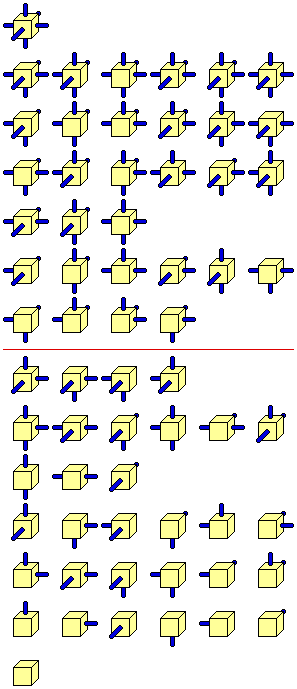

+++
title = "The Hanging Gardens Problem"
description = "Wave Function Collapse; or: the Relationship between Shrödinger's Cat and Sudoku Solvers"
draft = true
+++

This is a fun puzzle inspired by Christian Freeling's tile set [The China Cube](https://mindsports.nl/index.php/puzzles/3d/394-the-china-cube). As it has nothing to do with China, I decided to call it **the Hanging Gardens Problem**. Imagine each cube as a section of the Garden, and connections to other cubes are paths and stairways.

Here is a nice drawing showing the full set of 64 Cubes, from Freeling's site.

# Formulation of the Problem

- There are 64 cubes. 
- Each cube is unique.
- Each cube has a specific number of Red and Blue faces.
- Cubes do not rotate or change orientation in anyway. 
- Direction of the faces is specific: North, East, South, West, Top, Bottom.

It follows from these that there is
 
- One cube with all Red faces (the Red cube, bottom Cube in the earlier drawing.)
- One cube with all Blue faces (the Blue cube, top Cube in the earlier drawing)
- Six cubes with one Red face. 
- Six cubes with one Blue face.
- ... etc.

All possible permutations of Red and Blue faces are represented (hence 64 cubes).

Here is the puzzle:

*Assemble the cubes so the Blue faces touch each other, and all the Red faces are exposed.*[^1]

[^1]: This is what Freeling calls a "Transcendental solution".

In other words, a Blue face must always face, touching, another Blue face. A Red face must not do that. However, a Red face might wave to another Red face from a distance (at least one cube far.)

There is most likely is a solution.

The solution does not have to be one big shape. It actually *cannot*, because of the Red Cube.

## Coding Challenge 171: Wave Function Collapse

 https://www.youtube.com/watch?v=rI_y2GAlQFM

suggested by Gorilla Sun discord.

