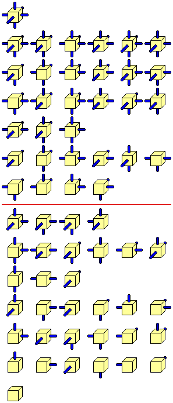
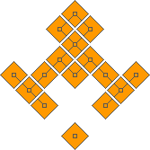

+++
title = "The Hanging Gardens Problem"
description = "Exploring the Link between Shrödinger's Cat and Sudoku Solvers"
date = 2024-09-20 # temporary to appease zola
draft = true
+++

This is an interesting puzzle inspired by Christian Freeling's tile set [The China Cube](https://mindsports.nl/index.php/puzzles/3d/394-the-china-cube). As it really has nothing to do with China, I call it **the Hanging Gardens Problem**. Imagine each cube as a section of the Garden, and connections to other cubes are paths and stairways.[^1]

[^1]: The original tile set inspired a number of games by Christian Freeling. One of them is Dominions, for which I wrote [an implementation in Odin](@/thoughts/The%20Garden%20of%20Odin/index.md).

Here is a nice drawing showing the full set of 64 Cubes, from Freeling's site.



## Problem Formulation

- There are 64 cubes. 
- Each cube is unique.
- Each cube has a specific number of Red and Blue faces.
- Cubes do not rotate or change orientation in anyway. 
- Direction of the faces is specific: North, East, South, West, Top, Bottom.

It follows from these that there is
 
- One cube with all Red faces (the Red cube, bottom Cube in the earlier drawing.)
- One cube with all Blue faces (the Blue cube, top Cube in the earlier drawing)
- Six cubes with one Red face. 
- Six cubes with one Blue face.
- ... etc.

All possible permutations of Red and Blue faces are represented (hence 64 cubes).

Here is the puzzle: **Assemble the cubes so the Blue faces touch each other, and all the Red faces are exposed.**[^2]

[^2]: This is what Freeling calls a "Transcendental solution".

In other words, a Blue face must always face, touching, another Blue face. A Red face must not do that. However, a Red face might wave to another Red face from a distance (at least one cube far.)

There is most likely is a solution.

The solution does not have to be one big shape. It actually *cannot*, because of the Red Cube.

## Wave Function Collapse

I asked around in a number of Discord servers on how to approach solving the problem programmatically, outside of 3-D printing the set and physically assembling it by hand. The [Gorilla Sun](https://www.gorillasun.de) Creative Coding server suggested that using the [Wave Function Collapse](https://github.com/mxgmn/WaveFunctionCollapse) algorithm might be the best fit for the problem, and suggested [a very excellent Youtube video from the Coding Train](https://www.youtube.com/watch?v=rI_y2GAlQFM) implementing the algorithm in Javascript. It is a *very* good video that I suggest watching.

As explained at the start of the video, this is simply the Sudoku solving algorithm, generalized to creating random tile sets. Apparently, the Quantum Mechanics inspired name is simply for flavor and searchability.

So, how does one solve a Sudoku?

1. First, identify the connection rules and the tile set. (Which, in Sudoku, need no explaining.)
2. Second, *Observation*: mark each empty cell in the grid with the candidate ~~tiles~~ numbers that go in them.
3. Third, the *Collapse* in Wave Function Collapse: identify the cells with the fewest number of candidates. 
        1. Any cell with 1 candidate "collapses" into that candidate, and the number is inked in. 
        2. *If there are not any cells with one candidate*, pick one cell with the fewest number of candidates and pick a candidate at random, "collapsing" it.[^3]
4. Fourth, *Propagation*: with the new state of things, update the candidates in each call. Here is where Sudoku people use X-wings and Swordfishes and what have you.
5. Repeat the *Collapse*, until the grid is full.
6. If there ever, after Propagation, a cell with *zero* candidates, this means an illegal state was reached. Either *Backtrack* to the last random choice, (and, well, choose another branch), or simply start the whole thing over.

[^3]: This might sound heretical in Sudoku, but in well constructed Sudoku puzzles there is always at least one cell with exactly one candidate in any given puzzle state thought solving. If ever there are not any, either it is not a well constructed puzzle, or the solver is unaware of the Ring of Phistomefel.

This approach can work just fine for the Hanging Gardens. The Tile set and the connection rules are clearly defined. It is only a matter of putting it into code and .. running it. The problem most apparent to me, however, is that the search space is potentially *huge*. So, I first need to try this approach with a smaller problem set.

## Square Gardens



Phrasing the problem in terms of Squares, and 2D connections, rather than Cubes, shrinks the problem space by an order of magnitude. Plus, [there is a known solution given by Freeling](https://www.mindsports.nl/index.php/puzzles/tilings/china-labyrinth/)!

### Tiles and Air

First, I need to formulate the tiles. There are two kinds of Tiles. The first kind is the actualy Squares. This is a *finite* set. The second kind, is an "Air" tile. This empty tile is infinitely availeble, and is automatically placed at the Propagation phase connected to every Red face. A Red face *must* connect to an Air tile, and a Blue face can *never* connect to one. An Air tile can connect from any side to any Air tile with no restriction. 

I am still having fun with [Odin](https://odin-lang.org), so I will try this solution in it first. Here are the starting types:

```odin
Side :: enum { North, East, South, West }
Tile :: distinct bit_set[Side]

Air  :: distinct struct {}

Cell :: union { Air, Tile }
```

I am not too happy about this because while the data can neatly fit into one byte, Odin puts this in two. This looks cleaner and easier to understand than weird hacks, so I will stick to it for the time being. Odin's `union` is nice here, semantically, as it actually has three states: `nil`, `Air` and `Tile`, exactly as much as we need.

The Squares are only 16 (count them in the image above). It is possible to safely ignore the Red (unconnected) Square, because it can simply be put anywhere in space and does not need to connect to anything. Generating a list of the Squares is as simple as counting to 15, or `0xF`. Running the below snippet to confirm:

```odin
main :: proc () {
    list : [dynamic]Cell

    for i in u8(0x1) ..= 0xF {
        fmt.println(transmute(Tile)i)
        append(&list, transmute(Tile)i) // <-- Odin casting magic here
    }

    fmt.println(len(list))
}
```

Prints the following:

```
Tile{North}
Tile{East}
Tile{North, East}
Tile{South}
Tile{North, South}
Tile{East, South}
Tile{North, East, South}
Tile{West}
Tile{North, West}
Tile{East, West}
Tile{North, East, West}
Tile{South, West}
Tile{North, South, West}
Tile{East, South, West}
Tile{North, East, South, West}
15
```

Which is exactly what is needed. Hooray!!

### Grid and Candidates

An infinite grid is infeasible due to being in a finite universe and using computers with finite resources. So what is a good size for a finite grid? There are 16 Tiles, so a 16 by 16 grid is a clear upper bound, and clearly too big, due to the impossibility of all squares being in one line. I will go with a 15 by 15 grid, which is also safe as it is too big, but it gives me a nice center cell to fix the Blue square in, and branch everywhere from there.

To track the candidates in each cell, the simplest option, perhaps, is to create a set of tiles. Since each tile corresponds neatly to a number (as per the `transmute` above,) simply tracking the mumbers should be enough. As mentioned also, the Red square can be placed anywhere in space, so it does not need to be tracked. Giving its number, 0, to track the Air Tile should be enough, as it can later replace almost any Air tile in the final grid.

```odin
Candidates :: distinct bit_set[0..=15; u16]

Grid :: struct {
    cells:      [15][15]Cell, // central cell is [8][8]
    candidates: [15][15]Candidates
}
```

Having `candidates` in a separate field like that is convenient. Any cell with no candidates (a `nil` bit set), would signal an illegal position reached. Any cell with only one candidate is considered collapsed, and the collapse would then be reflected in the `cells` field, which represents the actual contents. All this, of course, is subject to be iterated out later.

This is the first draft of how to initialize the grid. Note that in Odin `~` is the bitwise `NOT` operator. So `~Candidates{15}` is the full set *except* for 15. And `~Tile{}` is the full set.

```odin
grid_init :: proc() -> (ret: Grid) {
    // Blue Square
    ret.cells[8][8] = ~Tile{}

    // Fill the Candidates Grid 
    ret.candidates = ~Candidates{15} // broadcast magic
    ret.candidates[8][8] = {15}

    return ret
}
```

### Propagation

An astute Sudoku solver would quickly be able to see that this initial list of candidates is, in fact, useless and incorrect. Yes it removes the placed Tile from all candidate positions, but it does *not* take into account the placed Tile's connections.[^edges] For this to work the Candidate grid must be updated to match the new reality.

[^edges]: Nor does it into account the edges of the Grid (where only Red faces may, well, face.) However, the edges of the Grid are unlikely to be reached, so I will ignore that for now.

It follows that for each placed `Cell` in `cells`, it must update th surrounding candidates. So a function that gives out the candidates per face is needed. This can almost just be harcoded, since each number maps neatly to a specific square. It is possible to hard code it for each tile individually, but where is the fun in that.

```odin
Candidate_Set :: [Side]Candidates // Enumerated arrays, a nice Odin feature.

tile_connections :: proc (c: Cell) -> (ret: Candidate_Set) {
    // Why not just hard code it all the way?
    switch t in c {
    case Tile: 
        ret[.North] = {4, 5,  6,  7, 12, 13, 14, 15} if .North in t else {0}
        ret[.East]  = {8, 9, 10, 11, 12, 13, 14, 15} if .East  in t else {0}
        ret[.South] = {1, 3,  5,  7,  9, 11, 13, 15} if .South in t else {0}
        ret[.West]  = {2, 3,  6,  7, 10, 11, 14, 15} if .West  in t else {0}
    case Air:
        ret[.North] = {0, 1, 2, 3, 8,  9, 10, 11}
        ret[.East]  = {0, 1, 2, 3, 4,  5,  6,  7}
        ret[.South] = {0, 2, 4, 6, 8, 10, 12, 14}
        ret[.West]  = {0, 1, 4, 5, 8,  9, 12, 13}
    case: 
        ret = ~{}
    }
    return
}
```

This is nice, mainly because the `Candidates` type, being a bit set, can be `AND`ed together to quickly eliminate candidates from Cells in the relevant direction. This can be run for each new state in a loop (or maybe just twice) to propagate candidates of collapsed `Air` Cells.

The `grid_propagate` procedure will have to do a few things. First, it should scan `cells` for known placements. If there is a known placement, update `candidates` accordingly. Then scan `candidates` for any collapsed cells (where there is only one left candidate), and update those in `cells` accordingly, then repeat. Assertions could be placed if a known placement in `cells` does not match a collapsed candidates set in `candidates`. An error would be returned if, during propagation, a `candidates` cell was found with 0 candidates, indicating an illegal branch reached.

After some trial and error and stack overflows and segmentation faults (due to said stack overflows), I settled on this recursive version It is probably not efficient, as it calculates the same thing multiple times, but it is the most straightforward way i could think of.

```odin
grid_propagate :: proc (grid: ^Grid) -> bool {
    // Update candidates based on cells
    for y in 0..<15 do for x in 0..<15 {
        cell := grid.cells[x][y]
        tc := tile_connections(cell)

        // North
        if y < 14 do grid.candidates[x][y + 1] &= tc[.North]
        // East
        if x < 14 do grid.candidates[x + 1][y] &= tc[.East]
        // South
        if y >  0 do grid.candidates[x][y - 1] &= tc[.South]
        // West
        if x >  0 do grid.candidates[x - 1][y] &= tc[.West]

        // if cell is a tile, make sure it is not a candidate anywhere else.
        if tile, ok := cell.(Tile); ok {
            // stupid hack, don't ask
            cand := tile_to_candidates(tile)

            // remove it everywhere with broadcast magic
            grid.candidates -= cand

            // then add it in the appropriate place
            grid.candidates[x][y] = cand
        }
    }

    any_collpased := false
    
    // Update cells based on candidates
    for y in 0..<15 do for x in 0..<15 {
        cand := grid.candidates[x][y]
        if cand == {} do return false // illegal state reached
                
        // COLLAPSE
        // obviously only a new collapse if it isnt collapsed already
        if grid.cells[x][y] == nil && card(cand) == 1 do for id in cand {
            any_collpased = true

            // What did actually collapse
            grid.cells[x][y] = Air{} if id == 0 else transmute(Tile)i8(id)
        }
    }

    success := true
    if any_collpased do success = grid_propagate(grid) // recursion!!

    return success
}
```

Then just update `grid_init` like this 

```odin
grid_init :: proc () -> (ret: Grid) {
    
    // Fill the Candidates Grid
    ret.candidates = ~Candidates{}

    // Place Blue square
    ret.cells[8][8] = ~Tile{}

    grid_propagate(&ret)

    return ret
}
```

And it works, nicely! Place any of the Squares instead of `~Tile{}`, and it works correctly. Even propagates `Air` cells and their neighbors!!

### Controlled Demolition

The `grid_propagate` procedure takes of care of collapsing cells with one candidate left. But as soon as right after the initial position, there are still many cells with unresolved state. That's why Contollled Demolition is needed, to *force* things to collapse, randomly.[^metaphor]

[^metaphor]: Yes I am totally mixing metaphors right now. Way beyond Quantum Mechanics and well into AEC. Roll with it.

The best candidates for Controlled Demolition are the cells with the least amount of candidates that are not already collapsed. That's to say, the least amount of candidates more than 1. Recording these is probably easy. Choosing one randomly, with even chances all over, is, at first impression, not. It is easy to choose *arbitrarily*, but not necessarily randomly. If a robust backtracking algorithm exists, then arbitrary is probably better than random. But I do not currently plan to backtrack, but instead simply start over whenever an illegal position is encounterd.

How should one go about this? With so much randomness, the probably most straightforward course of action is to randomize the indices 0-14 three times. The first two randomized arrays are to loop over `candidates` in a somewhat random order. The third one is to loop over the candidates in the final found cell, and collapse to the first one it matches over.

Sounds absolutely *boneheaded*, but it should work just fine.

```odin
grid_controlled_demolition :: proc (grid: ^Grid) -> bool {
    // all the shuffling 
    rows := []int{ 0, 1, 2, 3, 4, 5, 6, 7, 8, 9, 10, 11, 12, 13, 14 }
    rand.shuffle(rows)
    
    cols := []int{ 0, 1, 2, 3, 4, 5, 6, 7, 8, 9, 10, 11, 12, 13, 14 }
    rand.shuffle(cols)
    
    ids  := []int{ 0, 1, 2, 3, 4, 5, 6, 7, 8, 9, 10, 11, 12, 13, 14 }
    rand.shuffle(ids)

    // target collapse stored here
    t_x : int 
    t_y : int 

    // tracking the minimum
    min_card := 15

    // loop over the grid "randomly"
    for y in cols do for x in rows {
        c := card(grid.candidates[x][y])
        (c > 1) or_continue // already collapsed

        if c < min_card {
            t_x = x
            t_y = y
            min_card = c
        }

        if min_card == 2 do break // no point in looking further in this case.
    }

    // loop over the set flags randomly and collapse to the first match.
    for id in ids do if id in grid.candidates[t_x][t_y] {
        // COLLAPSE
        if id == 0 {
            grid.cells[t_x][t_y] = Air{}
            grid.candidates[t_x][t_y] = {0}
        } else {
            tile := transmute(Tile)i8(id)
            cand := tile_to_candidates(tile) // seriously don't ask

            grid.cells[t_x][t_y] = tile
            grid.candidates -= cand
            grid.candidates[t_x][t_y] = cand
        } 

        break
    }

    // then propagate the new changes, returning the legality result
    return grid_propagate(grid)
}
```

This should be enough? Calling `grid_controlled_demolition` a couple of times seems to produce the expected result.

```odin
main :: proc () {
    grid := grid_init()
    
    // crude 
    grid_controlled_demolition(&grid)
    grid_controlled_demolition(&grid)
    grid_controlled_demolition(&grid)
    grid_controlled_demolition(&grid)
    grid_controlled_demolition(&grid)

    for row, ri in grid.candidates do for c, ci in row {
        fmt.println(ri, ci, c)
    }
}
```
<details> <summary>Sample output.</summary>

```
0 0 Candidates{0, 1, 2, 3, 4, 7, 8, 10, 11, 12}
0 1 Candidates{0, 1, 2, 3, 4, 7, 8, 10, 11, 12}
0 2 Candidates{0, 1, 2, 3, 4, 7, 8, 10, 11, 12}
0 3 Candidates{0, 1, 2, 3, 4, 7, 8, 10, 11, 12}
0 4 Candidates{0, 1, 2, 3, 4, 7, 8, 10, 11, 12}
0 5 Candidates{0, 1, 2, 3, 4, 7, 8, 10, 11, 12}
0 6 Candidates{0, 1, 2, 3, 4, 7, 8, 10, 11, 12}
0 7 Candidates{0, 1, 2, 3, 4, 7, 8, 10, 11, 12}
0 8 Candidates{0, 1, 2, 3, 4, 7, 8, 10, 11, 12}
0 9 Candidates{0, 1, 2, 3, 4, 7, 8, 10, 11, 12}
0 10 Candidates{0, 1, 2, 3, 4, 7, 8, 10, 11, 12}
0 11 Candidates{0, 1, 2, 3, 4, 7, 8, 10, 11, 12}
0 12 Candidates{0, 1, 2, 3, 4, 7, 8, 10, 11, 12}
0 13 Candidates{0, 1, 2, 3, 4, 7, 8, 10, 11, 12}
0 14 Candidates{0, 1, 2, 3, 4, 7, 8, 10, 11, 12}
1 0 Candidates{0, 1, 2, 3, 4, 7, 8, 10, 11, 12}
1 1 Candidates{0, 1, 2, 3, 4, 7, 8, 10, 11, 12}
1 2 Candidates{0, 1, 2, 3, 4, 7, 8, 10, 11, 12}
1 3 Candidates{0, 1, 2, 3, 4, 7, 8, 10, 11, 12}
1 4 Candidates{0, 1, 2, 3, 4, 7, 8, 10, 11, 12}
1 5 Candidates{0, 1, 2, 3, 4, 7, 8, 10, 11, 12}
1 6 Candidates{0, 1, 2, 3, 4, 7, 8, 10, 11, 12}
1 7 Candidates{0, 1, 2, 3, 4, 7, 8, 10, 11, 12}
1 8 Candidates{0, 1, 2, 3, 4, 7, 8, 10, 11, 12}
1 9 Candidates{0, 1, 2, 3, 4, 7, 8, 10, 11, 12}
1 10 Candidates{0, 1, 2, 3, 4, 7, 8, 10, 11, 12}
1 11 Candidates{0, 1, 2, 3, 4, 7, 8, 10, 11, 12}
1 12 Candidates{0, 1, 2, 3, 4, 7, 8, 10, 11, 12}
1 13 Candidates{0, 1, 2, 3, 4, 7, 8, 10, 11, 12}
1 14 Candidates{0, 1, 2, 3, 4, 7, 8, 10, 11, 12}
2 0 Candidates{0, 1, 2, 3, 4, 7, 8, 10, 11, 12}
2 1 Candidates{0, 1, 2, 3, 4, 7, 8, 10, 11, 12}
2 2 Candidates{0, 1, 2, 3, 4, 7, 8, 10, 11, 12}
2 3 Candidates{0, 1, 2, 3, 4, 7, 8, 10, 11, 12}
2 4 Candidates{0, 1, 2, 3, 4, 7, 8, 10, 11, 12}
2 5 Candidates{0, 1, 2, 3, 4, 7, 8, 10, 11, 12}
2 6 Candidates{0, 1, 2, 3, 4, 7, 8, 10, 11, 12}
2 7 Candidates{0, 1, 2, 3, 4, 7, 8, 10, 11, 12}
2 8 Candidates{0, 1, 2, 3, 4, 7, 8, 10, 11, 12}
2 9 Candidates{0, 1, 2, 3, 4, 7, 8, 10, 11, 12}
2 10 Candidates{0, 1, 2, 3, 4, 7, 8, 10, 11, 12}
2 11 Candidates{0, 1, 2, 3, 4, 7, 8, 10, 11, 12}
2 12 Candidates{0, 1, 2, 3, 4, 7, 8, 10, 11, 12}
2 13 Candidates{0, 1, 2, 3, 4, 7, 8, 10, 11, 12}
2 14 Candidates{0, 1, 2, 3, 4, 7, 8, 10, 11, 12}
3 0 Candidates{0, 1, 2, 3, 4, 7, 8, 10, 11, 12}
3 1 Candidates{0, 1, 2, 3, 4, 7, 8, 10, 11, 12}
3 2 Candidates{0, 1, 2, 3, 4, 7, 8, 10, 11, 12}
3 3 Candidates{0, 1, 2, 3, 4, 7, 8, 10, 11, 12}
3 4 Candidates{0, 1, 2, 3, 4, 7, 8, 10, 11, 12}
3 5 Candidates{0, 1, 2, 3, 4, 7, 8, 10, 11, 12}
3 6 Candidates{0, 1, 2, 3, 4, 7, 8, 10, 11, 12}
3 7 Candidates{0, 1, 2, 3, 4, 7, 8, 10, 11, 12}
3 8 Candidates{0, 1, 2, 3, 4, 7, 8, 10, 11, 12}
3 9 Candidates{0, 1, 2, 3, 4, 7, 8, 10, 11, 12}
3 10 Candidates{0, 1, 2, 3, 4, 7, 8, 10, 11, 12}
3 11 Candidates{0, 1, 2, 3, 4, 7, 8, 10, 11, 12}
3 12 Candidates{0, 1, 2, 3, 4, 7, 8, 10, 11, 12}
3 13 Candidates{0, 1, 2, 3, 4, 7, 8, 10, 11, 12}
3 14 Candidates{0, 1, 2, 3, 4, 7, 8, 10, 11, 12}
4 0 Candidates{0, 1, 2, 3, 4, 7, 8, 10, 11, 12}
4 1 Candidates{0, 1, 2, 3, 4, 7, 8, 10, 11, 12}
4 2 Candidates{0, 1, 2, 3, 4, 7, 8, 10, 11, 12}
4 3 Candidates{0, 1, 2, 3, 4, 7, 8, 10, 11, 12}
4 4 Candidates{0, 1, 2, 3, 4, 7, 8, 10, 11, 12}
4 5 Candidates{0, 1, 2, 3, 4, 7, 8, 10, 11, 12}
4 6 Candidates{0, 1, 2, 3, 4, 7, 8, 10, 11, 12}
4 7 Candidates{0, 1, 2, 3, 4, 7, 8, 10, 11, 12}
4 8 Candidates{0, 1, 2, 3, 4, 7, 8, 10, 11, 12}
4 9 Candidates{0, 1, 2, 3, 4, 7, 8, 10, 11, 12}
4 10 Candidates{0, 1, 2, 3, 4, 7, 8, 10, 11, 12}
4 11 Candidates{0, 1, 2, 3, 4, 7, 8, 10, 11, 12}
4 12 Candidates{0, 1, 2, 3, 4, 7, 8, 10, 11, 12}
4 13 Candidates{0, 1, 2, 3, 4, 7, 8, 10, 11, 12}
4 14 Candidates{0, 1, 2, 3, 4, 7, 8, 10, 11, 12}
5 0 Candidates{0, 1, 2, 3, 4, 7, 8, 10, 11, 12}
5 1 Candidates{0, 1, 2, 3, 4, 7, 8, 10, 11, 12}
5 2 Candidates{0, 1, 2, 3, 4, 7, 8, 10, 11, 12}
5 3 Candidates{0, 1, 2, 3, 4, 7, 8, 10, 11, 12}
5 4 Candidates{0, 1, 2, 3, 4, 7, 8, 10, 11, 12}
5 5 Candidates{0, 1, 2, 3, 4, 7, 8, 10, 11, 12}
5 6 Candidates{0, 1, 2, 3, 4, 7, 8, 10, 11, 12}
5 7 Candidates{0, 1, 2, 3, 4, 7, 8, 10, 11, 12}
5 8 Candidates{0, 1, 4, 8, 12}
5 9 Candidates{2, 3, 7, 10, 11}
5 10 Candidates{2, 3, 7, 10, 11}
5 11 Candidates{0, 1, 2, 3, 4, 7, 8, 10, 11, 12}
5 12 Candidates{0, 1, 2, 3, 4, 7, 8, 10, 11, 12}
5 13 Candidates{0, 1, 2, 3, 4, 7, 8, 10, 11, 12}
5 14 Candidates{0, 1, 2, 3, 4, 7, 8, 10, 11, 12}
6 0 Candidates{0, 1, 2, 3, 4, 7, 8, 10, 11, 12}
6 1 Candidates{0, 1, 2, 3, 4, 7, 8, 10, 11, 12}
6 2 Candidates{0, 1, 2, 3, 4, 7, 8, 10, 11, 12}
6 3 Candidates{0, 1, 2, 3, 4, 7, 8, 10, 11, 12}
6 4 Candidates{0, 1, 2, 3, 4, 7, 8, 10, 11, 12}
6 5 Candidates{0, 1, 2, 3, 4, 7, 8, 10, 11, 12}
6 6 Candidates{0, 1, 2, 3, 4, 7, 8, 10, 11, 12}
6 7 Candidates{0, 2, 4, 8, 10, 12}
6 8 Candidates{0}
6 9 Candidates{9}
6 10 Candidates{13}
6 11 Candidates{4, 7, 12}
6 12 Candidates{0, 1, 2, 3, 4, 7, 8, 10, 11, 12}
6 13 Candidates{0, 1, 2, 3, 4, 7, 8, 10, 11, 12}
6 14 Candidates{0, 1, 2, 3, 4, 7, 8, 10, 11, 12}
7 0 Candidates{0, 1, 2, 3, 4, 7, 8, 10, 11, 12}
7 1 Candidates{0, 1, 2, 3, 4, 7, 8, 10, 11, 12}
7 2 Candidates{0, 1, 2, 3, 4, 7, 8, 10, 11, 12}
7 3 Candidates{0, 1, 2, 3, 4, 7, 8, 10, 11, 12}
7 4 Candidates{0, 1, 2, 3, 4, 7, 8, 10, 11, 12}
7 5 Candidates{0, 1, 2, 3, 4, 7, 8, 10, 11, 12}
7 6 Candidates{0, 1, 2, 3, 4, 7, 8, 10, 11, 12}
7 7 Candidates{1, 3, 7, 11}
7 8 Candidates{6}
7 9 Candidates{0}
7 10 Candidates{0}
7 11 Candidates{0, 1, 2, 3, 8, 10, 11}
7 12 Candidates{0, 1, 2, 3, 4, 7, 8, 10, 11, 12}
7 13 Candidates{0, 1, 2, 3, 4, 7, 8, 10, 11, 12}
7 14 Candidates{0, 1, 2, 3, 4, 7, 8, 10, 11, 12}
8 0 Candidates{0, 1, 2, 3, 4, 7, 8, 10, 11, 12}
8 1 Candidates{0, 1, 2, 3, 4, 7, 8, 10, 11, 12}
8 2 Candidates{0, 1, 2, 3, 4, 7, 8, 10, 11, 12}
8 3 Candidates{0, 1, 2, 3, 4, 7, 8, 10, 11, 12}
8 4 Candidates{0, 1, 2, 3, 4, 7, 8, 10, 11, 12}
8 5 Candidates{0, 1, 2, 3, 4, 7, 8, 10, 11, 12}
8 6 Candidates{0, 1, 2, 3, 4, 7, 8, 10, 11, 12}
8 7 Candidates{1, 3, 7, 11}
8 8 Candidates{15}
8 9 Candidates{5}
8 10 Candidates{4, 7}
8 11 Candidates{0, 1, 2, 3, 4, 7, 8, 10, 11, 12}
8 12 Candidates{0, 1, 2, 3, 4, 7, 8, 10, 11, 12}
8 13 Candidates{0, 1, 2, 3, 4, 7, 8, 10, 11, 12}
8 14 Candidates{0, 1, 2, 3, 4, 7, 8, 10, 11, 12}
9 0 Candidates{0, 1, 2, 3, 4, 7, 8, 10, 11, 12}
9 1 Candidates{0, 1, 2, 3, 4, 7, 8, 10, 11, 12}
9 2 Candidates{0, 1, 2, 3, 4, 7, 8, 10, 11, 12}
9 3 Candidates{0, 1, 2, 3, 4, 7, 8, 10, 11, 12}
9 4 Candidates{0, 1, 2, 3, 4, 7, 8, 10, 11, 12}
9 5 Candidates{0, 1, 2, 3, 4, 7, 8, 10, 11, 12}
9 6 Candidates{0, 1, 2, 3, 4, 7, 8, 10, 11, 12}
9 7 Candidates{1, 3, 7, 11}
9 8 Candidates{14}
9 9 Candidates{0}
9 10 Candidates{0, 1, 2, 3, 8, 10, 11}
9 11 Candidates{0, 1, 2, 3, 4, 7, 8, 10, 11, 12}
9 12 Candidates{0, 1, 2, 3, 4, 7, 8, 10, 11, 12}
9 13 Candidates{0, 1, 2, 3, 4, 7, 8, 10, 11, 12}
9 14 Candidates{0, 1, 2, 3, 4, 7, 8, 10, 11, 12}
10 0 Candidates{0, 1, 2, 3, 4, 7, 8, 10, 11, 12}
10 1 Candidates{0, 1, 2, 3, 4, 7, 8, 10, 11, 12}
10 2 Candidates{0, 1, 2, 3, 4, 7, 8, 10, 11, 12}
10 3 Candidates{0, 1, 2, 3, 4, 7, 8, 10, 11, 12}
10 4 Candidates{0, 1, 2, 3, 4, 7, 8, 10, 11, 12}
10 5 Candidates{0, 1, 2, 3, 4, 7, 8, 10, 11, 12}
10 6 Candidates{0, 1, 2, 3, 4, 7, 8, 10, 11, 12}
10 7 Candidates{0, 1, 2, 3, 4, 7, 8, 10, 11, 12}
10 8 Candidates{8, 10, 11, 12}
10 9 Candidates{0, 1, 2, 3, 4, 7}
10 10 Candidates{0, 1, 2, 3, 4, 7, 8, 10, 11, 12}
10 11 Candidates{0, 1, 2, 3, 4, 7, 8, 10, 11, 12}
10 12 Candidates{0, 1, 2, 3, 4, 7, 8, 10, 11, 12}
10 13 Candidates{0, 1, 2, 3, 4, 7, 8, 10, 11, 12}
10 14 Candidates{0, 1, 2, 3, 4, 7, 8, 10, 11, 12}
11 0 Candidates{0, 1, 2, 3, 4, 7, 8, 10, 11, 12}
11 1 Candidates{0, 1, 2, 3, 4, 7, 8, 10, 11, 12}
11 2 Candidates{0, 1, 2, 3, 4, 7, 8, 10, 11, 12}
11 3 Candidates{0, 1, 2, 3, 4, 7, 8, 10, 11, 12}
11 4 Candidates{0, 1, 2, 3, 4, 7, 8, 10, 11, 12}
11 5 Candidates{0, 1, 2, 3, 4, 7, 8, 10, 11, 12}
11 6 Candidates{0, 1, 2, 3, 4, 7, 8, 10, 11, 12}
11 7 Candidates{0, 1, 2, 3, 4, 7, 8, 10, 11, 12}
11 8 Candidates{0, 1, 2, 3, 4, 7, 8, 10, 11, 12}
11 9 Candidates{0, 1, 2, 3, 4, 7, 8, 10, 11, 12}
11 10 Candidates{0, 1, 2, 3, 4, 7, 8, 10, 11, 12}
11 11 Candidates{0, 1, 2, 3, 4, 7, 8, 10, 11, 12}
11 12 Candidates{0, 1, 2, 3, 4, 7, 8, 10, 11, 12}
11 13 Candidates{0, 1, 2, 3, 4, 7, 8, 10, 11, 12}
11 14 Candidates{0, 1, 2, 3, 4, 7, 8, 10, 11, 12}
12 0 Candidates{0, 1, 2, 3, 4, 7, 8, 10, 11, 12}
12 1 Candidates{0, 1, 2, 3, 4, 7, 8, 10, 11, 12}
12 2 Candidates{0, 1, 2, 3, 4, 7, 8, 10, 11, 12}
12 3 Candidates{0, 1, 2, 3, 4, 7, 8, 10, 11, 12}
12 4 Candidates{0, 1, 2, 3, 4, 7, 8, 10, 11, 12}
12 5 Candidates{0, 1, 2, 3, 4, 7, 8, 10, 11, 12}
12 6 Candidates{0, 1, 2, 3, 4, 7, 8, 10, 11, 12}
12 7 Candidates{0, 1, 2, 3, 4, 7, 8, 10, 11, 12}
12 8 Candidates{0, 1, 2, 3, 4, 7, 8, 10, 11, 12}
12 9 Candidates{0, 1, 2, 3, 4, 7, 8, 10, 11, 12}
12 10 Candidates{0, 1, 2, 3, 4, 7, 8, 10, 11, 12}
12 11 Candidates{0, 1, 2, 3, 4, 7, 8, 10, 11, 12}
12 12 Candidates{0, 1, 2, 3, 4, 7, 8, 10, 11, 12}
12 13 Candidates{0, 1, 2, 3, 4, 7, 8, 10, 11, 12}
12 14 Candidates{0, 1, 2, 3, 4, 7, 8, 10, 11, 12}
13 0 Candidates{0, 1, 2, 3, 4, 7, 8, 10, 11, 12}
13 1 Candidates{0, 1, 2, 3, 4, 7, 8, 10, 11, 12}
13 2 Candidates{0, 1, 2, 3, 4, 7, 8, 10, 11, 12}
13 3 Candidates{0, 1, 2, 3, 4, 7, 8, 10, 11, 12}
13 4 Candidates{0, 1, 2, 3, 4, 7, 8, 10, 11, 12}
13 5 Candidates{0, 1, 2, 3, 4, 7, 8, 10, 11, 12}
13 6 Candidates{0, 1, 2, 3, 4, 7, 8, 10, 11, 12}
13 7 Candidates{0, 1, 2, 3, 4, 7, 8, 10, 11, 12}
13 8 Candidates{0, 1, 2, 3, 4, 7, 8, 10, 11, 12}
13 9 Candidates{0, 1, 2, 3, 4, 7, 8, 10, 11, 12}
13 10 Candidates{0, 1, 2, 3, 4, 7, 8, 10, 11, 12}
13 11 Candidates{0, 1, 2, 3, 4, 7, 8, 10, 11, 12}
13 12 Candidates{0, 1, 2, 3, 4, 7, 8, 10, 11, 12}
13 13 Candidates{0, 1, 2, 3, 4, 7, 8, 10, 11, 12}
13 14 Candidates{0, 1, 2, 3, 4, 7, 8, 10, 11, 12}
14 0 Candidates{0, 1, 2, 3, 4, 7, 8, 10, 11, 12}
14 1 Candidates{0, 1, 2, 3, 4, 7, 8, 10, 11, 12}
14 2 Candidates{0, 1, 2, 3, 4, 7, 8, 10, 11, 12}
14 3 Candidates{0, 1, 2, 3, 4, 7, 8, 10, 11, 12}
14 4 Candidates{0, 1, 2, 3, 4, 7, 8, 10, 11, 12}
14 5 Candidates{0, 1, 2, 3, 4, 7, 8, 10, 11, 12}
14 6 Candidates{0, 1, 2, 3, 4, 7, 8, 10, 11, 12}
14 7 Candidates{0, 1, 2, 3, 4, 7, 8, 10, 11, 12}
14 8 Candidates{0, 1, 2, 3, 4, 7, 8, 10, 11, 12}
14 9 Candidates{0, 1, 2, 3, 4, 7, 8, 10, 11, 12}
14 10 Candidates{0, 1, 2, 3, 4, 7, 8, 10, 11, 12}
14 11 Candidates{0, 1, 2, 3, 4, 7, 8, 10, 11, 12}
14 12 Candidates{0, 1, 2, 3, 4, 7, 8, 10, 11, 12}
14 13 Candidates{0, 1, 2, 3, 4, 7, 8, 10, 11, 12}
14 14 Candidates{0, 1, 2, 3, 4, 7, 8, 10, 11, 12}
```
</details>

### Success and Failure

This seems to work fine. But it is still missing ine: it needs to know when to stop. If it is a successful solution, (where every cell has exactly one candidate), then stop and print it out. If it is a failed solution, try again.
