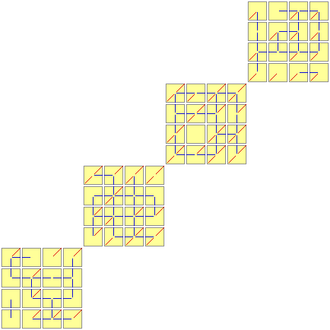
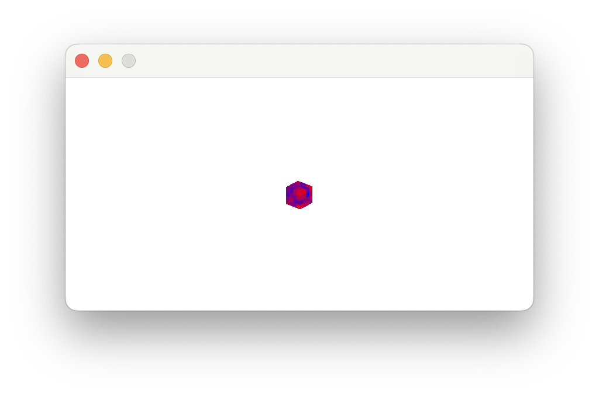
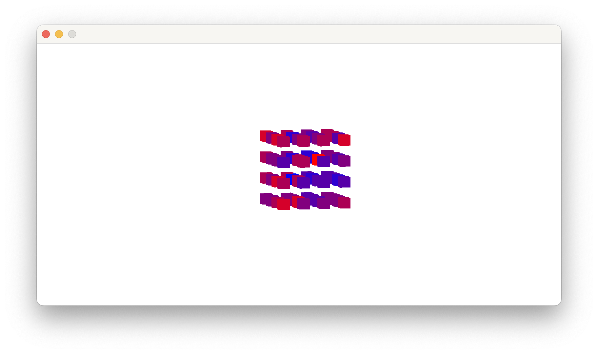
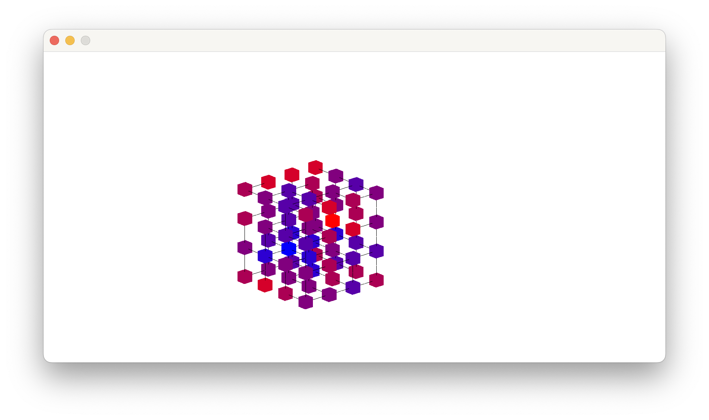
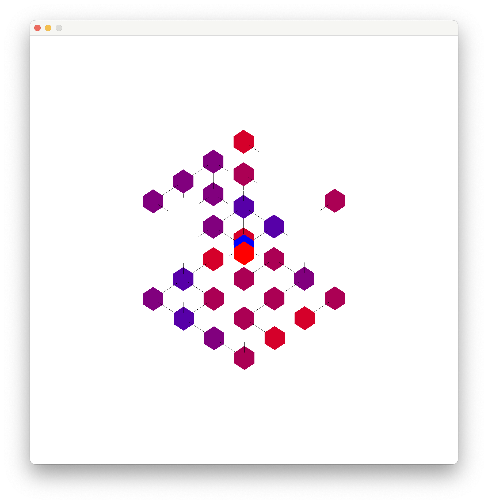
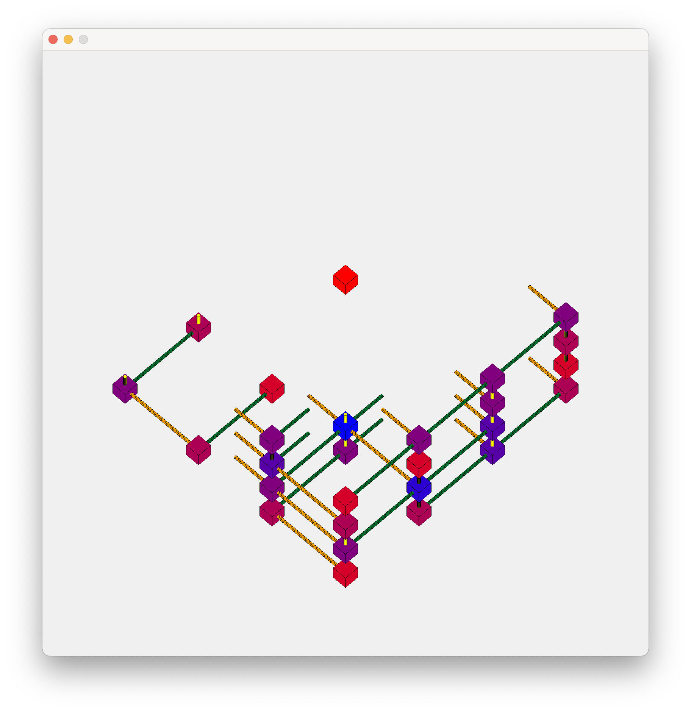
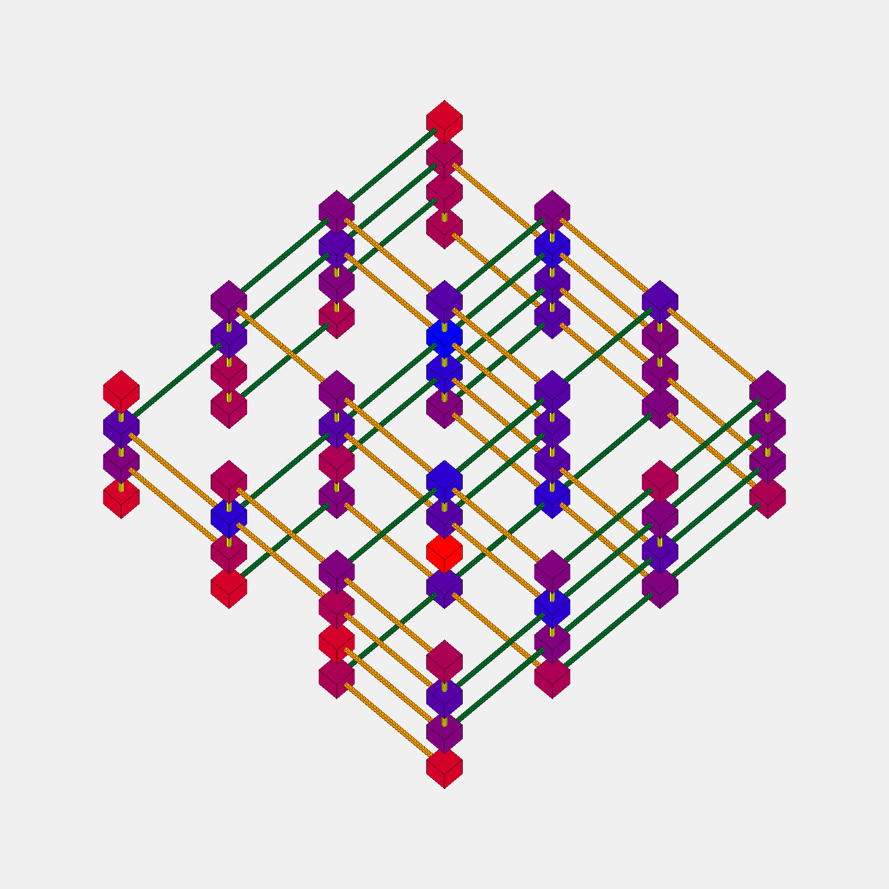
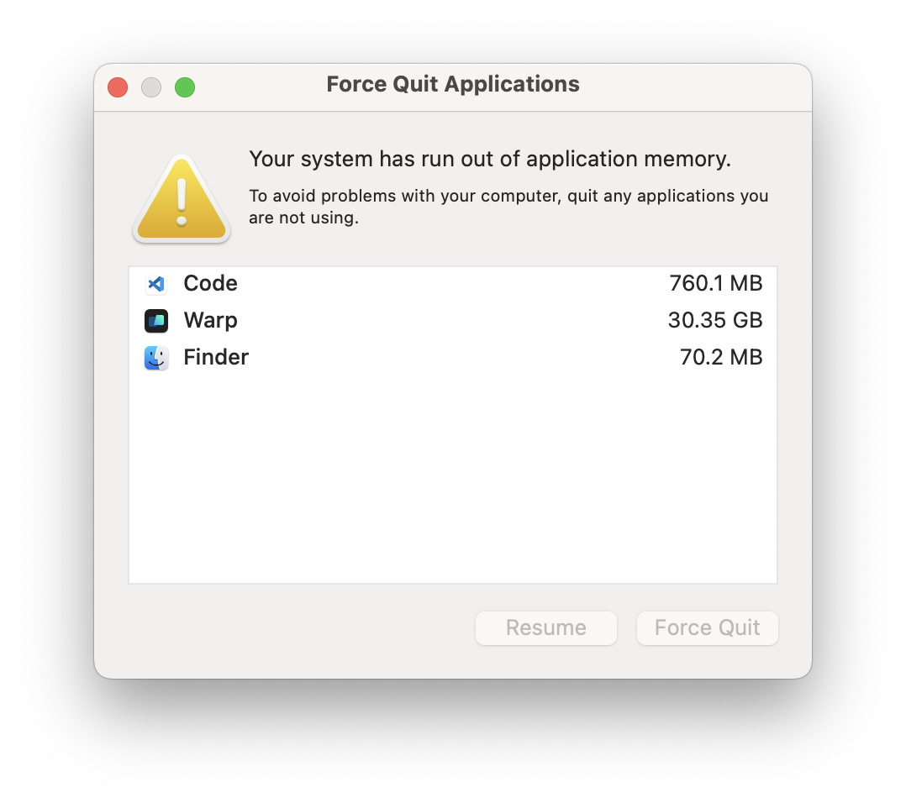

+++
title = "The Hanging Gardens Problem"
description = "Exploring the link between Shrödinger's Cat and Sudoku"
date = 2024-09-20 # temporary to appease Zola
draft = true
+++

This is an interesting puzzle inspired by Christian Freeling's tile set [The China Cube](https://mindsports.nl/index.php/puzzles/3d/394-the-china-cube). As it really has nothing to do with China, I call it **the Hanging Gardens Problem**. Imagine each cube as a section of the Garden, and connections to other cubes are paths and stairways.[^1]

[^1]: The original tile set inspired a number of games by Christian Freeling. One of them is Dominions, for which I wrote [an implementation in Odin](@/thoughts/2024-09-01-the-garden-of-odin/index.md).

Here is a nice drawing showing the full set of 64 Cubes, from Freeling's site.


## Problem Formulation

- There are 64 cubes. 
- Each cube is unique.
- Each cube has a specific number of Red and Blue faces.
- Cubes do not rotate or change orientation in anyway. 
- Direction of the faces is specific: North, East, South, West, Top, Bottom.

It follows from these that there is
 
- One cube with all Red faces (the Red cube, bottom Cube in the earlier drawing.)
- One cube with all Blue faces (the Blue cube, top Cube in the earlier drawing)
- Six cubes with one Red face. 
- Six cubes with one Blue face.
- ... etc.

All possible permutations of Red and Blue faces are represented (hence 64 cubes).

Here is the puzzle: **Assemble the cubes so the Blue faces touch each other, and all the Red faces are exposed.**[^2]

[^2]: This is what Freeling calls a "Transcendental solution".

In other words, a Blue face must always face, touching, another Blue face. A Red face must not do that. However, a Red face might wave to another Red face from a distance (at least one cube far.)

There is most likely is a solution.

The solution does not have to be one big shape. It actually *cannot*, because of the Red Cube.

## Wave Function Collapse

I asked around in a number of Discord servers on how to approach solving the problem programmatically, outside of 3-D printing the set and physically assembling it by hand. The [Gorilla Sun](https://www.gorillasun.de) Creative Coding server suggested that using the [Wave Function Collapse](https://github.com/mxgmn/WaveFunctionCollapse) algorithm might be the best fit for the problem, and suggested [a very excellent Youtube video from the Coding Train](https://www.youtube.com/watch?v=rI_y2GAlQFM) implementing the algorithm in Javascript. It is a *very* good video that I suggest watching.

As explained at the start of the video, this is simply the Sudoku solving algorithm, generalized to creating random tile sets. Apparently, the Quantum Mechanics inspired name is simply for flavor and searchability.

So, how does one solve a Sudoku?

1. First, identify the connection rules and the tile set. (Which, in Sudoku, need no explaining.)
2. Second, *Observation*: mark each empty cell in the grid with the candidate ~~tiles~~ numbers that go in them.
3. Third, the *Collapse* in Wave Function Collapse: identify the cells with the fewest number of candidates. 
        1. Any cell with 1 candidate "collapses" into that candidate, and the number is inked in. 
        2. *If there are not any cells with one candidate*, pick one cell with the fewest number of candidates and pick a candidate at random, "collapsing" it.[^3]
4. Fourth, *Propagation*: with the new state of things, update the candidates in each call. Here is where Sudoku people use X-wings and Swordfishes and what have you.
5. Repeat the *Collapse*, until the grid is full.
6. If there ever, after Propagation, a cell with *zero* candidates, this means an illegal state was reached. Either *Backtrack* to the last random choice, (and, well, choose another branch), or simply start the whole thing over.

[^3]: This might sound heretical in Sudoku, but in well constructed Sudoku puzzles there is always at least one cell with exactly one candidate in any given puzzle state thought solving. If ever there are not any, either it is not a well constructed puzzle, or the solver is unaware of the Ring of Phistomefel.

This approach can work just fine for the Hanging Gardens. The Tile set and the connection rules are clearly defined. It is only a matter of putting it into code and .. running it. The problem most apparent to me, however, is that the search space is potentially *huge*. So, I first need to try this approach with a smaller problem set.

---

## Square Gardens


Phrasing the problem in terms of Squares, and 2D connections, rather than Cubes, shrinks the problem space by an order of magnitude. Plus, [there is a known solution given by Freeling](https://www.mindsports.nl/index.php/puzzles/tilings/china-labyrinth/)!

### Tiles and Air

First, I need to formulate the tiles. There are two kinds of Tiles. The first kind is the actually Squares. This is a *finite* set. The second kind, is an "Air" tile. This empty tile is infinitely available, and is automatically placed at the Propagation phase connected to every Red face. A Red face *must* connect to an Air tile, and a Blue face can *never* connect to one. An Air tile can connect from any side to any Air tile with no restriction. 

I am still having fun with [Odin](https://odin-lang.org), so I will try this solution in it first. Here are the starting types:

```odin
Side :: enum { North, East, South, West }
Tile :: distinct bit_set[Side]

Air  :: distinct struct {}

Cell :: union { Air, Tile }
```

I am not too happy about this because while the data can neatly fit into one byte, Odin puts this in two. This looks cleaner and easier to understand than weird hacks, so I will stick to it for the time being. Odin's `union` is nice here, semantically, as it actually has three states: `nil`, `Air` and `Tile`, exactly as much as needed.

The Squares are only 16 (count them in the image above). It is possible to safely ignore the Red (unconnected) Square, because it can simply be put anywhere in space and does not need to connect to anything. Generating a list of the Squares is as simple as counting to 15, or `0xF`. Running the below snippet to confirm:

```odin
main :: proc () {
    list : [dynamic]Cell

    for i in u8(0x1) ..= 0xF {
        fmt.println(transmute(Tile)i)
        append(&list, transmute(Tile)i) // <-- Odin casting magic here
    }

    fmt.println(len(list))
}
```

Prints the following:

```
Tile{North}
Tile{East}
Tile{North, East}
Tile{South}
Tile{North, South}
Tile{East, South}
Tile{North, East, South}
Tile{West}
Tile{North, West}
Tile{East, West}
Tile{North, East, West}
Tile{South, West}
Tile{North, South, West}
Tile{East, South, West}
Tile{North, East, South, West}
15
```

Which is exactly what is needed. Hooray!!

### Grid and Candidates

An infinite grid is infeasible due to being in a finite universe and using computers with finite resources. So what is a good size for a finite grid? There are 16 Tiles, so a 16 by 16 grid is a clear upper bound, and clearly too big, due to the impossibility of all squares being in one line. I will go with a 15 by 15 grid, which is also safe as it is too big, but it gives me a nice center cell to fix the Blue square in, and branch everywhere from there.

To track the candidates in each cell, the simplest option, perhaps, is to create a set of tiles. Since each tile corresponds neatly to a number (as per the `transmute` above,) simply tracking the numbers should be enough. As mentioned also, the Red square can be placed anywhere in space, so it does not need to be tracked. Giving its number, 0, to track the Air Tile should be enough, as it can later replace almost any Air tile in the final grid.

```odin
Candidates :: distinct bit_set[0..=15; u16]

Grid :: struct {
    cells:      [15][15]Cell, // central cell is [7][7]
    candidates: [15][15]Candidates
}
```

Having `candidates` in a separate field like that is convenient. Any cell with no candidates (a `nil` bit set), would signal an illegal position reached. Any cell with only one candidate is considered collapsed, and the collapse would then be reflected in the `cells` field, which represents the actual contents. All this, of course, is subject to be iterated out later.

This is the first draft of how to initialize the grid. Note that in Odin `~` is the bitwise `NOT` operator. So `~Candidates{15}` is the full set *except* for 15. And `~Tile{}` is the full set.

```odin
grid_init :: proc() -> (ret: Grid) {
    // Blue Square
    ret.cells[7][7] = ~Tile{}

    // Fill the Candidates Grid 
    ret.candidates = ~Candidates{15} // broadcast magic
    ret.candidates[7][7] = {15}

    return ret
}
```

### Propagation

An astute Sudoku solver would quickly be able to see that this initial list of candidates is, in fact, useless and incorrect. Yes it removes the placed Tile from all candidate positions, but it does *not* take into account the placed Tile's connections.[^edges] For this to work the Candidate grid must be updated to match the new reality.

[^edges]: Nor does it into account the edges of the Grid (where only Red faces may, well, face.) However, the edges of the Grid are unlikely to be reached, so I will ignore that for now.

It follows that for each placed `Cell` in `cells`, it must update the surrounding candidates. So a function that gives out the candidates per face is needed. This can almost just be hardcoded, since each number maps neatly to a specific square. It is possible to hardcode it for each tile individually, but where is the fun in that.

```odin
Candidate_Set :: [Side]Candidates // Enumerated arrays, a nice Odin feature.

tile_connections :: proc (c: Cell) -> (ret: Candidate_Set) {
    // Why not just hardcode it all the way?
    switch t in c {
    case Tile: 
        ret[.North] = {4, 5,  6,  7, 12, 13, 14, 15} if .North in t else {0}
        ret[.East]  = {8, 9, 10, 11, 12, 13, 14, 15} if .East  in t else {0}
        ret[.South] = {1, 3,  5,  7,  9, 11, 13, 15} if .South in t else {0}
        ret[.West]  = {2, 3,  6,  7, 10, 11, 14, 15} if .West  in t else {0}
    case Air:
        ret[.North] = {0, 1, 2, 3, 8,  9, 10, 11}
        ret[.East]  = {0, 1, 2, 3, 4,  5,  6,  7}
        ret[.South] = {0, 2, 4, 6, 8, 10, 12, 14}
        ret[.West]  = {0, 1, 4, 5, 8,  9, 12, 13}
    case: 
        ret = ~{}
    }
    return
}
```

This is nice, mainly because the `Candidates` type, being a bit set, can be `AND`ed together to quickly eliminate candidates from Cells in the relevant direction. This can be run for each new state in a loop (or maybe just twice) to propagate candidates of collapsed `Air` Cells.

The `grid_propagate` procedure will have to do a few things. First, it should scan `cells` for known placements. If there is a known placement, update `candidates` accordingly. Then scan `candidates` for any collapsed cells (where there is only one left candidate), and update those in `cells` accordingly, then repeat. Assertions could be placed if a known placement in `cells` does not match a collapsed candidates set in `candidates`. An error would be returned if, during propagation, a `candidates` cell was found with 0 candidates, indicating an illegal branch reached.

After some trial and error and stack overflows and segmentation faults (due to said stack overflows), I settled on this recursive version It is probably not efficient, as it calculates the same thing multiple times, but it is the most straightforward way i could think of.

```odin
grid_propagate :: proc (grid: ^Grid) -> bool {
    // Update candidates based on cells
    for y in 0..<15 do for x in 0..<15 {
        cell := grid.cells[x][y]
        tc := tile_connections(cell)

        // North
        if y < 14 do grid.candidates[x][y + 1] &= tc[.North]
        // East
        if x < 14 do grid.candidates[x + 1][y] &= tc[.East]
        // South
        if y >  0 do grid.candidates[x][y - 1] &= tc[.South]
        // West
        if x >  0 do grid.candidates[x - 1][y] &= tc[.West]

        // if cell is a tile, make sure it is not a candidate anywhere else.
        if tile, ok := cell.(Tile); ok {
            // Weird hack
            cand := Candidates{ int(transmute(u8)tile) }

            // remove it everywhere with broadcast magic
            grid.candidates -= cand

            // then add it in the appropriate place
            grid.candidates[x][y] = cand
        }
    }

    any_collapsed := false
    
    // Update cells based on candidates
    for y in 0..<15 do for x in 0..<15 {
        cand := grid.candidates[x][y]
        if cand == {} do return false // illegal state reached
                
        // COLLAPSE
        // obviously only a new collapse if it is not collapsed already
        if grid.cells[x][y] == nil && card(cand) == 1 do for id in cand {
            any_collapsed = true

            // What did actually collapse
            grid.cells[x][y] = Air{} if id == 0 else transmute(Tile)i8(id)
        }
    }

    success := true
    if any_collapsed do success = grid_propagate(grid) // recursion!!

    return success
}
```

Then just update `grid_init` like this 

```odin
grid_init :: proc () -> (ret: Grid) {
    
    // Fill the Candidates Grid
    ret.candidates = ~Candidates{}

    // Place Blue square
    ret.cells[7][7] = ~Tile{}

    grid_propagate(&ret)

    return ret
}
```

And it works, nicely! Place any of the Squares instead of `~Tile{}`, and it works correctly. Even propagates `Air` cells and their neighbors!!

### Controlled Demolition

The `grid_propagate` procedure takes of care of collapsing cells with one candidate left. But as soon as right after the initial position, there are still many cells with unresolved state. That's why Controlled Demolition is needed, to *force* things to collapse, randomly.[^metaphor]

[^metaphor]: Yes I am totally mixing metaphors right now. Way beyond Quantum Mechanics and well into AEC. Roll with it.

The best candidates for Controlled Demolition are the cells with the least amount of candidates that are not already collapsed. That's to say, the least amount of candidates more than 1. Recording these is probably easy. Choosing one randomly, with even chances all over, is, at first impression, not. It is easy to choose *arbitrarily*, but not necessarily randomly. If a robust backtracking algorithm exists, then arbitrary is probably better than random. But I do not currently plan to backtrack, but instead simply start over whenever an illegal position is encountered.

How should one go about this? With so much randomness, the probably most straightforward course of action is to randomize the indices 0-14 three times. The first two randomized arrays are to loop over `candidates` in a somewhat random order. The third one is to loop over the candidates in the final found cell, and collapse to the first one it matches over.

Sounds absolutely *boneheaded*, but it should work just fine.

```odin
grid_controlled_demolition :: proc (grid: ^Grid) -> bool {
    // all the shuffling 
    rows := []int{ 0, 1, 2, 3, 4, 5, 6, 7, 8, 9, 10, 11, 12, 13, 14 }
    rand.shuffle(rows)
    
    cols := []int{ 0, 1, 2, 3, 4, 5, 6, 7, 8, 9, 10, 11, 12, 13, 14 }
    rand.shuffle(cols)
    
    ids  := []int{ 0, 1, 2, 3, 4, 5, 6, 7, 8, 9, 10, 11, 12, 13, 14 }
    rand.shuffle(ids)

    // target collapse stored here
    t_x, t_y: int

    // tracking the minimum
    min_card := 15

    // loop over the grid "randomly"
    for y in cols do for x in rows {
        c := card(grid.candidates[x][y])
        (c > 1) or_continue // already collapsed

        if c < min_card {
            t_x = x
            t_y = y
            min_card = c
        }

        if min_card == 2 do break // no point in looking further
    }

    // loop over the set flags randomly and collapse to the first match.
    for id in ids do if id in grid.candidates[t_x][t_y] {
        // COLLAPSE
        if id == 0 {
            grid.cells[t_x][t_y] = Air{}
            grid.candidates[t_x][t_y] = {0}
        } else {
            tile := transmute(Tile)i8(id)
            cand := Candidates{ int(transmute(u8)tile) }

            grid.cells[t_x][t_y] = tile
            grid.candidates -= cand
            grid.candidates[t_x][t_y] = cand
        } 

        break
    }

    // then propagate the new changes, returning the legality result
    return grid_propagate(grid)
}
```

This should be enough? Calling `grid_controlled_demolition` a couple of times seems to produce the expected result.

```odin
main :: proc () {
    grid := grid_init()
    
    // crude 
    grid_controlled_demolition(&grid)
    grid_controlled_demolition(&grid)
    grid_controlled_demolition(&grid)
    grid_controlled_demolition(&grid)
    grid_controlled_demolition(&grid)

    for row, ri in grid.candidates do for c, ci in row {
        fmt.println(ri, ci, c)
    }
}
```
<details> <summary>Sample output.</summary>

```
0 0 Candidates{0, 1, 2, 3, 4, 7, 8, 10, 11, 12}
0 1 Candidates{0, 1, 2, 3, 4, 7, 8, 10, 11, 12}
0 2 Candidates{0, 1, 2, 3, 4, 7, 8, 10, 11, 12}
0 3 Candidates{0, 1, 2, 3, 4, 7, 8, 10, 11, 12}
0 4 Candidates{0, 1, 2, 3, 4, 7, 8, 10, 11, 12}
0 5 Candidates{0, 1, 2, 3, 4, 7, 8, 10, 11, 12}
0 6 Candidates{0, 1, 2, 3, 4, 7, 8, 10, 11, 12}
0 7 Candidates{0, 1, 2, 3, 4, 7, 8, 10, 11, 12}
0 8 Candidates{0, 1, 2, 3, 4, 7, 8, 10, 11, 12}
0 9 Candidates{0, 1, 2, 3, 4, 7, 8, 10, 11, 12}
0 10 Candidates{0, 1, 2, 3, 4, 7, 8, 10, 11, 12}
0 11 Candidates{0, 1, 2, 3, 4, 7, 8, 10, 11, 12}
0 12 Candidates{0, 1, 2, 3, 4, 7, 8, 10, 11, 12}
0 13 Candidates{0, 1, 2, 3, 4, 7, 8, 10, 11, 12}
0 14 Candidates{0, 1, 2, 3, 4, 7, 8, 10, 11, 12}
1 0 Candidates{0, 1, 2, 3, 4, 7, 8, 10, 11, 12}
1 1 Candidates{0, 1, 2, 3, 4, 7, 8, 10, 11, 12}
1 2 Candidates{0, 1, 2, 3, 4, 7, 8, 10, 11, 12}
1 3 Candidates{0, 1, 2, 3, 4, 7, 8, 10, 11, 12}
1 4 Candidates{0, 1, 2, 3, 4, 7, 8, 10, 11, 12}
1 5 Candidates{0, 1, 2, 3, 4, 7, 8, 10, 11, 12}
1 6 Candidates{0, 1, 2, 3, 4, 7, 8, 10, 11, 12}
1 7 Candidates{0, 1, 2, 3, 4, 7, 8, 10, 11, 12}
1 8 Candidates{0, 1, 2, 3, 4, 7, 8, 10, 11, 12}
1 9 Candidates{0, 1, 2, 3, 4, 7, 8, 10, 11, 12}
1 10 Candidates{0, 1, 2, 3, 4, 7, 8, 10, 11, 12}
1 11 Candidates{0, 1, 2, 3, 4, 7, 8, 10, 11, 12}
1 12 Candidates{0, 1, 2, 3, 4, 7, 8, 10, 11, 12}
1 13 Candidates{0, 1, 2, 3, 4, 7, 8, 10, 11, 12}
1 14 Candidates{0, 1, 2, 3, 4, 7, 8, 10, 11, 12}
2 0 Candidates{0, 1, 2, 3, 4, 7, 8, 10, 11, 12}
2 1 Candidates{0, 1, 2, 3, 4, 7, 8, 10, 11, 12}
2 2 Candidates{0, 1, 2, 3, 4, 7, 8, 10, 11, 12}
2 3 Candidates{0, 1, 2, 3, 4, 7, 8, 10, 11, 12}
2 4 Candidates{0, 1, 2, 3, 4, 7, 8, 10, 11, 12}
2 5 Candidates{0, 1, 2, 3, 4, 7, 8, 10, 11, 12}
2 6 Candidates{0, 1, 2, 3, 4, 7, 8, 10, 11, 12}
2 7 Candidates{0, 1, 2, 3, 4, 7, 8, 10, 11, 12}
2 8 Candidates{0, 1, 2, 3, 4, 7, 8, 10, 11, 12}
2 9 Candidates{0, 1, 2, 3, 4, 7, 8, 10, 11, 12}
2 10 Candidates{0, 1, 2, 3, 4, 7, 8, 10, 11, 12}
2 11 Candidates{0, 1, 2, 3, 4, 7, 8, 10, 11, 12}
2 12 Candidates{0, 1, 2, 3, 4, 7, 8, 10, 11, 12}
2 13 Candidates{0, 1, 2, 3, 4, 7, 8, 10, 11, 12}
2 14 Candidates{0, 1, 2, 3, 4, 7, 8, 10, 11, 12}
3 0 Candidates{0, 1, 2, 3, 4, 7, 8, 10, 11, 12}
3 1 Candidates{0, 1, 2, 3, 4, 7, 8, 10, 11, 12}
3 2 Candidates{0, 1, 2, 3, 4, 7, 8, 10, 11, 12}
3 3 Candidates{0, 1, 2, 3, 4, 7, 8, 10, 11, 12}
3 4 Candidates{0, 1, 2, 3, 4, 7, 8, 10, 11, 12}
3 5 Candidates{0, 1, 2, 3, 4, 7, 8, 10, 11, 12}
3 6 Candidates{0, 1, 2, 3, 4, 7, 8, 10, 11, 12}
3 7 Candidates{0, 1, 2, 3, 4, 7, 8, 10, 11, 12}
3 8 Candidates{0, 1, 2, 3, 4, 7, 8, 10, 11, 12}
3 9 Candidates{0, 1, 2, 3, 4, 7, 8, 10, 11, 12}
3 10 Candidates{0, 1, 2, 3, 4, 7, 8, 10, 11, 12}
3 11 Candidates{0, 1, 2, 3, 4, 7, 8, 10, 11, 12}
3 12 Candidates{0, 1, 2, 3, 4, 7, 8, 10, 11, 12}
3 13 Candidates{0, 1, 2, 3, 4, 7, 8, 10, 11, 12}
3 14 Candidates{0, 1, 2, 3, 4, 7, 8, 10, 11, 12}
4 0 Candidates{0, 1, 2, 3, 4, 7, 8, 10, 11, 12}
4 1 Candidates{0, 1, 2, 3, 4, 7, 8, 10, 11, 12}
4 2 Candidates{0, 1, 2, 3, 4, 7, 8, 10, 11, 12}
4 3 Candidates{0, 1, 2, 3, 4, 7, 8, 10, 11, 12}
4 4 Candidates{0, 1, 2, 3, 4, 7, 8, 10, 11, 12}
4 5 Candidates{0, 1, 2, 3, 4, 7, 8, 10, 11, 12}
4 6 Candidates{0, 1, 2, 3, 4, 7, 8, 10, 11, 12}
4 7 Candidates{0, 1, 2, 3, 4, 7, 8, 10, 11, 12}
4 8 Candidates{0, 1, 2, 3, 4, 7, 8, 10, 11, 12}
4 9 Candidates{0, 1, 2, 3, 4, 7, 8, 10, 11, 12}
4 10 Candidates{0, 1, 2, 3, 4, 7, 8, 10, 11, 12}
4 11 Candidates{0, 1, 2, 3, 4, 7, 8, 10, 11, 12}
4 12 Candidates{0, 1, 2, 3, 4, 7, 8, 10, 11, 12}
4 13 Candidates{0, 1, 2, 3, 4, 7, 8, 10, 11, 12}
4 14 Candidates{0, 1, 2, 3, 4, 7, 8, 10, 11, 12}
5 0 Candidates{0, 1, 2, 3, 4, 7, 8, 10, 11, 12}
5 1 Candidates{0, 1, 2, 3, 4, 7, 8, 10, 11, 12}
5 2 Candidates{0, 1, 2, 3, 4, 7, 8, 10, 11, 12}
5 3 Candidates{0, 1, 2, 3, 4, 7, 8, 10, 11, 12}
5 4 Candidates{0, 1, 2, 3, 4, 7, 8, 10, 11, 12}
5 5 Candidates{0, 1, 2, 3, 4, 7, 8, 10, 11, 12}
5 6 Candidates{0, 1, 2, 3, 4, 7, 8, 10, 11, 12}
5 7 Candidates{0, 1, 2, 3, 4, 7, 8, 10, 11, 12}
5 8 Candidates{0, 1, 4, 8, 12}
5 9 Candidates{2, 3, 7, 10, 11}
5 10 Candidates{2, 3, 7, 10, 11}
5 11 Candidates{0, 1, 2, 3, 4, 7, 8, 10, 11, 12}
5 12 Candidates{0, 1, 2, 3, 4, 7, 8, 10, 11, 12}
5 13 Candidates{0, 1, 2, 3, 4, 7, 8, 10, 11, 12}
5 14 Candidates{0, 1, 2, 3, 4, 7, 8, 10, 11, 12}
6 0 Candidates{0, 1, 2, 3, 4, 7, 8, 10, 11, 12}
6 1 Candidates{0, 1, 2, 3, 4, 7, 8, 10, 11, 12}
6 2 Candidates{0, 1, 2, 3, 4, 7, 8, 10, 11, 12}
6 3 Candidates{0, 1, 2, 3, 4, 7, 8, 10, 11, 12}
6 4 Candidates{0, 1, 2, 3, 4, 7, 8, 10, 11, 12}
6 5 Candidates{0, 1, 2, 3, 4, 7, 8, 10, 11, 12}
6 6 Candidates{0, 1, 2, 3, 4, 7, 8, 10, 11, 12}
6 7 Candidates{0, 2, 4, 8, 10, 12}
6 8 Candidates{0}
6 9 Candidates{9}
6 10 Candidates{13}
6 11 Candidates{4, 7, 12}
6 12 Candidates{0, 1, 2, 3, 4, 7, 8, 10, 11, 12}
6 13 Candidates{0, 1, 2, 3, 4, 7, 8, 10, 11, 12}
6 14 Candidates{0, 1, 2, 3, 4, 7, 8, 10, 11, 12}
7 0 Candidates{0, 1, 2, 3, 4, 7, 8, 10, 11, 12}
7 1 Candidates{0, 1, 2, 3, 4, 7, 8, 10, 11, 12}
7 2 Candidates{0, 1, 2, 3, 4, 7, 8, 10, 11, 12}
7 3 Candidates{0, 1, 2, 3, 4, 7, 8, 10, 11, 12}
7 4 Candidates{0, 1, 2, 3, 4, 7, 8, 10, 11, 12}
7 5 Candidates{0, 1, 2, 3, 4, 7, 8, 10, 11, 12}
7 6 Candidates{0, 1, 2, 3, 4, 7, 8, 10, 11, 12}
7 7 Candidates{1, 3, 7, 11}
7 8 Candidates{6}
7 9 Candidates{0}
7 10 Candidates{0}
7 11 Candidates{0, 1, 2, 3, 8, 10, 11}
7 12 Candidates{0, 1, 2, 3, 4, 7, 8, 10, 11, 12}
7 13 Candidates{0, 1, 2, 3, 4, 7, 8, 10, 11, 12}
7 14 Candidates{0, 1, 2, 3, 4, 7, 8, 10, 11, 12}
8 0 Candidates{0, 1, 2, 3, 4, 7, 8, 10, 11, 12}
8 1 Candidates{0, 1, 2, 3, 4, 7, 8, 10, 11, 12}
8 2 Candidates{0, 1, 2, 3, 4, 7, 8, 10, 11, 12}
8 3 Candidates{0, 1, 2, 3, 4, 7, 8, 10, 11, 12}
8 4 Candidates{0, 1, 2, 3, 4, 7, 8, 10, 11, 12}
8 5 Candidates{0, 1, 2, 3, 4, 7, 8, 10, 11, 12}
8 6 Candidates{0, 1, 2, 3, 4, 7, 8, 10, 11, 12}
8 7 Candidates{1, 3, 7, 11}
8 8 Candidates{15}
8 9 Candidates{5}
8 10 Candidates{4, 7}
8 11 Candidates{0, 1, 2, 3, 4, 7, 8, 10, 11, 12}
8 12 Candidates{0, 1, 2, 3, 4, 7, 8, 10, 11, 12}
8 13 Candidates{0, 1, 2, 3, 4, 7, 8, 10, 11, 12}
8 14 Candidates{0, 1, 2, 3, 4, 7, 8, 10, 11, 12}
9 0 Candidates{0, 1, 2, 3, 4, 7, 8, 10, 11, 12}
9 1 Candidates{0, 1, 2, 3, 4, 7, 8, 10, 11, 12}
9 2 Candidates{0, 1, 2, 3, 4, 7, 8, 10, 11, 12}
9 3 Candidates{0, 1, 2, 3, 4, 7, 8, 10, 11, 12}
9 4 Candidates{0, 1, 2, 3, 4, 7, 8, 10, 11, 12}
9 5 Candidates{0, 1, 2, 3, 4, 7, 8, 10, 11, 12}
9 6 Candidates{0, 1, 2, 3, 4, 7, 8, 10, 11, 12}
9 7 Candidates{1, 3, 7, 11}
9 8 Candidates{14}
9 9 Candidates{0}
9 10 Candidates{0, 1, 2, 3, 8, 10, 11}
9 11 Candidates{0, 1, 2, 3, 4, 7, 8, 10, 11, 12}
9 12 Candidates{0, 1, 2, 3, 4, 7, 8, 10, 11, 12}
9 13 Candidates{0, 1, 2, 3, 4, 7, 8, 10, 11, 12}
9 14 Candidates{0, 1, 2, 3, 4, 7, 8, 10, 11, 12}
10 0 Candidates{0, 1, 2, 3, 4, 7, 8, 10, 11, 12}
10 1 Candidates{0, 1, 2, 3, 4, 7, 8, 10, 11, 12}
10 2 Candidates{0, 1, 2, 3, 4, 7, 8, 10, 11, 12}
10 3 Candidates{0, 1, 2, 3, 4, 7, 8, 10, 11, 12}
10 4 Candidates{0, 1, 2, 3, 4, 7, 8, 10, 11, 12}
10 5 Candidates{0, 1, 2, 3, 4, 7, 8, 10, 11, 12}
10 6 Candidates{0, 1, 2, 3, 4, 7, 8, 10, 11, 12}
10 7 Candidates{0, 1, 2, 3, 4, 7, 8, 10, 11, 12}
10 8 Candidates{8, 10, 11, 12}
10 9 Candidates{0, 1, 2, 3, 4, 7}
10 10 Candidates{0, 1, 2, 3, 4, 7, 8, 10, 11, 12}
10 11 Candidates{0, 1, 2, 3, 4, 7, 8, 10, 11, 12}
10 12 Candidates{0, 1, 2, 3, 4, 7, 8, 10, 11, 12}
10 13 Candidates{0, 1, 2, 3, 4, 7, 8, 10, 11, 12}
10 14 Candidates{0, 1, 2, 3, 4, 7, 8, 10, 11, 12}
11 0 Candidates{0, 1, 2, 3, 4, 7, 8, 10, 11, 12}
11 1 Candidates{0, 1, 2, 3, 4, 7, 8, 10, 11, 12}
11 2 Candidates{0, 1, 2, 3, 4, 7, 8, 10, 11, 12}
11 3 Candidates{0, 1, 2, 3, 4, 7, 8, 10, 11, 12}
11 4 Candidates{0, 1, 2, 3, 4, 7, 8, 10, 11, 12}
11 5 Candidates{0, 1, 2, 3, 4, 7, 8, 10, 11, 12}
11 6 Candidates{0, 1, 2, 3, 4, 7, 8, 10, 11, 12}
11 7 Candidates{0, 1, 2, 3, 4, 7, 8, 10, 11, 12}
11 8 Candidates{0, 1, 2, 3, 4, 7, 8, 10, 11, 12}
11 9 Candidates{0, 1, 2, 3, 4, 7, 8, 10, 11, 12}
11 10 Candidates{0, 1, 2, 3, 4, 7, 8, 10, 11, 12}
11 11 Candidates{0, 1, 2, 3, 4, 7, 8, 10, 11, 12}
11 12 Candidates{0, 1, 2, 3, 4, 7, 8, 10, 11, 12}
11 13 Candidates{0, 1, 2, 3, 4, 7, 8, 10, 11, 12}
11 14 Candidates{0, 1, 2, 3, 4, 7, 8, 10, 11, 12}
12 0 Candidates{0, 1, 2, 3, 4, 7, 8, 10, 11, 12}
12 1 Candidates{0, 1, 2, 3, 4, 7, 8, 10, 11, 12}
12 2 Candidates{0, 1, 2, 3, 4, 7, 8, 10, 11, 12}
12 3 Candidates{0, 1, 2, 3, 4, 7, 8, 10, 11, 12}
12 4 Candidates{0, 1, 2, 3, 4, 7, 8, 10, 11, 12}
12 5 Candidates{0, 1, 2, 3, 4, 7, 8, 10, 11, 12}
12 6 Candidates{0, 1, 2, 3, 4, 7, 8, 10, 11, 12}
12 7 Candidates{0, 1, 2, 3, 4, 7, 8, 10, 11, 12}
12 8 Candidates{0, 1, 2, 3, 4, 7, 8, 10, 11, 12}
12 9 Candidates{0, 1, 2, 3, 4, 7, 8, 10, 11, 12}
12 10 Candidates{0, 1, 2, 3, 4, 7, 8, 10, 11, 12}
12 11 Candidates{0, 1, 2, 3, 4, 7, 8, 10, 11, 12}
12 12 Candidates{0, 1, 2, 3, 4, 7, 8, 10, 11, 12}
12 13 Candidates{0, 1, 2, 3, 4, 7, 8, 10, 11, 12}
12 14 Candidates{0, 1, 2, 3, 4, 7, 8, 10, 11, 12}
13 0 Candidates{0, 1, 2, 3, 4, 7, 8, 10, 11, 12}
13 1 Candidates{0, 1, 2, 3, 4, 7, 8, 10, 11, 12}
13 2 Candidates{0, 1, 2, 3, 4, 7, 8, 10, 11, 12}
13 3 Candidates{0, 1, 2, 3, 4, 7, 8, 10, 11, 12}
13 4 Candidates{0, 1, 2, 3, 4, 7, 8, 10, 11, 12}
13 5 Candidates{0, 1, 2, 3, 4, 7, 8, 10, 11, 12}
13 6 Candidates{0, 1, 2, 3, 4, 7, 8, 10, 11, 12}
13 7 Candidates{0, 1, 2, 3, 4, 7, 8, 10, 11, 12}
13 8 Candidates{0, 1, 2, 3, 4, 7, 8, 10, 11, 12}
13 9 Candidates{0, 1, 2, 3, 4, 7, 8, 10, 11, 12}
13 10 Candidates{0, 1, 2, 3, 4, 7, 8, 10, 11, 12}
13 11 Candidates{0, 1, 2, 3, 4, 7, 8, 10, 11, 12}
13 12 Candidates{0, 1, 2, 3, 4, 7, 8, 10, 11, 12}
13 13 Candidates{0, 1, 2, 3, 4, 7, 8, 10, 11, 12}
13 14 Candidates{0, 1, 2, 3, 4, 7, 8, 10, 11, 12}
14 0 Candidates{0, 1, 2, 3, 4, 7, 8, 10, 11, 12}
14 1 Candidates{0, 1, 2, 3, 4, 7, 8, 10, 11, 12}
14 2 Candidates{0, 1, 2, 3, 4, 7, 8, 10, 11, 12}
14 3 Candidates{0, 1, 2, 3, 4, 7, 8, 10, 11, 12}
14 4 Candidates{0, 1, 2, 3, 4, 7, 8, 10, 11, 12}
14 5 Candidates{0, 1, 2, 3, 4, 7, 8, 10, 11, 12}
14 6 Candidates{0, 1, 2, 3, 4, 7, 8, 10, 11, 12}
14 7 Candidates{0, 1, 2, 3, 4, 7, 8, 10, 11, 12}
14 8 Candidates{0, 1, 2, 3, 4, 7, 8, 10, 11, 12}
14 9 Candidates{0, 1, 2, 3, 4, 7, 8, 10, 11, 12}
14 10 Candidates{0, 1, 2, 3, 4, 7, 8, 10, 11, 12}
14 11 Candidates{0, 1, 2, 3, 4, 7, 8, 10, 11, 12}
14 12 Candidates{0, 1, 2, 3, 4, 7, 8, 10, 11, 12}
14 13 Candidates{0, 1, 2, 3, 4, 7, 8, 10, 11, 12}
14 14 Candidates{0, 1, 2, 3, 4, 7, 8, 10, 11, 12}
```
</details>

### Success and Failure

This seems to work fine. But it is still missing one thing: it needs to know when to stop. If it is a successful solution, (where every cell has exactly one candidate), then stop and print it out. If it is a failed solution, try again. Thankfully, this could be expressed in a couple of lines, with the assumption that the grid has collapsed completely if the first element in the grid, as unlikely as it is to be reached, equals `{0}`, an `Air` cell.:

```odin
main :: proc () {
    grid := grid_init()

    outer: for {
        for grid_controlled_demolition(&grid) {
            if grid.candidates[0][0] == {0} do break outer
        }

        grid = grid_init()
    }

    grid_print(&grid) // uninteresting code. it is a grid.
}
```

Here are two sample results, which appear to be correct. The second result is interesting as it has a floating element. Obviously the code is undeterministic: each time it runs it gives a different result.[^symmetric]

[^symmetric]: More interesting variations can include a search for only symmetrical solutions. This would require additional, more complex constraints in candidate placements. Nothing that cannot be dome but a whole lot more code.

```
// try 1
|  |  |  |  |  |  |  |  |  |  |  |  |  |  |  |
|  |  |  |  |  |  |  |  |  |  |  |  |  |  |  |
|  |  |  |  |  |  |  |  |  |  |  |  |  |  |  |
|  |  |  |  |  |  |  |  |  |  |  |  |  |  |  |
|  |  |  |  |  |  |  |  |02|  |  |  |  |  |  |
|  |  |  |  |  |  |03|07|12|  |  |  |  |  |  |
|  |  |  |  |  |  |11|14|  |  |  |  |  |  |  |
|  |  |  |  |  |  |09|15|04|  |  |  |  |  |  |
|  |  |  |  |  |  |  |10|  |  |  |  |  |  |  |
|  |  |  |  |  |01|05|13|06|  |  |  |  |  |  |
|  |  |  |  |  |  |  |  |08|  |  |  |  |  |  |
|  |  |  |  |  |  |  |  |  |  |  |  |  |  |  |
|  |  |  |  |  |  |  |  |  |  |  |  |  |  |  |
|  |  |  |  |  |  |  |  |  |  |  |  |  |  |  |
|  |  |  |  |  |  |  |  |  |  |  |  |  |  |  |

// try 2
|  |  |  |  |  |  |  |  |  |  |  |  |  |  |  |
|  |  |  |  |  |  |  |  |  |  |  |  |  |  |  |
|  |  |  |  |  |  |  |  |  |  |  |  |  |  |  |
|  |  |  |  |  |  |  |  |  |  |  |  |  |  |  |
|  |  |  |  |  |  |01|06|  |02|  |  |  |  |  |
|  |  |  |  |  |  |  |10|  |08|  |  |  |  |  |
|  |  |  |  |  |  |03|14|  |  |  |  |  |  |  |
|  |  |  |  |  |  |11|15|07|05|04|  |  |  |  |
|  |  |  |  |  |  |09|13|12|  |  |  |  |  |  |
|  |  |  |  |  |  |  |  |  |  |  |  |  |  |  |
|  |  |  |  |  |  |  |  |  |  |  |  |  |  |  |
|  |  |  |  |  |  |  |  |  |  |  |  |  |  |  |
|  |  |  |  |  |  |  |  |  |  |  |  |  |  |  |
|  |  |  |  |  |  |  |  |  |  |  |  |  |  |  |
|  |  |  |  |  |  |  |  |  |  |  |  |  |  |  |
```

3D Cubes here I come!!

---

## Packed Gardens

As the solution for the Square Gardens works, it is obvious that simply changing the data structures and the hardcoded values would solve the 3D solution. I will get to that, but first, I want to try a Packed solution first.

The Packed solution has a much simpler to state goal: Pack all 64 cubes into a 4x4x4 cube. Obviously, in this version, the Red faces can (actually have to) face each other. *Only* Red faces are allowed to face outside. In his [page about the set](https://mindsports.nl/index.php/puzzles/3d/394-the-china-cube), Freeling does actually provide one Packed solution, with a caveat.



The caveat here is that the Red Cube must be contained inside, and not on the edge. It *is* a difficult requirement, but the provided solution achieves it, at the cost of another floating group at the bottom left of the image above.

### Initialization

Nonetheless, as it is only a 4x4x4 cube, the search space for the solution is much smaller. There are *no* `Air` tiles in here: it is packed. Adding the additional requirement of the Red Cube being wholly contained actually simplifies the solution's initialization. Start the Blue cube at `(1,1,1)` coordinates, and the Red cube at `(2,2,2)` coordinates. Any other placement of the two Cubes would actually be a mirror image, or a rotation, of this specific arrangement.

Here are the types, which, for the most part, are shared between the Packed Gardens and the Hanging Gardens, and the initialization function as described.

```odin
Side :: enum u8 { North, East, South, West, Top, Bottom }
Tile :: distinct bit_set[Side; u8]

Cell :: Maybe(Tile)
Candidates :: distinct bit_set[0..<64; u64]

Grid :: struct {
    cells:      [4][4][4]Cell,
    candidates: [4][4][4]Candidates,
}

Candidate_Set :: [Side]Candidates

grid_init :: proc () -> (ret: Grid) {
    // Fill the candidate Grid
    ret.candidates = ~Candidates{ 0, 63 }

    // Place Blue and Red cubes respectively
    ret.cells[1][1][1] = ~Tile{}
    ret.cells[2][2][2] = Tile{}

    // Placeholder for now
    grid_propagate(&ret)

    return 
}

```

### Cube Edges

Unlike in the Square Gardens, this is not enough. While the candidates for the edges were safely ignored there, (as the the solution is unlikely to reach them), they must be encoded here, because they are integral. Time to hardcode the implementation! This is how the values are generated: 

```odin
generate_consts :: proc () {
    for side in (~Tile{}) {
        fmt.printf("%v_CONNECTED :: Candidates{{", side)
        for i in 0..<64 {
            tile := transmute(Tile)u8(i)
            if side in tile do fmt.print(i, ",")
        }
        fmt.println("}")
        fmt.printf("%v_NOT_CONNECTED :: Candidates{{", side)
        for i in 0..<64 {
            tile := transmute(Tile)u8(i)
            if side not_in tile do fmt.print(i, ",")
        }
        fmt.println("}")
    }    
}
```

And this is the generated code (with light formatting editing). I have *no* idea if it is correct. The proof of the pudding is in the eating.

```odin
NORTH_CONNECTED  :: Candidates{ 1,  3,  5,  7,  9, 11, 13, 15, 17, 19, 21, 23, 25, 27, 29, 31, 33, 35, 37, 39, 41, 43, 45, 47, 49, 51, 53, 55, 57, 59, 61, 63 }
EAST_CONNECTED   :: Candidates{ 2,  3,  6,  7, 10, 11, 14, 15, 18, 19, 22, 23, 26, 27, 30, 31, 34, 35, 38, 39, 42, 43, 46, 47, 50, 51, 54, 55, 58, 59, 62, 63 }
SOUTH_CONNECTED  :: Candidates{ 4,  5,  6,  7, 12, 13, 14, 15, 20, 21, 22, 23, 28, 29, 30, 31, 36, 37, 38, 39, 44, 45, 46, 47, 52, 53, 54, 55, 60, 61, 62, 63 }
WEST_CONNECTED   :: Candidates{ 8,  9, 10, 11, 12, 13, 14, 15, 24, 25, 26, 27, 28, 29, 30, 31, 40, 41, 42, 43, 44, 45, 46, 47, 56, 57, 58, 59, 60, 61, 62, 63 }
TOP_CONNECTED    :: Candidates{16, 17, 18, 19, 20, 21, 22, 23, 24, 25, 26, 27, 28, 29, 30, 31, 48, 49, 50, 51, 52, 53, 54, 55, 56, 57, 58, 59, 60, 61, 62, 63 }
BOTTOM_CONNECTED :: Candidates{32, 33, 34, 35, 36, 37, 38, 39, 40, 41, 42, 43, 44, 45, 46, 47, 48, 49, 50, 51, 52, 53, 54, 55, 56, 57, 58, 59, 60, 61, 62, 63 }

NORTH_NOT_CONNECTED  :: Candidates{ 0, 2, 4, 6, 8, 10, 12, 14, 16, 18, 20, 22, 24, 26, 28, 30, 32, 34, 36, 38, 40, 42, 44, 46, 48, 50, 52, 54, 56, 58, 60, 62 }
EAST_NOT_CONNECTED   :: Candidates{ 0, 1, 4, 5, 8,  9, 12, 13, 16, 17, 20, 21, 24, 25, 28, 29, 32, 33, 36, 37, 40, 41, 44, 45, 48, 49, 52, 53, 56, 57, 60, 61 }
SOUTH_NOT_CONNECTED  :: Candidates{ 0, 1, 2, 3, 8,  9, 10, 11, 16, 17, 18, 19, 24, 25, 26, 27, 32, 33, 34, 35, 40, 41, 42, 43, 48, 49, 50, 51, 56, 57, 58, 59 }
WEST_NOT_CONNECTED   :: Candidates{ 0, 1, 2, 3, 4,  5,  6,  7, 16, 17, 18, 19, 20, 21, 22, 23, 32, 33, 34, 35, 36, 37, 38, 39, 48, 49, 50, 51, 52, 53, 54, 55 }
TOP_NOT_CONNECTED    :: Candidates{ 0, 1, 2, 3, 4,  5,  6,  7,  8,  9, 10, 11, 12, 13, 14, 15, 32, 33, 34, 35, 36, 37, 38, 39, 40, 41, 42, 43, 44, 45, 46, 47 }
BOTTOM_NOT_CONNECTED :: Candidates{ 0, 1, 2, 3, 4,  5,  6,  7,  8,  9, 10, 11, 12, 13, 14, 15, 16, 17, 18, 19, 20, 21, 22, 23, 24, 25, 26, 27, 28, 29, 30, 31 }
```

```odin
tile_connections :: proc (c: Cell) -> (ret: Candidate_Set) {
    switch t in c {
    case Tile: 
        ret[.North]  = .North  in t ? SOUTH_CONNECTED  : SOUTH_NOT_CONNECTED
        ret[.East]   = .East   in t ? WEST_CONNECTED   : WEST_NOT_CONNECTED
        ret[.South]  = .South  in t ? NORTH_CONNECTED  : NORTH_NOT_CONNECTED
        ret[.West]   = .West   in t ? EAST_CONNECTED   : EAST_NOT_CONNECTED
        ret[.Top]    = .Top    in t ? BOTTOM_CONNECTED : BOTTOM_NOT_CONNECTED
        ret[.Bottom] = .Bottom in t ? TOP_CONNECTED    : TOP_NOT_CONNECTED
    case:
        ret = ~{}
    }
    return
}
```

Then edit `grid_init` to adjust the candidates in the edge cubes accordingly. However, care must be taken as how these values translate there. For example, the westernmost cubes are the ones that do *not* have a connection on the `.West` side. Again, I am not currently sure how correct this is. The pudding is yet to be eaten.

```odin
grid_init :: proc () -> (ret: Grid) {
    // Fill the candidate Grid
    ret.candidates = ~Candidates{ 0, 63 }
    for z in 0..<4 do for y in 0..<4 do for x in 0..<4 {
        if x == 0 do ret.candidates[x][y][z] &= WEST_NOT_CONNECTED
        if x == 3 do ret.candidates[x][y][z] &= EAST_NOT_CONNECTED
        if y == 0 do ret.candidates[x][y][z] &= SOUTH_NOT_CONNECTED
        if y == 3 do ret.candidates[x][y][z] &= NORTH_NOT_CONNECTED
        if z == 0 do ret.candidates[x][y][z] &= BOTTOM_NOT_CONNECTED
        if z == 3 do ret.candidates[x][y][z] &= TOP_NOT_CONNECTED
    }

    // Place Blue and Red cubes respectively
    ret.cells[1][1][1] = ~Tile{}
    ret.cells[2][2][2] = Tile{}

    // still a placeholder
    grid_propagate(&ret)

    return 
}
```

### Propagation and Controlled Demolition

Applying minor changes from the Square Gardens' `grid_propgagate` and `grid_controlled_demolition`, they end up like this.

```odin
grid_propagate :: proc (grid: ^Grid) -> bool {
    // Update candidates based on cells
    for z in 0..<4 do for y in 0..<4 do for x in 0..<4 {
        cell := grid.cells[x][y][z]
        tc := tile_connections(cell)

        if y < 3 do grid.candidates[x][y + 1][z] &= tc[.North]
        if x < 3 do grid.candidates[x + 1][y][z] &= tc[.East]
        if y > 0 do grid.candidates[x][y - 1][z] &= tc[.South]
        if x > 0 do grid.candidates[x - 1][y][z] &= tc[.West]
        // Top
        if z < 3 do grid.candidates[x][y][z + 1] &= tc[.Top]
        // Bottom
        if z > 0 do grid.candidates[x][y][z - 1] &= tc[.Bottom]

        if tile, ok := cell.(Tile); ok {
            // Weird magic
            cand := Candidates{ int (transmute(u8)tile) }
        
            grid.candidates -= cand
            grid.candidates[x][y][z] = cand
        }
    }

    any_collapsed := false

    // Update cells based on candidates
    for z in 0..<4 do for y in 0..<4 do for x in 0..<4  {
        cand := grid.candidates[x][y][z]
        if cand == {} do return false

        if grid.cells[x][y][z] == nil && card(cand) == 1 do for id in cand {
            any_collapsed = true

            grid.cells[x][y][z] = transmute(Tile)u8(id)
        }
    }

    success := true
    if any_collapsed do success = grid_propagate(grid) // recursion!!

    return success
}
```

```odin
grid_controlled_demolition :: proc (grid: ^Grid) -> bool {
    // all the shuffling 
    rows := []int{ 0, 1, 2, 3 }
    rand.shuffle(rows)
    
    cols := []int{ 0, 1, 2, 3 }
    rand.shuffle(cols)

    verts := []int{ 0, 1, 2, 3 }
    rand.shuffle(verts)
    
    ids := []int{ 0,  1,  2,  3,  4,  5,  6,  7,  8,  9, 10, 11, 12, 13, 14, 15,
                 16, 17, 18, 19, 20, 21, 22, 23, 24, 25, 26, 27, 28, 29, 30, 31,
                 32, 33, 34, 35, 36, 37, 38, 39, 40, 41, 42, 43, 44, 45, 46, 47,
                 48, 49, 50, 51, 52, 53, 54, 55, 56, 57, 58, 59, 60, 61, 62, 63}
    rand.shuffle(ids)

    t_x, t_y, t_z: int

    min_card := max(int)

    for z in verts do for y in cols do for x in rows {
        c := card(grid.candidates[x][y][z])
        (c > 1) or_continue

        if c < min_card {
            t_x = x
            t_y = y
            t_z = z
            min_card = c
        }

        if min_card == 2 do break
    }

    for id in ids do if id in grid.candidates[t_x][t_y][t_z] {
        tile := transmute(Tile)i8(id)
        cand := Candidates{ id }

        grid.cells[t_x][t_y][t_z] = tile
        grid.candidates -= cand
        grid.candidates[t_x][t_y][t_z] = cand

        break
    }

    return grid_propagate(grid)
}
```

And this does it. Figuring out how to ascertain how every cell in the grid has only one candidate took a bit of finessing and experimenting with Odin's core library `slice.all_in_proc`, but I ended up doing it manually.

```odin
main :: proc () {
    grid := grid_init()

    outer: for {
        inner: for grid_controlled_demolition(&grid) {
            for z in 0..<4 do for y in 0..<4 do for x in 0..<4 {
                if card(grid.candidates[x][y][z]) != 1 do continue inner
            }

            break outer
        }
        grid = grid_init()
    }
    
    grid_draw(grid) // <-- this one is a bit more interesting.
}
```

This works, and thankfully halts. However, the execution time, in the few times I ran it, varied anything between 3 seconds and one minute. This obviously depends on how *lucky* the random seed is. Using threads would help to get a result faster.

Printing the solution naïvely prints a bunch of numbers, with no repeats (as far I could tell), but to verify that the solution is correct it needs to be outputted into a readable format. THe "easy" solution is to put together a dictionary of images and make a collage, much like the image at the top of the section, but that is not very interesting. 

### Solution Output

Simply printing out the resultant grid to console is not a very useful output. With the Square Gardens, it is possible to verify the correctness of the result by simply checking, visually, that each number/square is the only one in the grid that has neighbors in a specific configuration.

In other words, look at this grid given from before (with pointless empty spaces removed and the Red Square `00` added):

```
|  |  |  |  |  |  |
|  |00|  |  |02|  |
|  |  |03|07|12|  |
|  |  |11|14|  |  |
|  |  |09|15|04|  |
|  |  |  |10|  |  |
|  |01|05|13|06|  |
|  |  |  |  |08|  |
|  |  |  |  |  |  |
```

It is easy to verify that, for example, `08` is literally the only tile that has only one connection to the top (and whether in code that's `North` or `South` is irrelevant to the correctness of the solution.) `14`, for example, is the only tile that has only three connections to the top, left, and bottom, and so on for all of them.

For the packed solution, it is harder to verify that over text output. One solution would be to create a little image for every cube, (as Freeling's provided solution does) and pack them together. The other solution is to render a 3D image of the solution and visually inspect it that way.

Looking over Odin's `vendor` libraries, and asking around for ideas how to do that, I could not figure out how to draw on an image canvas (the way the [`imageproc`](https://docs.rs/imageproc/latest/imageproc/) lets me do in Rust.) But there are a few bindings to different graphics libraries, and word on the street was that [`raylib`](https://www.raylib.com) is the simplest solution for this sort of thing.

I spent a day playing around with `raylib`'s tutorials and asking for help on the Discord. The API is ... weirder than I am used to, to say the least. But it looks simple enough. To draw a window with a render scene, the code is the following:

```odin
import rl "vendor:raylib"

grid_draw :: proc (grid: Grid) {
    SCREEN_WIDTH  :: 400
    SCREEN_HEIGHT :: 200

    // raylib must start with this.
    rl.InitWindow(SCREEN_WIDTH, SCREEN_HEIGHT, "")

    // and end with this.
    defer rl.CloseWindow()

    camera := rl.Camera3D{
        position   = ({10.0, -5.0, 5.0} + 2.5), 
        target     = {2.5, 2.5, 2.5},
        up         = {0.0, 1.0, 0.0}, 
        fovy       = 50, 
        projection = .ORTHOGRAPHIC
    }

    for !rl.WindowShouldClose() {
        rl.UpdateCamera(&camera, .THIRD_PERSON)

        // This honestly weird pattern is how everything in raylib must work
        rl.BeginDrawing()
        defer rl.EndDrawing()

        rl.ClearBackground(rl.WHITE)

        rl.BeginMode3D(camera)
        defer rl.EndMode3D()

        // draw 3D things here.
    }
}
```

Just to test things out, I will try drawing each cube with a different shade based on how many connections it has. The Blue cube shall be blue and the Red cube shall be red, and the other cubes will be different shades of purple.

```odin
for z in 0..<4 do for y in 0..<4 do for x in 0..< 4 {
    tile := grid.cells[x][y][z].(Tile) or_continue
    grade := u8(card(tile))

    b := (max(u8) / 6) * grade
    r := max(u8) - b

    rl.DrawCubeV({f32(x), f32(y), f32(z)}, 1.0, {r, 0, b, 255})
}
```

And now: the moment of truth `odin run .`



I have *no* idea what's going on here. Everything is mushed together and the screen is tiny. Upping the screen's resolution (to `800, 400`), multiplying the position by `2.0` would be a start, and bringing the camera closer would be a decent start.[^iterating] 

[^iterating]: Iterating on this would be a lot more pleasant if generating the solution was faster. Maybe I should not have skipped that distributing work across threads step.



Ah .. much better already. This actually rotates (but not zooms) with the mouse movement, thanks to that `.THIRD_PERSON` setting up there. Time to draw the lines, and better organize the code while I am at it. Here is the full function. (I do not actually expect this to be correct.)

```odin
grid_draw :: proc(grid: Grid) {
    SCREEN_WIDTH  :: 1200
    SCREEN_HEIGHT :: 600

    CUBE_DISTANCE :: 3.0
    CENTER_POINT  :: 2.5 * CUBE_DISTANCE

    rl.InitWindow(SCREEN_WIDTH, SCREEN_HEIGHT, "")
    defer rl.CloseWindow()

    camera := rl.Camera3D {
        position   = ({10.0, -5.0, 5.0} + CENTER_POINT),
        target     = CENTER_POINT,
        up         = {0.0, 1.0, 0.0},
        fovy       = 30,
        projection = .ORTHOGRAPHIC,
    }

    for !rl.WindowShouldClose() {
        rl.UpdateCamera(&camera, .THIRD_PERSON)

        rl.BeginDrawing()
        defer rl.EndDrawing()

        rl.ClearBackground(rl.WHITE)

        rl.BeginMode3D(camera)
        defer rl.EndMode3D()

        for z in 0 ..< 4 do for y in 0 ..< 4 do for x in 0 ..< 4 {
            tile := grid.cells[x][y][z].(Tile) or_continue
            grade := u8(card(tile))

            pos  := rl.Vector3{f32(x), f32(y), f32(z)} * CUBE_DISTANCE
            size := rl.Vector3{ 1.0, 1.0, 1.0 }

            b := (max(u8) / 6) * grade
            r := max(u8) - b

            color := rl.Color{ r, 0, b, 255}

            rl.DrawCubeV( pos, size, color )

            if .North  in tile do rl.DrawLine3D(pos, pos + {0,  CUBE_DISTANCE / 2, 0}, rl.BLACK)
            if .South  in tile do rl.DrawLine3D(pos, pos + {0, -CUBE_DISTANCE / 2, 0}, rl.BLACK)
            if .East   in tile do rl.DrawLine3D(pos, pos + { CUBE_DISTANCE / 2, 0, 0}, rl.BLACK)
            if .West   in tile do rl.DrawLine3D(pos, pos + {-CUBE_DISTANCE / 2, 0, 0}, rl.BLACK)
            if .Top    in tile do rl.DrawLine3D(pos, pos + {0, 0,  CUBE_DISTANCE / 2}, rl.BLACK)
            if .Bottom in tile do rl.DrawLine3D(pos, pos + {0, 0, -CUBE_DISTANCE / 2}, rl.BLACK)
        }
    }
}

```



This looks .. ok? half decent? Rotating it around does not show any mistakes. The centering is off, however. And due to the Orthographic projection and camera work I cannot zoom in to see how everything connects in more detail.

### Faster Iteration of Visuals

Also, frankly, I am getting tired of waiting for the solution to solve before the render show up, so I am changing the code a bit to, maybe, see the cube solve it in real time. This makes the solver *much* slower, but it makes for a fun animation.

```odin
SCREEN_WIDTH  :: 800
SCREEN_HEIGHT :: 800

CUBE_DISTANCE :: 3.0
CENTER_POINT  :: 1.5 * CUBE_DISTANCE

main :: proc () {

    rl.InitWindow(SCREEN_WIDTH, SCREEN_HEIGHT, "")
    defer rl.CloseWindow()

    rl.SetTargetFPS(60)

    camera := rl.Camera3D {
        position   = ({10.0, -5.0, 5.0} + CENTER_POINT),
        target     = CENTER_POINT,
        up         = {0.0, 1.0, 0.0},
        fovy       = 30,
        projection = .ORTHOGRAPHIC,
    }

    grid   := grid_init()
    solved := false
    paused := false

    for !rl.WindowShouldClose() {
        rl.UpdateCamera(&camera, .THIRD_PERSON)

        if rl.IsKeyPressed(.SPACE) do paused ~= true

        {    // Draw current state
            rl.BeginDrawing()
            defer rl.EndDrawing()
    
            rl.ClearBackground(rl.WHITE)
    
            rl.BeginMode3D(camera)
            defer rl.EndMode3D()

            for z in 0 ..< 4 do for y in 0 ..< 4 do for x in 0 ..< 4 {
                tile := grid.cells[x][y][z].(Tile) or_continue
                grade := u8(card(tile))
    
                pos  := rl.Vector3{f32(x), f32(y), f32(z)} * CUBE_DISTANCE
                size := rl.Vector3{ 1.0, 1.0, 1.0 }
    
                b := (max(u8) / 6) * grade
                r := max(u8) - b
    
                color := rl.Color{ r, 0, b, 255}
    
                rl.DrawCubeV( pos, size, color )
    
                if .North  in tile do rl.DrawLine3D(pos, pos + {0,  CUBE_DISTANCE / 2, 0}, rl.BLACK)
                if .South  in tile do rl.DrawLine3D(pos, pos + {0, -CUBE_DISTANCE / 2, 0}, rl.BLACK)
                if .East   in tile do rl.DrawLine3D(pos, pos + { CUBE_DISTANCE / 2, 0, 0}, rl.BLACK)
                if .West   in tile do rl.DrawLine3D(pos, pos + {-CUBE_DISTANCE / 2, 0, 0}, rl.BLACK)
                if .Top    in tile do rl.DrawLine3D(pos, pos + {0, 0,  CUBE_DISTANCE / 2}, rl.BLACK)
                if .Bottom in tile do rl.DrawLine3D(pos, pos + {0, 0, -CUBE_DISTANCE / 2}, rl.BLACK)
            }
        }

        if !paused && !solved {
            if grid_controlled_demolition(&grid) {
                solved = true
                for z in 0..<4 do for y in 0..<4 do for x in 0..<4 {
                    if card(grid.candidates[x][y][z]) != 1 {
                        solved = false 
                        break
                    }
                }
            } else { 
                grid = grid_init() 
                solved = false
            }
        }
    }
}
```

<video controls width="400" autoplay="true">
  <source src="animation_1.mp4" type="video/mp4" />
</video>

Well this is a lot more pleasant to look at, isn't it? One nicety: it pauses when the Space bar is pressed, easier to inspect the connections. It will find a solution in a million years, but until that happens it would be easier to iterate the presentation's colors and distances.

Miracolously, howver, no matter when I pause it, the connections between adaject cubes are always correct. There are no cubes that are next to each other with one line hanging midways between them. Every high five is reciprocated. This is a fancy screenshot for an attempted solution.



### Final Visuals

After a bit of trial and error and experimenting with different colors and distances and camera positions, I ended up with these constants and draw functions.

```odin
SCREEN_WIDTH  :: 800
SCREEN_HEIGHT :: 800

CUBE_DISTANCE_X :: 6.0
CUBE_DISTANCE_Y :: 6.0
CUBE_DISTANCE_Z :: 2.5

CENTER_POINT :: [3]f32 {
    1.5 * CUBE_DISTANCE_X,
    1.5 * CUBE_DISTANCE_Y,
    1.5 * CUBE_DISTANCE_Z
}

main :: proc () {
    // boring boilerplate

    camera := rl.Camera3D {
        position   = ({-7, -7, 15} + CENTER_POINT),
        target     = CENTER_POINT,
        up         = {0.0, 0.0, 1.0},
        fovy       = 35,
        projection = .ORTHOGRAPHIC,
    }

    // other boring boilerplate
    
    rl.ClearBackground(rl.Color{ 240, 240, 240, 255 })
    
    // you know
    
    pos  := rl.Vector3{
        f32(x) * CUBE_DISTANCE_X,
        f32(y) * CUBE_DISTANCE_Y,
        f32(z) * CUBE_DISTANCE_Z,
    } 

    // more of it
    
    rl.DrawCubeV(pos, size, color)
    rl.DrawCubeWiresV(pos, size, rl.BLACK)

    if .North  in tile {
        end_pos := pos + {0,  CUBE_DISTANCE_Y / 2, 0}
        rl.DrawCylinderEx(pos, end_pos, 0.1, 0.1, 12, rl.ORANGE)
        rl.DrawCylinderWiresEx(pos, end_pos, 0.1, 0.1, 12, rl.BLACK)
    }
    if .South  in tile {
        end_pos := pos + {0, -CUBE_DISTANCE_Y / 2, 0}
        rl.DrawCylinderEx(pos, end_pos, 0.1, 0.1, 12, rl.ORANGE)
        rl.DrawCylinderWiresEx(pos, end_pos, 0.1, 0.1, 12, rl.BLACK)
    }
    if .East   in tile {
        end_pos := pos + { CUBE_DISTANCE_X / 2, 0, 0}
        rl.DrawCylinderEx(pos, end_pos, 0.1, 0.1, 12, rl.DARKGREEN)
        rl.DrawCylinderWiresEx(pos, end_pos, 0.1, 0.1, 12, rl.BLACK)
    }
    if .West   in tile {
    end_pos := pos + {-CUBE_DISTANCE_X / 2, 0, 0}
        rl.DrawCylinderEx(pos, end_pos, 0.1, 0.1, 12, rl.DARKGREEN)
        rl.DrawCylinderWiresEx(pos, end_pos, 0.1, 0.1, 12, rl.BLACK)
    }
    if .Top    in tile {
        end_pos := pos + {0, 0,  CUBE_DISTANCE_Z / 2}
        rl.DrawCylinderEx(pos, end_pos, 0.1, 0.1, 12, rl.YELLOW)
        rl.DrawCylinderWiresEx(pos, end_pos, 0.1, 0.1, 12, rl.BLACK)
    }
    if .Bottom in tile {
        end_pos := pos + {0, 0, -CUBE_DISTANCE_Z / 2}
        rl.DrawCylinderEx(pos, end_pos, 0.1, 0.1, 12, rl.YELLOW)
        rl.DrawCylinderWiresEx(pos, end_pos, 0.1, 0.1, 12, rl.BLACK)
    }
    // end of proc boilerplate
}
```



### Producing an Image

Well, now that apparently all the logic and visuals are top notch and as clear as they can be, I do not actually want a visual of the solver solving and taking for ever. I only want a final image. So I will revert `main` to what it was before, and adjust `grid_draw` so it only saves an image to disk, rather than opening a window and waiting for me to take a screenshot.

The code is mostly the same as before, only without starting a loop. `raylib` has functions to render a texture and save it as an image without third party libraries, so I just use those.

This is the final `grid_draw` and its resultant image

```odin
grid_draw :: proc(grid: Grid) {
    rl.SetConfigFlags({.WINDOW_HIDDEN})
    rl.InitWindow(SCREEN_WIDTH, SCREEN_HEIGHT, "")
    defer rl.CloseWindow()

    camera := rl.Camera3D {
        position   = ({7, 7, -15} + CENTER_POINT),
        target     = CENTER_POINT,
        up         = {0.0, 0.0, 1.0},
        fovy       = 35,
        projection = .ORTHOGRAPHIC,
    }

    txtr := rl.LoadRenderTexture(SCREEN_WIDTH, SCREEN_HEIGHT)

    {    // Drawing here
        rl.BeginTextureMode(txtr)
        defer rl.EndTextureMode()

        rl.BeginDrawing()
        defer rl.EndDrawing()

        rl.ClearBackground(rl.Color{ 240, 240, 240, 255 })

        rl.BeginMode3D(camera)
        defer rl.EndMode3D()

        for z in 0 ..< 4 do for y in 0 ..< 4 do for x in 0 ..< 4 {
            tile := grid.cells[x][y][z].(Tile) or_continue
            grade := u8(card(tile))

            pos := rl.Vector3{
                f32(x) * CUBE_DISTANCE_X,
                f32(y) * CUBE_DISTANCE_Y,
                f32(z) * CUBE_DISTANCE_Z
            }

            size := rl.Vector3{1.0, 1.0, 1.0}

            b := (max(u8) / 6) * grade
            r := max(u8) - b

            color := rl.Color{r, 0, b, 255}

            rl.DrawCubeV(pos, size, color)
            rl.DrawCubeWiresV(pos, size, rl.BLACK)

            if .North in tile {
                end_pos := pos + {0, CUBE_DISTANCE_Y / 2, 0}
                rl.DrawCylinderEx(pos, end_pos, 0.1, 0.1, 12, rl.ORANGE)
                rl.DrawCylinderWiresEx(pos, end_pos, 0.1, 0.1, 12, rl.BLACK)
            }
            if .South in tile {
                end_pos := pos + {0, -CUBE_DISTANCE_Y / 2, 0}
                rl.DrawCylinderEx(pos, end_pos, 0.1, 0.1, 12, rl.ORANGE)
                rl.DrawCylinderWiresEx(pos, end_pos, 0.1, 0.1, 12, rl.BLACK)
            }
            if .East in tile {
                end_pos := pos + {CUBE_DISTANCE_X / 2, 0, 0}
                rl.DrawCylinderEx(pos, end_pos, 0.1, 0.1, 12, rl.DARKGREEN)
                rl.DrawCylinderWiresEx(pos, end_pos, 0.1, 0.1, 12, rl.BLACK)
            }
            if .West in tile {
                end_pos := pos + {-CUBE_DISTANCE_X / 2, 0, 0}
                rl.DrawCylinderEx(pos, end_pos, 0.1, 0.1, 12, rl.DARKGREEN)
                rl.DrawCylinderWiresEx(pos, end_pos, 0.1, 0.1, 12, rl.BLACK)
            }
            if .Top in tile {
                end_pos := pos + {0, 0, CUBE_DISTANCE_Z / 2}
                rl.DrawCylinderEx(pos, end_pos, 0.1, 0.1, 12, rl.YELLOW)
                rl.DrawCylinderWiresEx(pos, end_pos, 0.1, 0.1, 12, rl.BLACK)
            }
            if .Bottom in tile {
                end_pos := pos + {0, 0, -CUBE_DISTANCE_Z / 2}
                rl.DrawCylinderEx(pos, end_pos, 0.1, 0.1, 12, rl.YELLOW)
                rl.DrawCylinderWiresEx(pos, end_pos, 0.1, 0.1, 12, rl.BLACK)
            }
        }
    }

    img := rl.LoadImageFromTexture(txtr.texture)
    rl.ExportImage(img, "result.png")
}
```



---

## Hanging Gardens

With the Square Gardens and the Packed Gardens done, time to return to the original problem. Much of the different pieces of the solution are already in place, and it is just a question of assembling them together.

The main problem left is how to determine the proper size of the grid. It needs to be big enough to potentially accept any variation of the problem, but small enough that it does not cause a stack overflow. When I was experimenting with it, I tried a grid of size 31x31x31 and the Odin compiler warnned[^warning] me that it is so big it might cause said overflow. Or might just put it on the heap and let the OS take care of cleaning it from memory.

[^warning]: `Declaration of 'grid' may cause a stack overflow due to its type 'Grid' having a size of 297912 bytes`

### Frankenstein's Monster

This is the full program, with a helpful `GRID_SIZE` constant that allowed me to iterate and debug a bit with a smaller grid size. 

```odin
package hanging_gardens

import "core:fmt"
import "core:math/rand"

GRID_SIZE :: 31
MID_POINT :: (GRID_SIZE - 1) / 2

Side :: enum u8 { North, East, South, West, Top, Bottom }
Tile :: distinct bit_set[Side; u8]

Air :: distinct struct {}

Cell :: union { Air, Tile }
Candidates :: distinct bit_set[0..<64; u64]

Grid :: struct {
    cells:      [GRID_SIZE][GRID_SIZE][GRID_SIZE]Cell,
    candidates: [GRID_SIZE][GRID_SIZE][GRID_SIZE]Candidates,
}

Candidate_Set :: [Side]Candidates

NORTH_CONNECTED  :: Candidates { 1,  3,  5,  7,  9, 11, 13, 15, 17, 19, 21, 23, 25, 27, 29, 31, 33, 35, 37, 39, 41, 43, 45, 47, 49, 51, 53, 55, 57, 59, 61, 63 }
EAST_CONNECTED   :: Candidates { 2,  3,  6,  7, 10, 11, 14, 15, 18, 19, 22, 23, 26, 27, 30, 31, 34, 35, 38, 39, 42, 43, 46, 47, 50, 51, 54, 55, 58, 59, 62, 63 }
SOUTH_CONNECTED  :: Candidates { 4,  5,  6,  7, 12, 13, 14, 15, 20, 21, 22, 23, 28, 29, 30, 31, 36, 37, 38, 39, 44, 45, 46, 47, 52, 53, 54, 55, 60, 61, 62, 63 }
WEST_CONNECTED   :: Candidates { 8,  9, 10, 11, 12, 13, 14, 15, 24, 25, 26, 27, 28, 29, 30, 31, 40, 41, 42, 43, 44, 45, 46, 47, 56, 57, 58, 59, 60, 61, 62, 63 }
TOP_CONNECTED    :: Candidates {16, 17, 18, 19, 20, 21, 22, 23, 24, 25, 26, 27, 28, 29, 30, 31, 48, 49, 50, 51, 52, 53, 54, 55, 56, 57, 58, 59, 60, 61, 62, 63 }
BOTTOM_CONNECTED :: Candidates {32, 33, 34, 35, 36, 37, 38, 39, 40, 41, 42, 43, 44, 45, 46, 47, 48, 49, 50, 51, 52, 53, 54, 55, 56, 57, 58, 59, 60, 61, 62, 63 }

NORTH_NOT_CONNECTED  :: Candidates{ 0, 2, 4, 6, 8, 10, 12, 14, 16, 18, 20, 22, 24, 26, 28, 30, 32, 34, 36, 38, 40, 42, 44, 46, 48, 50, 52, 54, 56, 58, 60, 62 }
EAST_NOT_CONNECTED   :: Candidates{ 0, 1, 4, 5, 8,  9, 12, 13, 16, 17, 20, 21, 24, 25, 28, 29, 32, 33, 36, 37, 40, 41, 44, 45, 48, 49, 52, 53, 56, 57, 60, 61 }
SOUTH_NOT_CONNECTED  :: Candidates{ 0, 1, 2, 3, 8,  9, 10, 11, 16, 17, 18, 19, 24, 25, 26, 27, 32, 33, 34, 35, 40, 41, 42, 43, 48, 49, 50, 51, 56, 57, 58, 59 }
WEST_NOT_CONNECTED   :: Candidates{ 0, 1, 2, 3, 4,  5,  6,  7, 16, 17, 18, 19, 20, 21, 22, 23, 32, 33, 34, 35, 36, 37, 38, 39, 48, 49, 50, 51, 52, 53, 54, 55 }
TOP_NOT_CONNECTED    :: Candidates{ 0, 1, 2, 3, 4,  5,  6,  7,  8,  9, 10, 11, 12, 13, 14, 15, 32, 33, 34, 35, 36, 37, 38, 39, 40, 41, 42, 43, 44, 45, 46, 47 }
BOTTOM_NOT_CONNECTED :: Candidates{ 0, 1, 2, 3, 4,  5,  6,  7,  8,  9, 10, 11, 12, 13, 14, 15, 16, 17, 18, 19, 20, 21, 22, 23, 24, 25, 26, 27, 28, 29, 30, 31 }

tile_connections :: proc (c: Cell) -> (ret: Candidate_Set) {
    switch t in c {
    case Tile: 
        ret[.North]  = SOUTH_CONNECTED  if .North  in t else {0}
        ret[.East]   = WEST_CONNECTED   if .East   in t else {0}
        ret[.South]  = NORTH_CONNECTED  if .South  in t else {0}
        ret[.West]   = EAST_CONNECTED   if .West   in t else {0}
        ret[.Top]    = BOTTOM_CONNECTED if .Top    in t else {0}
        ret[.Bottom] = TOP_CONNECTED    if .Bottom in t else {0}
    case Air:
        ret[.North]  = SOUTH_NOT_CONNECTED
        ret[.East]   = WEST_NOT_CONNECTED
        ret[.South]  = NORTH_NOT_CONNECTED
        ret[.West]   = EAST_NOT_CONNECTED
        ret[.Top]    = BOTTOM_NOT_CONNECTED
        ret[.Bottom] = TOP_NOT_CONNECTED
    case: 
        ret = ~{}
    }
    return
}

grid_propagate :: proc(grid: ^Grid) -> bool {
    // Update candidates based on cells
    for z in 0..<GRID_SIZE do for y in 0..<GRID_SIZE do for x in 0..<GRID_SIZE {
        cell := grid.cells[x][y][z]
        tc := tile_connections(cell)

        // North
        if y < GRID_SIZE - 1 do grid.candidates[x][y + 1][z] &= tc[.North]
        // East
        if x < GRID_SIZE - 1 do grid.candidates[x + 1][y][z] &= tc[.East]
        // Top
        if z < GRID_SIZE - 1 do grid.candidates[x][y][z + 1] &= tc[.Top]
        // South
        if y > 0 do grid.candidates[x][y - 1][z] &= tc[.South]
        // West
        if x > 0 do grid.candidates[x - 1][y][z] &= tc[.West]
        // Bottom
        if z > 0 do grid.candidates[x][y][z - 1] &= tc[.Bottom]

        // if cell is a tile, make sure it is not a candidate anywhere else.
        if tile, ok := cell.(Tile); ok {
            cand := Candidates{ int ( transmute(u8)tile ) }

            grid.candidates -= cand
            grid.candidates[x][y][z] = cand
        }
    }

    any_collapsed     := false

    // Update cells based on candidates
    for z in 0..<GRID_SIZE do for y in 0..<GRID_SIZE do for x in 0..<GRID_SIZE {
        cand := grid.candidates[x][y][z]
        if cand == {} do return false // illegal state reached

        // COLLAPSE
        // obviously only a new collapse if it isnt collapsed already
        if grid.cells[x][y][z] == nil && card(cand) == 1 do for id in cand {
            any_collapsed     = true

            // What did actually collapse
            grid.cells[x][y][z] = Air{} if id == 0 else transmute(Tile)i8(id)
        }
    }

    success := true
    if any_collapsed do success = grid_propagate(grid) 

    return success
}

grid_init :: proc (grid: ^Grid) {
    // different grid_init from before to reuse memory
    grid.cells = {}
    grid.cells[MID_POINT][MID_POINT][MID_POINT] = ~Tile{}

    grid.candidates = ~Candidates{} 

    grid_propagate(grid)

    return 
}


grid_controlled_demolition :: proc(grid: ^Grid) -> bool {
    
    // all the shuffling 
    rows := [GRID_SIZE]int{}
    for i in 0..<GRID_SIZE do rows[i] = i
    cols := rows
    verts := cols

    rand.shuffle(rows[:])
    rand.shuffle(cols[:])
    rand.shuffle(verts[:])

    ids := []int{ 0, 1, 2, 3, 4, 5, 6, 7, 8, 9, 10, 11, 12, 13, 14, 15, 16, 17, 18, 19, 20, 21, 22, 23, 24, 25, 26, 27, 28, 29, 30, 31, 32, 33, 34, 35, 36, 37, 38, 39, 40, 41, 42, 43, 44, 45, 46, 47, 48, 49, 50, 51, 52, 53, 54, 55, 56, 57, 58, 59, 60, 61, 62, 63 }
    rand.shuffle(ids)

    // target collapse stored here
    t_x, t_y, t_z: int

    // tracking the minimum
    min_card := max(int)

    for z in verts do for y in cols do for x in rows {
        c := card(grid.candidates[x][y][z])
        (c > 1) or_continue // already collapsed

        if c < min_card {
            t_x = x
            t_y = y
            t_z = z
            min_card = c
        }

        if min_card == 2 do break // no point in looking further in this case.
    }

    for id in ids do if id in grid.candidates[t_x][t_y][t_z] {
        // COLLAPSE
        if id == 0 {
            grid.cells[t_x][t_y][t_z] = Air{}
            grid.candidates[t_x][t_y][t_z] = {0}
        } else {
            tile := transmute(Tile)i8(id)
            cand := Candidates{ id }

            grid.cells[t_x][t_y][t_z] = tile
            grid.candidates -= cand
            grid.candidates[t_x][t_y][t_z] = cand
        }

        break
    }

    return grid_propagate(grid)
}


main :: proc () {
    grid := new(Grid)
    grid_init(grid)

    outer: for i in 1 ..< max(int) {
        for grid_controlled_demolition(grid) {
            if grid.candidates[0][0][0] == {0} do break outer
        }

        grid_init(grid)
        if i % 10 == 0 do fmt.eprint("failed solution", i, "\r")
    }


    for z in 0..<GRID_SIZE do for y in 0..<GRID_SIZE do for x in 0..<GRID_SIZE {
        fmt.println(x, y, z, grid.candidates[x][y][z])
    }

}
```

Running this takes *forever*, by the way. Even when compiling it optimized for speed with `odin build . -o:speed`, the first run at the solution took more than 290,000 iterations and more than 18 minutes before I gave up on it, and decided to change allocations a bit. Doubt rised in my heart whether this halts at all, or if it has a nasty bug that is difficult to find due to, well, the long runtime. Threading will probably *not* make this faster.

The longest time I ran it, it went for 25,771,590 iterations and around 27 hours of usertime before I shut it off.

Maybe, just maybe, completely random attempts are the wrong approach. Maybe I actually need to implement proper backtracking to ensure that the same tree is not being barked multiple times.

I have spent a few days mulling it over, and the simplest way to implement is to have a dynamic array in `Grid` to save every state where an arbitrary (*not* random) choice was made, in addition to the *index* of the choice. And whenever reaching an illegal state, the grid is reset to the previous state, and the index is incremented. Should the index reach a certain value (10 or whatever), then the last state is discarded and the index is incremented on the one before it.

### Grid Enhancements

So, first things first, here is the new `Grid` struct, with a few type aliases to lighten the mood.

```odin
Cell_Grid      :: [GRID_SIZE][GRID_SIZE][GRID_SIZE]Cell
Candidate_Grid :: [GRID_SIZE][GRID_SIZE][GRID_SIZE]Candidates

Demolition_Point :: struct {
    grid: Cell_Grid,
    idx:  int,
}

Grid :: struct {
    cells:       Cell_Grid,
    candidates:  Candidate_Grid,
    demolitions: [dynamic]Demolition_Point
}
```

Having the dynamic array there should, in theory, be safe. The Grid is initialized once, And whenever the controlled demolition fails, the index of the last item in `demolitions` is updated. *Or*, if it exceeds some threshold (preferably exhausting all the candidates in a cell), the last entry is removed and the second to last entry increments its index instead.

Now, for the procedures used, `grid_propagate` should probably be the same. While `grid_init` and `grid_controlled_demolition` should perhaps be overhauled.

A potential enhancement, to avoid the algorithm being stuck on the same start every time, is to reuse the shuffling above in initialization. Shuffling the IDs for every new `Demolition_Point` would be enough, unlike shuffling rows and columns. the reason for that is, if the program exhausted every candidate from a cell, then there is no point in trying other cells from the same state. This is what that would look like.

```odin
Demolition_Point :: struct {
    grid:        Cell_Grid,
    idx:         int,
    ids_shuffle: [64]int
}

// ...

grid_init :: proc (grid: ^Grid) {
    grid.cells[MID_POINT][MID_POINT][MID_POINT] = ~Tile{}
    grid.candidates = ~Candidates{} 

    grid_propagate(grid)

    start_point := Demolition_Point {
        grid = grid.cells,
        idx = 0,
        ids_shuffle = IDS, // IDS is numbers from 0 to 63.
    }

    rand.shuffle(start_point.ids_shuffle[:])

    append(&grid.demolitions, start_point)

    return 
}
```

### Demolitoon Revision

Previously, `grid_init` was used to reset the state after every failed attempt. This time a different procedure is needed, which may be called `grid_backtrack`, or `increment`, who knows. This proc would only be called for a *failed* controlled demolition. Demolition can fail for two reasons: either the candidate chosen forced an illegal state, or all candidates from the lowest cell were exhausted. This call for an `enum`! `grid_controlled_demolition` can return this enum and based on whivh `grid_backtrack` decides what to do.

```odin
Demolition_Result :: enum { Success, Exhausted_Candidates, Illegal_State }
```

And this would be the new version of `grid_controlled_demolition`, with less shuffling and small changes:

```odin
grid_controlled_demolition :: proc(grid: ^Grid) -> Demolition_Result {

    t_x, t_y, t_z: int
    min_card := max(int)

    for z in RANKS do for y in RANKS do for x in RANKS { // RANKS is numbers 0 to 30
        c := card(grid.candidates[x][y][z])
        (c > 1) or_continue 

        if c < min_card {
            t_x = x
            t_y = y
            t_z = z
            min_card = c
        }

        if min_card == 2 do break 
    }

    demo_pt := grid.demolitions[len(grid.demolitions) - 1] // should never be empty

    counter := 0
    exhausted := true 

    for id in demo_pt.ids_shuffle do if id in grid.candidates[t_x][t_y][t_z] {
        if counter < demo_pt.idx {
            // Skip till idx is reached.
            counter += 1
            continue
        }

        // COLLAPSE
        if id == 0 {
            grid.cells[t_x][t_y][t_z] = Air{}
            grid.candidates[t_x][t_y][t_z] = {0}
        } else {
            tile := transmute(Tile)i8(id)
            cand := Candidates{ id }

            grid.cells[t_x][t_y][t_z] = tile
            grid.candidates -= cand
            grid.candidates[t_x][t_y][t_z] = cand
        }

        exhausted = false
        break
    }

    // Here is the interesting part.
    if exhausted do return .Exhausted_Candidates
    
    ok := grid_propagate(grid)
    return .Success if ok else .Illegal_State
}
```

### The Main Loop

Before figuring out how the supposed `grid_backtrack` looks like, it might help to construct how the loop looks. With a side of Odin flavoured golf:

```odin
main :: proc () {
    grid := new(Grid)
    grid_init(grid)

    // inner tag is only for readability
    outer: for i in 1 ..< max(int) do inner: for {
        result := grid_controlled_demolition(grid)
        switch result {
        case .Success:
            if grid.candidates[0][0][0] == {0} do break outer

            demo_pt := Demolition_Point {
                grid = grid.cells,
                idx = 0,
                ids_shuffle = IDS
            }
            rand.shuffle(demo_pt.ids_shuffle[:])

            append(&grid.demolitions, demo_pt)

        case .Exhausted_Candidates, .Illegal_State:
            grid_backtrack(grid, result)
            if i % 10 == 0 do fmt.eprint("try", i, "\r") // debug land
            break inner
        }
    }

    grid_draw(grid) // <-- later
}
```

### The Step Back

For backtracking, what is done depends on the error returned. If it is an illegal state, just increment the index and restart. If it is exhausted candidates, remove the last state, then increment the index of the previous one. This is the initial idea:

```odin
grid_backtrack :: proc (grid: ^Grid, result: Result) {
    switch result {
    case .Success: 
        unreachable()
    case .Exhausted_Candidates:
        pop(&grid.demolitions)
    case .Illegal_State:
        // nothing
    }

    last := slice.last_ptr(grid.demolitions[:])
    last.idx += 1

    grid.cells = last.grid
    grid_propagate(grid)
}
```

Unfortunately, putting all these together and running it, quickly hits a segfault. I could not figure out why at first, but then peppering a few `fmt.eprint` around, I realized that the state of `grid.candidates` wasn't being reset properly between iterations. So any changes made to it in `grid_propagate` would persist.

I fixed that by adding a line just before the call to `grid_propagate` in `grid_backtrack`:
```odin
    grid.cells = last.grid
    grid.candidates = ~Candidates{} // <-- this one

    grid_propagate(grid)
```

Ok, not segfaulting. Good news. The peppered around `fmt.eprint`s show behaviour that make sense.

Also, similarly to the reset the world behaviour experimented with at first, this is still taking a long time to run, with no idea whether it halts or not. Building it with `-o:speed` as done before, and running it overnight might give the needed answer. And I woke up to this (after 503420 attempts, in 8 hours, 40 minutes runtime.)



Which is all sorts of miraculous because my computer only has 8GB of memory.[^virtual] That aside, one can probably guess what's causing this inflation of memory. The `Cell_Grid` matrix is big, and `demolitions` is storing a potentially infinite numbers of them. There could also be a logic error somewhere, but I cannot find one currently and I do not want to attach a debugger, or a visualizer, yet.

[^virtual]: Yes I know there is a thing called virtual memory.

Unfortunately, storing the state at a random choice interval is integral to backtracking, or there would be nothing to backtrack to. However, `Demolition_Point` can be made a tiny bit smaller: remove `ids` shuffling. This would make the alogirthm only find the first solution, instead of finding a random solution, but the goal right now is to .. well .. actually terminate the program eventually.

The other "easy" way to get memory is to shrink the grid size. a 31x31x31 Grid is huge. A smaller grid (say 15x15x15) would constrain the problem space, and would require handling for candidates at the edges. However, it is much, much lighter on memory footprint.

I will first try the first idea, and keep the computer running to see what happens. The code change is extremely minimal, so I will not bother with it here.

### Logic Error

Well that went swimmingly. It terminated in 9 seconds! Zero failure states too. Wait .. what?

Looking over the output, I realized what happened. Because `Air` is the first ID being tested, and it because every `Air` can connect to `Air`, it just quickly fills up the grid with `Air` tiles. The resultant grid was just the Blue Cube `63` in the middle, with the six single connections connected to it, and .. that's it.

```text
// everything else is Candidates{0}
13953   15 15 14 Candidates{16}
14865   15 14 15 Candidates{1}
14895   14 15 15 Candidates{2}
14896   15 15 15 Candidates{63}
14897   16 15 15 Candidates{8}
14927   15 16 15 Candidates{4}
15857   15 15 16 Candidates{32}
```

I put `0` at the end of `IDS` just to see how it would go, and it reached the same memory usage as before. 

Obviously, the fix here, without shuffling, is to "optimize" the iteration order. Iterating over the Grid should not start from `0, 0, 0`, but from the middle. Iterating over candidates should not begin from `0`, but from `63`, which has 6 connections, and iterate down from there.

One last thing, looking over the output file, it has 29791 lines. One for each cell. That's a *lot* of cells. Maybe I should proceed with shrinking the problem space too.
