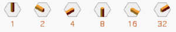

+++
title = "The Garden of Odin"
description = "An Odin implementation of an abstract board game."
date = "2024-09-01"
+++

In an escape from the worries of life, I have been reading recently into the [Odin programming language](https://odin-lang.org). I wanted to learn something that is closer to the metal than Rust, and Odin seems nice.

For a project to do with the language, I figured I would build a library for the abstract board game [Domnions, by Christian Freeling](https://mindsports.nl/index.php/the-pit/526-dominions). ([Sensei's Library link](https://senseis.xmp.net/?Dominions)). The game can be described as a Go variant with distinct pieces, as opposed to Go itself where every "piece" is identical.

The game is *weird*. It is much less known than Freeling's other games like Havannah (for which I wrote [an implementation for in Rust](https://github.com/asibahi/w9l)) and Grand Chess (which I designed and built a physical set for). Even Freeling himself does not put much stock into it, and is more interested in the tile set itself (which he calls [the China Labyrinth](https://mindsports.nl/index.php/puzzles/tilings/china-labyrinth/), even though they have nothing to do with China) than the game. He made other games with the tile set which you can find by browsing his site.

In code and my handwirtten notes, I call the tile set **Bustan**: Arabic for Garden (hence the name of this article). Variety, branches, paths, and fences all make gardens seem like an appropriate metaphor for what is going on.

This is the sample game Freeling posted on his website:


I am writing this post as a way to organize my thoughts on how to represent the game in code. It is a semi organized, semi-chronologically-sorted brain dump: I am writing it as I iterate over the code. I will be talking mostly about how to represent the game in code form, leaving the rules for later. The end result can be found in the git history of the [`bustan` repositry](https://github.com/asibahi/bustan).

## Tiles

The most intriguing feature of Dominions, for me, is the tiles. There are many tile sets and game piece sets in the world of games: chess, dominoes, mahjong, playing cards, tarot. Dominions tiles are such a set.


Each tile defines how it connects to its neighbors. They do not rotate, but they can be flipped to change controller (which is how capture happens in the game). A full set of tiles, pictured above, has 64 shapes.

A clever Id/numbering scheme for the tiles is described by Freeling.



Each side is assigned a power of two. So each piece unique id is simply the sum of which sides it connects. Binary system! 

Each player starts the game with the full set of tiles, minus the Blank, the Zero-Tile, as it does not have a role in the game. So each tile has also, an owner.

During the game, control of tiles can be flipped from the owner to the opponent. After all one wins the game by controlling more tiles.

All this neatly fits into a `u8`! And Odin has bitsets native into the language. When I was asking questions in Odin's discord, Ginger Bill (BDFL of Odin) suggested this structure.

```odin
// 0b 0 0 _ 0 0 0 _ 0 0 0
//    | |   | | |   | | | 
//    | |   | | |   | | Top_Right
//    | |   | | |   | Right
//    | |   | | |   Btm_Right
//    | |   | | Btm_Left
//    | |   | Left
//    | |   Top_Left
//    | Owner_Is_Host
//    Controller_Is_Host
// 
// the two players are Guest and Host. Guest starts.

Tile_Flag :: enum u8 {
    Top_Rght,
    Right,
    Btm_Right,
    Btm_Left,
    Left,
    Top_Left,
    Owner_Is_Host,
    Controller_Is_Host,
}
Tile :: distinct bit_set[Tile_Flag;u8]
```

The game starts with 126 unique tiles. Guest starts with the tiles `0b00_000_001` to `0b00_111_111` (or neatly in Octal: `0o001` to `0o077`). Host starts with the tiles `0b11_000_001` to `0b11_111_111` (`0o301` to `0o377`). The highest bit may flip during the game.

```odin
// ^ is the pointer operator in Odin.
// ~ is bitwise XOR.
tile_flip:: proc(t: ^Tile) {
    t^ ~= Tile{.Controller_Is_Host}
}
```

## Board Representation

Here is where I go back and forth into reading Red Blob Games's [excellent guide to Hexagonal boards](https://www.redblobgames.com/grids/hexagons/).

The board of Dominions is a 9-sided hexagon. 217 cells. Ignoring tile placement restrictions for now, how to actially place tiles onto the board? 

I oscillated (heh) between a few ideas, but eventually settled on a giant big array of `[217]Tile`, where an empty cell has the value `0`[^1]. To calculate offsets, I adapted the functions declared in the Red Blob article, and started with this neat loop (`N`, `CENTER`, and `CELL_COUNT` are compile-time constants based on the board's size):

[^1]: As mentioned earlier, the Blank tile is not used in the game. This permits using a sentinel value of `0` (or really any value with the smallest six bits set to `0`) to mark an empty cell. Since Tiles are a `u8` bitset anyway, why waste memory on pointers (which are wider), or `Maybe`, which is at least an extra byte in size? I am not thinking *too* hard about performance (I know nobody will use this), but it is an interesting constraint to keep in mind.

```odin
Board :: [CELL_COUNT]Tile

board_get_tile :: proc(back: ^[CELL_COUNT]Tile, hex: Hex) -> (^Tile, bool) {
    if hex_distance(hex, CENTER) > N {
        return nil, false
    }

    // From RedBlob on representing Hexagonal boards with an array of arrays:
    // Store Hex(q, r) at array[r][q - max(0, N-r)]. Row r size is 2*N+1 - abs(N-r).
    // this loop calculates r's offset.

    q, r := hex[0], hex[1]

    r_len := 0
    for r_idx in 0 ..< r {
        r_len += 2 * int(N) + 1 - abs(int(N - r_idx))
    }

    idx := r_len + int(q - max(0, N - r))
    return &back[idx], true
}
```

But having this loop run every time I make a look up is .. uncertain at best. So I decided to hardcode the row offsets:

```odin
board_get_tile :: proc(back: ^[CELL_COUNT]Tile, hex: Hex) -> (^Tile, bool) {
    if hex_distance(hex, CENTER) > N {
        return nil, false
    }

    q, r := hex[0], hex[1]

    r_len := 0
    switch r {
        case  0:
        case  1: r_len =   9
        case  2: r_len =  19
        case  3: r_len =  30
        case  4: r_len =  42
        case  5: r_len =  55
        case  6: r_len =  69
        case  7: r_len =  84
        case  8: r_len = 100
        case  9: r_len = 117
        case 10: r_len = 133
        case 11: r_len = 148
        case 12: r_len = 162
        case 13: r_len = 175
        case 14: r_len = 187
        case 15: r_len = 198
        case 16: r_len = 208
    }

    idx := r_len + int(q - max(0, N - r))
    return &back[idx], true
}
```

This has the advantage of being "clean", with no wasted place in the array for unused coordinates.[^2] Cell lookup is O(1): when checking a cell, it is imperative to check its neighbors quickly to verify legal moves.

[^2]: I should be careful not to index into `Board` directly, however.

A separate data structure would be needed to track the tiles in player's hands (not in play yet).

An alternative idea is to represent `Tile` itself by a struct, that holds data whether the tile is in play, and if so its location on the board. However, the only way to quickly query the tile's neighbors is to iterate over every tile at every check to know where it is. Might as well stuff them all in an array.

## Hand 

Following the same idea from representing the board, Hands are better implemented as a fixed array. Initializing a full set of hands for both players by transmuting a `u8` into a `Tile`. *That is* why I wanted `Tile`s to be `u8`s to begin with!! 

```odin
HAND_SIZE :: 63
Hand :: distinct [HAND_SIZE]Tile

hands_init :: proc() -> (guest: Hand, host: Hand) {
    for i in 0 ..< u8(HAND_SIZE) {
        guest[i] = transmute(Tile)(i + 0o001)
        host[i]  = transmute(Tile)(i + 0o301)
    }

    return
}
```

Also, to check the legality of move, the player has to have the tile available to play, so I defined a couple of helper ~~methods~~ procedures.

```odin
hand_has_tile :: proc(hand: Hand, id: u8) -> bool {
    assert(0 < id, "Blank Tile is not playable")
    assert(id <= HAND_SIZE, "Tile is impossible")

    return !tile_is_empty(hand[id - 1])
}

hand_get_tile :: proc(hand: ^Hand, id: u8) -> (Tile, bool) {
    if !hand_has_tile(hand^, id) do return nil, false

    ret := hand[id - 1]
    hand[id - 1] = {}
    return ret, true
}
```

About here, I thought I would like to test my logic. So I took advantage of Odin's testing framework with a couple of simple asserts. Note that I put these in the same file as the procedures they test, and they worked just fine. They are all prefixed with `test_*` not to pollute the autocompletion too much.

```odin
import "core:testing"

@(test)
test_hand_get_tile :: proc(t: ^testing.T) {
    w, _ := hands_init()

    tile: Tile
    ok: bool

    // should be successful
    tile, ok = hand_get_tile(&w, 63)
    testing.expect(t, !tile_is_empty(tile))
    testing.expect(t, ok)

    // should fail. tile was emptied
    tile, ok = hand_get_tile(&w, 63)
    testing.expect(t, tile_is_empty(tile))
    testing.expect(t, !ok)
}
// other tests go here
```

After that, I figured I would make sure for every weird logic I make I'd have to write a bunch of tests to .. test it, and sanity check my code.

## *The* Game Object - First Draft

Now that I have the basic, naïve framework of the game's representation, I started looking into it from the other side: top down.

Looking at different game libraries, to see which API they provide and how they allow their users to interact with the internal rules engine. The [shakmaty crate](https://docs.rs/shakmaty/latest/shakmaty/) has been of great help in the past, as well as the [goban crate](https://docs.rs/goban/0.18.1/goban/). JaniM from the Rust discord also shared with me their [Variant Go Server](https://github.com/JaniM/variant-go-server). I also looked back at my [Havannah implementation](https://github.com/asibahi/w9l) which I did last year to remember how I structured things. (Maybe I'd tool both into WASM modules. How about that?)

Most of these structure their API around a specific object: the *Game* object, which is interacted with by querying legal moves, making moves, and, optionally, undoing moves. That's it. The Game object tracks the state of all elements in the game.

The most straightforward way to do that is a struct. I do not really know if this is the "optimal" arrangment of fields, but I am doing what makes sense to me.

```odin
Player :: enum u8 {
    Guest, // White. Goes first.
    Host,  // Black
}

Status :: enum u8 {
    Ongoing,
    Guest_Win,
    Host_Win,
    Tie,
}

// The Object of attention
Game :: struct {
    board:                 Board,
    to_play:               Player,
    status:                Status,
    guest_hand, host_hand: Hand,
    // ... more to come
}
```

To inquire about moves, a `Move` struct is needed[^3]. A move is simply a placement of a `Tile` on `Hex`. Whose tile and whose turn are ideally tracked and verified by the Game object.

[^3]: I love that `move` is not a keyword here, which is really annoying in Rust.

```odin
Move :: struct {
    hex:  Hex,
    tile: Tile,
}
```

This misses one big thing: Groups. Dominions is a game of territory, based on Go. Tiles together make Groups. Groups have liberties, which they live and die of. Groups capture other Groups. The winner is the player with bigger Groups. Groups are importamt.

## Bitboards

Before talking about Groups, [Bitboards](https://en.wikipedia.org/wiki/Bitboard) warrant an introduction.

Bitboards are, at their core, based on a simple observations: a chessboard has 64 squares, and a `u64` has 64 bits. By tying each bit address to a specific square, *any* binary value can be mapped.

In chess implementations: There is a bitboard (read: a `u64`) to mark where all the White pieces are. There is another bitboard to mark where all the squares the Queen sees are.

The other advantage of bitboards is that, since they are just bits, they have bit operations. With a bitboard showing the white pieces are and a bitboard showing where black's pieces can move next turn: just `AND` them together and there is now a new bitboard of which pieces of white are under attack. They are small, simple integers, and operating on them is as easy as integers. 

Unfortunately, however, the Dominions board is decidedly *not* 64 cells, or any such convenient number. It is 217 cells. It would be possible to represent the whole board with a 217bit integer, should it exist, but the largest bit set Odin provides is 128 bits. But have no fear! An array of 7 bit sets can solve the problem, as 7 `u32` integers can fit the needed 217 bits and more (namely 224 bits). This is as small as can be. Thanks to Odin's array programming (which is also taken advantage of for Hex math), using bitwise operations on these bitboards is as easy as they are on usual bitsets. The additional 7 bits can be used for metadata, as well.

```odin
Bitboard :: distinct [7]bit_set[0 ..< 32;u32] // 7 * 32 = 224
PLAY_AREA: Bitboard : {~{}, ~{}, ~{}, ~{}, ~{}, ~{}, ~{25, 26, 27, 28, 29, 30, 31}}
DATA_AREA: Bitboard : {{}, {}, {}, {}, {}, {}, {25, 26, 27, 28, 29, 30, 31}} // Extra bits for metadata

// helper procedure for common maths 
@(private = "file")
bit_to_col_row :: proc(bit: int) -> (col, row: int) {
    col = bit % 32
    row = bit / 32
    return
}

bb_set_bit :: proc(bb: ^Bitboard, bit: int) {
    // assert here to allow an unchecked version for meta data
    assert(0 <= bit && bit < CELL_COUNT)
    col, row := bit_to_col_row(bit)
    bb^[row] |= {col}
}

bb_get_bit :: proc(bb: Bitboard, bit: int) -> bool {
    col, row := bit_to_col_row(bit)
    return col in bb[row]
}
```

Not to get ahead of the topic, but merging two of these bitboards (bitwise `OR`) is now as simple as this:

```odin
group_capture :: proc(blessed, cursed: ^Group) {
    // ----- snipped
    blessed.tiles |= cursed.tiles // `tiles` field is a Bitboard
    // ----- snipped
}
```

As an addition, I implemented an iterator over the set bits in `Bitboard`. Odin has nice syntax to iterate over the set flags in a bitset, but an array of bitsets presents a logistical challenge. I hacked at it for a couple of hours and came up with the following. Odin's implementation of iterators is, all considered, fairly easy.

```odin
// The State machine
Bitboard_Iterator :: struct { 
    bb:   Bitboard,
    next: int,
}
bb_make_iter :: proc(bb: Bitboard) -> (it: Bitboard_Iterator) {
    it.bb = bb & PLAY_AREA
    return
}

// The iterator procedure
bb_iter :: proc(it: ^Bitboard_Iterator) -> (item: Hex, idx: int, ok: bool) {
    for i in it.next ..< CELL_COUNT {
        if bb_get_bit(it.bb, i) {
            item = hex_from_index(i)
            idx = i
            it.next = i + 1
            ok = true
            return
        }
    }

    return
}

// And it is used such:
bbi := bb_make_iter(bitboard_from_somewhere)
for hex, idx in bb_iter(&bbi) {
    // do something with this hex or its corresponding index
}
```

With the help of the Hex to Index math mentioned earlier in `Board` (and I have by now extracted it to another procedure), each bit in the bitboard can be quickly mapped to its corresponding Hex.

Which would bring the topic back to Groups, but there is another detour.

## Slotmaps

In my implementation of Havannah (linked earlier), I used the `slotmap` Rust crate to track groups. Odin does not have a slotmap[^4] in its core library. There is [a sample showcase implementation by Ginger Bill](https://gist.github.com/gingerBill/7282ff54744838c52cc80c559f697051), but I wanted to try my hand at this FFI thing. With help from the Rust and Odin discords to navigate the FFI of both languages, I did the following, and it works! Almost statically typechecked from both sides, too.

[^4]: Generational arena, generational handles, handle-based map, a rose by any other name.

```rust
use slotmap::{DefaultKey, Key, KeyData, SlotMap};

// The Rust code does not need to manipulate the object in anyway.
// Type erased `*mut c_void` is all Rust knows: only a pointer.
type SmItem = *mut core::ffi::c_void;
type SmPtr = *mut SlotMap<DefaultKey, SmItem>;

#[no_mangle]
pub extern "C" fn slotmap_init() -> SmPtr {
    let sm = Box::new(SlotMap::<_, SmItem>::new());
    Box::into_raw(sm)
}

#[no_mangle]
pub unsafe extern "C" fn slotmap_destroy(sm: SmPtr) {
    _ = unsafe { Box::from_raw(sm) };
}

#[no_mangle]
pub unsafe extern "C" fn slotmap_insert(sm: SmPtr, item: SmItem) -> u64 {
    let Some(sm) = (unsafe { sm.as_mut() }) else {
        return 0;
    };
    let handle = sm.insert(item);
    handle.data().as_ffi()
}

#[no_mangle]
pub unsafe extern "C" fn slotmap_contains_key(sm: SmPtr, key: u64) -> bool {
    let Some(sm) = (unsafe { sm.as_mut() }) else {
        return false;
    };
    let key = DefaultKey::from(KeyData::from_ffi(key));
    sm.contains_key(key)
}

#[no_mangle]
pub unsafe extern "C" fn slotmap_get(sm: SmPtr, key: u64) -> SmItem {
    let Some(sm) = (unsafe { sm.as_mut() }) else {
        return core::ptr::null_mut();
    };
    let key = DefaultKey::from(KeyData::from_ffi(key));
    let ret = sm.get(key);
    *ret.unwrap_or(&core::ptr::null_mut())
}

#[no_mangle]
pub unsafe extern "C" fn slotmap_remove(sm: SmPtr, key: u64) -> SmItem {
    let Some(sm) = (unsafe { sm.as_mut() }) else {
        return core::ptr::null_mut();
    };
    let key = DefaultKey::from(KeyData::from_ffi(key));
    sm.remove(key).unwrap_or(core::ptr::null_mut())
}
```

And after compiling this to a `staticlib`, do this from the Odin side:

```odin
foreign import slotmap "deps/slotmap/libslotmap.a"
import "core:c"

Slot_Map :: distinct rawptr
Sm_Key :: distinct c.uint64_t
Sm_Item :: ^Group

foreign slotmap {
    slotmap_init         :: proc() -> Slot_Map ---
    slotmap_destroy      :: proc(sm: Slot_Map) ---
    slotmap_insert       :: proc(sm: Slot_Map, item: Sm_Item) -> Sm_Key ---
    slotmap_contains_key :: proc(sm: Slot_Map, key: Sm_Key)   -> c.bool ---
    slotmap_get          :: proc(sm: Slot_Map, key: Sm_Key)   -> Sm_Item ---
    slotmap_remove       :: proc(sm: Slot_Map, key: Sm_Key)   -> SmItem ---
}
```

Odin's type system allows a `rawptr` to really be cast to .. any pointer. So here all the types I *know* are the same, regardless of C's type erasure, are marked with the same alias. Even though, as far as the C ABI is concerned, both `Slot_Map` and `Sm_Item` are `rawptr`s, but *I* know the difference. Conveniently, `Sm_Item` can now be easily derefrenced to get the underlying Group without casting.

Having done that, and as much as I am pleased with myself for getting this to work, I do not like that the keys are `u64`s. They are *large*: much larger than any number of groups/indices required. Even in the unlikely event of each tile placed forming its own group, there would be a maximum of 126 groups (2 x 63). Eight bits would be enough to have a unique key for every possible group in the game. Something to optimize later, perhaps?

## Groups, and Game Object - Second Draft

A group is, simply, two bitboards:

```odin
Group :: struct {
    tiles:     Bitboard,
    liberties: Bitboard,
}
```

Each group keeps track of its location (which hexes it occupies) and its liberties. A group's size and liberty count is calculated by calculating the cardinality of the respective bitboards.

```odin
bb_card :: proc(bb: Bitboard) -> (ret: int) {
    temp := bb & PLAY_AREA
    for i in 0 ..< 7 {
        ret += card(temp[i])
    }
    return
}

group_size :: proc(grp: ^Group) -> int {
    return bb_card(grp.tiles)
}


group_life :: proc(grp: ^Group) -> int {
    return bb_card(grp.liberties)
}
```

To track groups, two fields are added to the Game Object: one for each player. Additionally, a "Group Map" of sorts might be needed to quickly look up the group any cell belongs to. (This is the initial idea, but keeping all these things in sync seems daunting. There could be a better design that is only revealed with a conrete implementation.)

Revisiting the `Game` struct from before:

```odin
Game :: struct {
    board:                 Board,
    to_play:               Player,
    status:                Status,
    last_move:             Maybe(Move), // <-- I will get to that
    guest_hand, host_hand: Hand,
    groups_map:            [CELL_COUNT]Sm_Key,
    guest_grps, host_grps: Slot_Map,
}
``` 

Note that the score is not recorded here. As with many aspects of this design, I am currently unsure if it something should be tracked and updated individually with each move, or something calculated from the game state at any given moment.

There is also no history tracking, which needs lists of `Move`s and past  `Board`s and `Hand`s. The slotmap, being currently the only heap allocation, complicates undoing moves trivially, so a new `Game` object would be constructed from past raw data of boards and games. I decided to ignore history tracking for now.

```odin
// A player's territory consists of the number of their pieces
// on the board minus the number of pieces they didn't place.
game_get_score :: proc(game: ^Game) -> (guest, host: int) {
    for tile in game.board {
        (!tile_is_empty(tile)) or_continue
        if .Controller_Is_Host in tile {
            host  += 1
        } else {
            guest += 1
        }
    }
    for tile in game.guest_hand {
        if !tile_is_empty(tile) do guest -= 1
    }
    for tile in game.host_hand {
        if !tile_is_empty(tile) do host  -= 1
    }
    return
}
```

Now the game state and its metadata at any given point are neatly encoded, it is time to start thinking about how to make moves, and how to check their legality.

## The Game Rules

So far, I made no mention of the game's rules, only talking about its physical properties: the tiles, the board, the game zones. But players cannot place Tiles where they choose: here are the rules summarized for your convenience:


### Tiles

- Each **Tile** has a specific set of sides it can connect to, encoded, visually, on the Tile itself.
- Each Tile *must* match its neighboring Tiles in connections. **Connected** sides must match and **Separated** sides must match.
- Board edges are cosidered neutral Separateds.

### Groups

- A **Group** is one or more Tiles of the same color (Controller) that are connected together. Adjacencies on Separated sides do not count.
- The **Liberties** of a Group are its Connected sides border empty cells.
- If a Group loses its last Liberty, it is captured, and all its tiles are flipped (switched Controller).

### The Structure

- The **Structure** is the collective name of all the connections together, in the whole board, *regardless of Controller*.
- Disconnected parts of the Structure are called **Sections**, created as Tiles are placed on Separated adjacencies. A single Section can include multiple Groups (but a Group cannot belong to multiple Sections).

### Placement

*Finally*

- Bears repeating: A Tile can only be placed where it matches its neighboars in Connected and Separated sides.
- Firstly, the Guest, first player, starts by placing any Tile anywhere.
- Afterwards, a Tile can only be placed *adjacent to an enemy Tile*, with one exception.
- A Tile can be placed where it is not adjacent to an enemy Tile *if and only if* it is extending a Group that is a whole Section.
- Suicide is legal. Player may place a Tile so it has no Liberties (by matching its Liberties to enemy Tiles), and is therefore immediately captured.
- Lastly, it is illegal to cause **Oscillation**: a Section which has no Liberties. [^5]
- A Player may, instead of placing a Tile, pass the turn instead. Or if they have no legal moves, they *must*.

[^5]: It is *Oscillation* because the resulting Group has no Liberties, and therefore has no clear Controller, so it *oscillates* between both colors. This is way the Blank tile has no role in the game: it automatically oscillates. 

### Scoring

- The Game ends when both players pass consecutively.
- The winner is the Player with the highest score.
- The score is the amount of Tiles controlled on the boad *minus* the Tiles still in Hand.

## Moves, and Game Object - Third Draft

Back to code. As a refresher, here is `Move`:

```odin
Move :: struct {
    hex:  Hex,
    tile: Tile,
}
```

That is all a `Move` is: the player whose turn it is (as tracked by `Game`) places a `Tile` from their hand into a `Hex`, and from there follows that groups get updated and tiles get flipped and game progresses.

But as a player may (or may have to) pass the turn, and as the game ends with two successive passes, `last_move` is registered in `Game` to track whether the game is about to end.[^6]

[^6]: Technically, only a record of whether the last move *was* a pass is needed, but `last_move` is semantically clearer than a `last_move_was_a_pass` (or `pass_ends_the_game` or `the_end_is_nigh`) boolean or a `player_who_last_made_a_move` enum field. It may also be useful to highlight the last move in a GUI.

To play the game, `Game` needs to have the following:

- A way to make the move
- A way to query if a move is legal
- A way to query the list of legal moves

Perhaps the most straightforward way to do it is to have `game_make_move` do *all* the work. It updates the game state, naturally, but also (based on said game state) update an embedded list of legal moves in `Game` itself. And then to check if a move is legal, simply query the embedded list of moves. Here is what `Game`, and the skeleton of `game_make_move`, look like now:

```odin
Game :: struct {
    board:                 Board,
    to_play:               Player,
    status:                Status,
    last_move:             Maybe(Move),

    guest_hand, host_hand: Hand,

    groups_map:            [CELL_COUNT]SmKey,
    guest_grps, host_grps: SlotMap,

    legal_moves:           [dynamic]Move,
}

game_make_move :: proc(game: ^Game, try: Maybe(Move)) -> bool {
    (game.status == .Ongoing) or_return // Game is over.
    move, not_pass := try.?

    // legal move check
    (!not_pass ||
        slice.contains(game.legal_moves[:], move) ||
        board_is_empty(&game.board)) or_return

    defer if game.status == .Ongoing {
        switch game.to_play {
        case .Guest: game.to_play = .Host
        case .Host:  game.to_play = .Guest
        }
        game.last_move = move
        game_regen_legal_moves(game)
    }

    if !not_pass {     // Pass
        if game.last_move == nil {     // Game ends
            guest, host := game_get_score(game)
            if guest > host do game.status = .Guest_Win
            else if guest < host do game.status = .Host_Win
            else do game.status = .Tie
        }
        return true
    }

    active_hand: ^Hand

    switch game.to_play {
    case .Guest: active_hand = &game.guest_hand
    case .Host:  active_hand = &game.host_hand
    }

    // Make move. Already known to be legal!!
    hand_tile, removed := hand_remove_tile(active_hand, move.tile)
    assert(removed) // but verify
    game.board[hex_to_index(move.hex)] = hand_tile
    move.tile = hand_tile // probably superfluous.

    // TODO: update game state

    return true
}

@(private)
game_regen_legal_moves :: proc(game: ^Game) {
    clear(&game.legal_moves)

    // TODO: build them again
}
```

The two `TODO`s left are probably the meat of this whole engine. It is clearer to write them out in steps, in English, before encoding them into code.

## Updating the Game State

The key observation, I think, is that the game state change starts from the where the last move is played. No need for a global search process, but only the exact Hex being played and the surrounding groups.

### `group_section_init`

The simplest, and shortest, game state change that is not a Pass, is a Tile that starts its own Section. This happens in two occasions: the first move, and whenever a Tile is only adjacent to other tiles via its Separated sides. This Tile by definition also starts a new Group. This procedure assumes it is only called when a move is legal.

```odin
@(private)
group_section_init :: proc(move: Move, game: ^Game) -> (ret: Group, ok: bool = true) {
    // Check that all Connected sides connect to empty tiles.
    // AND find Liberties
    for flag in move.tile & CONNECTION_FLAGS {
        neighbor := move.hex + flag_dir(flag)

        t, in_bounds := board_get_tile(&game.board, neighbor)
        if in_bounds {
            tile_is_empty(t^) or_return
            bb_set_bit(&ret.liberties, hex_to_index(neighbor))
        }
    }

    bb_set_bit(&ret.tiles, hex_to_index(move.hex))
    // CELL_COUNT is where the Extended flag is.
    bb_set_bit_unchecked(&ret.liberties, CELL_COUNT)

    return
}
```

And in `game_make_move` :

```odin
if grp, ok := group_section_init(move, game); ok {
    grp := new_clone(grp)
    key := slotmap_insert(game.host_grps, grp)
    game.groups_map[hex_to_index(move.hex)] = key
} 
```

### `group_attach_to_friendlies`

The second easiest to deal with is a Tile that only connects to Groups of its own color. But there are a few variations

- *Extension*: The Tile may only extend one Group
- *Merge*: The Tile may merge two friendly Groups into one.
- *Suicide*: The Tile may consume the remaining Liberties of the Group(s) it connects to, Suiciding the whole Group. In which case the newly formed Group is captured (flipped) as a whole, and merged with the surrounding enemy Group(s).

The last case is interesting. Note that Move legality is checked earlier, so on principle, it is *known* that the newly formed enemy Group has at least one Liberty left.

A funny observation here is that it is impossible for a Tile that *only connects to friendlies* to Capture an enemy Group, but it is entirely possible that is causes its own Group to be immediately captured.

An easy check to whether this move is a Suicide is to check whether the new Tile has any Liberties of its own. For example: if it has 2 Connections and is connected to a friendly Group from only one side of the two, and the other Connection is to an empty cell, then it is obviously *not* a Suicide.

Ergo, the procedure for extension or merging is as follows. It turned *way* longer than I expected.

```odin
@(private)
group_extend_or_merge :: proc(move: Move, game: ^Game) -> (ok: bool = true) {
    // Bug tracker
    tile_liberties_count := card(move.tile & CONNECTION_FLAGS)

    // Friendliness tracker
    tile_control := move.tile & {.Controller_Is_Host}

    // Scratchpad: Found Groups
    nbr_friend_grps: [6]Sm_Key
    nfg_cursor:      int

    // Scratchpad: New Liberties
    new_libs:    [6]Hex
    libs_cursor: int

    for flag in move.tile & CONNECTION_FLAGS {
        neighbor := move.hex + flag_dir(flag)
        nbr_tile := board_get_tile(&game.board, neighbor) or_continue

        if tile_is_empty(nbr_tile^) {
            new_libs[libs_cursor] = neighbor
            libs_cursor += 1
        } else if nbr_tile^ & {.Controller_Is_Host} == tile_control {
            // Same Controller
            tile_liberties_count -= 1

            // record Group of neighbor tile.
            key := game.groups_map[hex_to_index(neighbor)]
            if !slice.contains(nbr_friend_grps[:], key) {
                nbr_friend_grps[nfg_cursor] = key
                nfg_cursor += 1
            }
        } else {
            // Different Controller
            return false
        }
    }
    assert(
        tile_liberties_count >= 0, 
        "if this is broken there is a legality bug"
    )
    assert(
        nfg_cursor > 0, 
        "This proc should not be called with no friendly neighbors"
        )
    // and if this is false then this might be a Suicide
    (tile_liberties_count > 0) or_return   

    // == Are we the Baddies?
    friendly_grps: Slot_Map
    if tile_control == {} {
        friendly_grps = game.guest_grps
    } else {
        friendly_grps = game.host_grps
    }

    // == Identify first group
    blessed_key := nbr_friend_grps[0]
    assert(slotmap_contains_key(friendly_grps, blessed_key))
    blessed_grp := slotmap_get(friendly_grps, blessed_key)
    bb_set_bit(&blessed_grp.tiles, hex_to_index(move.hex))

    // == Merge other groups with first group
    for i in 1 ..< nfg_cursor {
        assert(slotmap_contains_key(friendly_grps, nbr_friend_grps[i]))
        grp := slotmap_remove(friendly_grps, nbr_friend_grps[i])
        defer free(grp)

        blessed_grp.tiles |= grp.tiles

        // Only if both Groups are extendable is the new one extendable
        play_area := PLAY_AREA & (blessed_grp.liberties | grp.liberties)
        data_area := DATA_AREA & (blessed_grp.liberties & grp.liberties)
        blessed_grp.liberties = play_area | data_area
    }

    // == Update liberties
    bb_unset_bit(&blessed_grp.liberties, hex_to_index(move.hex))
    for l in 0 ..< libs_cursor {
        bb_set_bit(&blessed_grp.liberties, hex_to_index(new_libs[l]))
    }

    // == Update the groupmap
    bbi := bb_make_iter(blessed_grp.tiles)
    for _, idx in bb_iter(&bbi) {
        game.groups_map[idx] = blessed_key
    }

    // this should be all.

    return
}
```

Now, what to do if it *is* a potential suicide? First of all, it is not possible to know whether it is a suicide or not without doing everything already done in `group_extend_or_merge` anyway. If it were a Suicide, the final, collasced Group would have no Liberties, and therefore it would be an easy decision to simply flip its Controller and swap its allegiance.

The problem lies in how to merge it with its capturing Group(s). It needs to be merged to maintain an accurate count of Liberties, as the count of Liberties is clearly being used to test whether it needs to be captured or not!! (Not in *this* move. but in subsequent ones.)

The naïve approach is to iterate over every Tile member of the Group and every Connection of said Tile, and compile a list of opponent-controlled neighbors, then check the Group membership of *those* Tiles, (similarly to how `nbr_friend_grps` is used,) then do the merging routine again, but this time for the opponent.

The *other* naïve approach is to add a third `Bitboard` to `Group` to track its surrounding enemies and just iterate over those.

Both solutions bother me for different reasons. The first seems like a time and CPU cycle waste (as I am already iterating over the same Tile's flags multiple times ..), and the second seems adds an extra knob to keep track of.

## Rethinking Groups

One idea to explore is to change `Group`'s representation entirely, away from Bitboards. (Yes I spent a lot of time talking about Bitboards, and they're really cool, but hear me out). Throughout the program, the state of the game has been tracked through a number of `[CELL_COUNT]` arrays, of variable things, with trivial conversion from a human-readable `Hex` to an index within these arrays. So what's another `[CELL_COUNT]` array? But what would it be an array *of*?

Currently, as far as a Group is concerned, a location can be one of three states: Either a member Tile, a Liberty, or an enemy Connection. That is an enum! More things can be added to it later as needed.

```odin
Hex_State :: enum u8 {
    Empty            = 0b000, // numbers chosen for a reason
    Liberty          = 0b001,
    Enemy_Connection = 0b011,
    Member_Tile      = 0b111,
}
```

And this how the `Group` using this enum would look like:

```odin
Rethought_Group :: struct {
    state:      [CELL_COUNT]Hex_State,
    extendable: bool, // sadly no clean niche to hide that
}
```

Much cleaner! Surprisingly, Odin allows bitwise OR over enumerations.[^7] If the resulting value has no tag assigned, it becomes a `BAD_ENUM_VALUE` and may potentially wreck the program. But if the numbers are assigned appropraitely, it can be made to always have a valid value.

[^7]: Rust would *totally* yell at me. Then tell me to implement the trait to define the behavior myself.

Thinking through this, it is clear that `.Empty` with any other tag should be, well, that other tag. `.Liberty`, being essentially an empty cell as well, with any of the other two tags should produce the other tag. `.Member_Tile` and `.Enemy_Connection` overlap when capturing groups, so Enemies should be converted to Members. Here is the printed `OR` table:

```
          Empty   Liberty   Enemy   Member

Empty     Empty   Liberty   Enemy   Member
Liberty ------>   Liberty   Enemy   Member
Enemy   ---------------->   Enemy   Member
Member  ------------------------>   Member
```
Great. Looks good to me. Let's roll with it. This is how `Group` works now. Should I need more states I shall think of other clever numbers to use. Then follow the compiler's erros about missing fields and correct those as needed.

Compiler driven development !!

## Back to Updating Game State

### Back to `group_attach_to_friendlies`

This above change makes the merging process much simpler. It also allowed me to delete the entire `bitboard.odin` file! Following the compiler's errors leads me to this version of `group_extend_or_merge`:

```odin
@(private)
group_extend_or_merge :: proc(move: Move, game: ^Game) -> (ok: bool = true) {
    // ----- snip: same as before, for now.

    // == Identify first group
    blessed_key := nbr_friend_grps[0]
    assert(slotmap_contains_key(friendly_grps, blessed_key))
    blessed_grp := slotmap_get(friendly_grps, blessed_key)
    blessed_grp.state[hex_to_index(move.hex)] = .Member_Tile

    // == Merge other groups with first group
    for i in 1 ..< nfg_cursor {
        assert(slotmap_contains_key(friendly_grps, nbr_friend_grps[i]))
        grp := slotmap_remove(friendly_grps, nbr_friend_grps[i])
        defer free(grp)

        blessed_grp.state |= grp.state
        blessed_grp.extendable &= grp.extendable
    }

    // == Update liberties
    for l in 0 ..< libs_cursor {
        blessed_grp.state[hex_to_index(new_libs[l])] |= .Liberty
    }

    // == Update the groupmap
    for slot, idx in blessed_grp.state {
        if slot == .Member_Tile do game.groups_map[idx] = blessed_key
    }

    return
}
```

Now, merging groups membership and liberties also merges their enemy connections as well. No additional bookkeeping! The check for potential Suicide earlier can now be removed, and writing this (larger and larger) procedure can continue:

```odin
    // ----- snip: same as before + declaring pointers to enemy groups

    // == Update liberties
    for l in 0 ..< libs_cursor {
        blessed_grp.state[hex_to_index(new_libs[l])] |= .Liberty
    }

    if tile_liberties_count == 0      // Potential Suicide
       && group_life(blessed_grp) == 0 // Definite Suicide
    {
        // no insertion into the enemy slotmap .. there is merging to be done!
        cursed_grp := slotmap_remove(friendly_grps, blessed_key)
        defer free(cursed_grp)

        // Scratchpad 
        nbr_enemy_grps := make([dynamic]Sm_Key)
        defer delete(nbr_enemy_grps)

        for loc, idx in cursed_grp.state {
            #partial switch loc {
            case .Member_Tile:
                tile_flip(&game.board[idx])
            case .Enemy_Connection:
                key := game.groups_map[idx]
                if !slice.contains(nbr_enemy_grps[:], key) {
                    append(&nbr_enemy_grps, key)
                }
            }
        }
        // == same steps as before
        assert(len(nbr_enemy_grps) > 0) // or there is Oscillation
        blessed_key = nbr_enemy_grps[0]

        assert(slotmap_contains_key(enemy_grps, blessed_key))
        blessed_grp = slotmap_get(enemy_grps, blessed_key)

        blessed_grp.state |= cursed_grp.state

        for i in 1 ..< len(nbr_enemy_grps) {
            assert(slotmap_contains_key(enemy_grps, nbr_enemy_grps[i]))
            grp := slotmap_remove(enemy_grps, nbr_enemy_grps[i])
            defer free(grp)

            blessed_grp.state |= grp.state
        }

        // check if blessed_grp is extendable
        extendable := true
        for loc in blessed_grp.state {
            if loc == .Enemy_Connection {
                extendable = false
                break
            }
        }
        blessed_grp.extendable = extendable
    }

    // == Update the groupmap
    for slot, idx in blessed_grp.state {
        if slot == .Member_Tile do game.groups_map[idx] = blessed_key
    }

    return
}
```

Change the procedure's name to `group_attach_to_friendlies`, and *now* it is done. All this merging logic should really be refactored and `DRY`'d, but I will let it be for now. This one procedure end up about 130 lines of code.

### `group_attach_to_enemies`

Similarly to attaching to friendlies, this move can either be a nothing, a capture, or a suicide. The logic of the `friendlies` procedure might need to be repeated in this one. And the checks done and the data collected would also need to be repeated. 

So why separate it at all? The idea was it would simplify handling, but it does not seem to do that. So, rethinking the move handling, allow me to try summarising the logic that *actually* needs to be done (this was revised in tandem with writing the code in the next section):

1. Create these trackers:
    1. Liberties of the newly placed tile,
    2. Neighboring, connected Friendlies (tracking Groups), and
    3. Neighboring, connected Enemies (tracking locations).
2. Iterate over all Connected Sides of the newly placed tile, and fill in the trackers as needed,
3. For every Friendly connected Group, merge them together. (If none are connected, the Tile starts its own Group with marked Liberties and Enemy neighbors.) Mark this group as "Blessed".
4. Iterate over neighboring Enemy Groups, if any have a Liberty count of 0: [^8]
    1. They are flipped and merged with the Blessed Group.
    2. Iterate over connections of the Blessed Group, and merge with it any friendly Groups found.
    3. Move is over. (This is because legal moves are already screened, or a check for Oscillation would be needed.)
5. The Blessed Group is checked for Liberty count. If it is 0, it is captured (flipped) and merged with its surrounding Enemy Groups.
6. Done

[^8]: Freeling does not specify in which order captures are processed. I am assuming here the order is the same as Go. Anyway, all this needs to be verified later once (if?) the engine is implemented.

Note that I am assuming here that this is not a recursive operation. Here is the assumption: A new Tile placement that has no liberties *but* takes away the last liberty of an enemy Group captures it. There is no need to check if the surrounding friendly Groups (that surrounded the surrounding Enemy Groups) would also have no Liberties, because if they had no Liberties they would not exist! A lot of weight is placed right now on the correctness of `game_regen_legal_moves`, which is still delayed for later.

### `game_update_state_inner` - Second Draft

A monstrous 230-ish lines of code which could really use some refactoring. This drags on but I made my best to comment my thoughts throughout. Written without Tests, as I don't actually know *how* to test this yet

```odin
@(private)
game_update_state_inner :: proc(move: Move, game: ^Game) {
    // Bug tracker
    tile_liberties := card(move.tile & CONNECTION_FLAGS)
    tile_liberties_countdown := tile_liberties

    // Friendliness tracker
    tile_control := move.tile & {.Controller_Is_Host}

    // Scratchpad: Found friendly Groups
    nbr_friend_grps: [6]Sm_Key
    nfg_counter:     uint

    // Scratchpad: Found Enemy Groups
    nbr_enemy_tiles: [6]Hex
    net_counter:     uint

    // Scratchpad: New Liberties
    new_libs:     [6]Hex
    libs_counter: uint

    for flag in move.tile & CONNECTION_FLAGS {
        neighbor := move.hex + flag_dir(flag)
        nbr_tile := board_get_tile(&game.board, neighbor) or_continue

        if tile_is_empty(nbr_tile^) {
            new_libs[libs_counter] = neighbor
            libs_counter += 1
        } else if nbr_tile^ & {.Controller_Is_Host} == tile_control {
            // Same Controller
            tile_liberties_countdown -= 1

            // record Group of neighbor tile.
            key := game.groups_map[hex_to_index(neighbor)]
            if !slice.contains(nbr_friend_grps[:], key) {
                nbr_friend_grps[nfg_counter] = key
                nfg_counter += 1
            }
        } else {
            // Different Controller
            tile_liberties_countdown -= 1

            nbr_enemy_tiles[net_counter] = neighbor
            net_counter += 1
        }
    }

    assert(
        tile_liberties_countdown >= 0,
        "if this is broken there is a legality bug"
    )

    // == Are we the Baddies?
    friendly_grps, enemy_grps: Slot_Map
    if tile_control == {} {
        // Guest Controller
        friendly_grps = game.guest_grps
        enemy_grps = game.host_grps
    } else {
        // Host Controller
        friendly_grps = game.host_grps
        enemy_grps = game.guest_grps
    }

    // The placed Tile's Group
    blessed_key: Sm_Key
    blessed_grp: Sm_Item
    if nfg_counter == 0 {
        blessed_grp = new(Group)
        blessed_key = slotmap_insert(friendly_grps, blessed_grp)

        if net_counter == 0 {
            blessed_grp.extendable = true
        }
    } else {
        blessed_key = nbr_friend_grps[0]
        assert(
            slotmap_contains_key(friendly_grps, blessed_key),
            "Friendly slotmap does not have friendly Key",
        )
        blessed_grp = slotmap_get(friendly_grps, blessed_key)

        // == Merge other groups with blessed group
        for i in 1 ..< nfg_counter {
            assert(
                slotmap_contains_key(friendly_grps, nbr_friend_grps[i]),
                "Friendly slotmap does not have friendly Key",
            )
            temp_grp := slotmap_remove(friendly_grps, nbr_friend_grps[i])
            defer free(temp_grp)

            blessed_grp.state |= temp_grp.state
            blessed_grp.extendable &= temp_grp.extendable
        }
    }
    blessed_grp.state[hex_to_index(move.hex)] |= .Member_Tile

    defer {
        // == Update the groupmap
        for slot, idx in blessed_grp.state {
            if slot == .Member_Tile do game.groups_map[idx] = blessed_key
        }
    }

    // == Update liberties
    for i in 0 ..< libs_counter {
        blessed_grp.state[hex_to_index(new_libs[i])] |= .Liberty
    }
    // == Update Enemy neighbors for blessed group
    for i in 0 ..< net_counter {
        blessed_grp.state[hex_to_index(nbr_enemy_tiles[i])] |= .Enemy_Connection
    }

    // == register surrounding Enemy Groups of blessed Group
    surrounding_enemy_grps := make([dynamic]Sm_Key)
    defer delete(surrounding_enemy_grps)

    for slot, idx in blessed_grp.state {
        (slot == .Enemy_Connection) or_continue
        key := game.groups_map[idx]
        if !slice.contains(surrounding_enemy_grps[:], key) {
            append(&surrounding_enemy_grps, key)
        }
    }

    // == if there are no surrounding enemy groups there is nothing to do
    if len(surrounding_enemy_grps) == 0 {
        assert(
            group_life(blessed_grp) > 0,
            "newly formed groups must have liberites or enemy connections",
        )
        blessed_grp.extendable = true
        return
    }

    // == these are the friendly groups that surround the dead enemy groups.
    level_2_surrounding_friendlies := make([dynamic]Sm_Key)
    defer delete(level_2_surrounding_friendlies)

    // == go over surrounding enemy groups to see if they're dead.
    capture_occurance := false
    for key in surrounding_enemy_grps {
        assert(
            slotmap_contains_key(enemy_grps, key), 
            "Enemy slotmap does not have enemy Key"
        )
        temp_grp := slotmap_get(enemy_grps, key)
        temp_grp.state[hex_to_index(move.hex)] |= .Enemy_Connection // spoiler: there be bugs

        // Enemy Group is dead
        (group_life(temp_grp) == 0) or_continue
        capture_occurance = true

        cursed_grp := slotmap_remove(enemy_grps, key)
        defer free(cursed_grp)

        for slot, idx in cursed_grp.state {
            #partial switch slot {
            case .Member_Tile:
                tile_flip(&game.board[idx])
            case .Enemy_Connection:
                key := game.groups_map[idx]
                if !slice.contains(level_2_surrounding_friendlies[:], key) {
                    append(&level_2_surrounding_friendlies, key)
                }
            }
        }

        // CAPTURE
        blessed_grp.state      |= cursed_grp.state
        blessed_grp.extendable &= cursed_grp.extendable
    }

    // == merge level 2 surrounding friendlies into blessed group
    for key in level_2_surrounding_friendlies {
        assert(slotmap_contains_key(friendly_grps, key))
        temp_grp := slotmap_remove(friendly_grps, key)
        defer free(temp_grp)

        blessed_grp.state |= temp_grp.state
        blessed_grp.extendable &= temp_grp.extendable
    }

    // == if there is a capture, it is done.
    if capture_occurance do return

    // == if blessed group's liberties larger than 0, it is done capturing
    if group_life(blessed_grp) > 0 do return

    // == Now the blessed group has converted.

    cursed_grp := slotmap_remove(friendly_grps, blessed_key)
    defer free(cursed_grp)

    new_family := make([dynamic]Sm_Key)
    defer delete(new_family)

    for loc, idx in blessed_grp.state {
        #partial switch loc {
        case .Member_Tile:
            tile_flip(&game.board[idx])
        case .Enemy_Connection:
            key := game.groups_map[idx]
            if !slice.contains(new_family[:], key) {
                append(&new_family, key)
            }
        }
    }

    assert(len(new_family) > 0, "Oscillation")

    blessed_key = new_family[0]
    assert(
        slotmap_contains_key(enemy_grps, blessed_key), 
        "Enemy key is not in enemy map"
    )

    blessed_grp = slotmap_get(enemy_grps, blessed_key)
    blessed_grp.state |= cursed_grp.state

    for i in 1 ..< len(new_family) {
        assert(slotmap_contains_key(enemy_grps, new_family[i]))
        temp_grp := slotmap_remove(enemy_grps, new_family[i])
        defer free(temp_grp)

        blessed_grp.state |= temp_grp.state
    }

    // check if new blessed group is extendable
    extendable := true
    for loc in blessed_grp.state {
        if loc == .Enemy_Connection {
            extendable = false
            break
        }
    }
    blessed_grp.extendable = extendable

    return
}
```

I attempted refactoring some of it out but I am not sure the result is necessarily better. I also used the `core:container/small_array` library (from the Odin core lib) to smooth some of the logic.

## `game_regen_legal_moves`

This is the current state of this procedure, which a lot is riding on:

```odin
@(private)
game_regen_legal_moves :: proc(game: ^Game) {
    clear(&game.legal_moves)

    // todo: build them again
}
```

This is perhaps an easier problem than it presented to me at first. The rules have a harsh restriction to placement: any Tile placed MUST be placed next to an enemy Tile, unless it extends a Group which makes its own Section (which is already being tracked by the `extendable` field in `Group`. Assuming the logic, of course, is correct.)

The naïve, crude approach is as follows: Iterate over every empty `Hex`, and if it has an enemy neighbor, *or* if it has a friendly neighbor that is part of an extendable Group *and* it is that Group's liberty, add it to the candidates. Then for each `Hex` of the candidates, iterate over the friendly `Hand`, and add a `Move` where the `Tile` fits. There might be a more efficient way but this will do for now.

(Yes this does not take Oscillation into account, yet?)

```odin
game_regen_legal_moves :: proc(game: ^Game) {
    clear(&game.legal_moves)

    // == Are we the Baddies?
    friendly_grps: Slot_Map
    friendly_hand: ^Hand
    enemy_grps: Slot_Map

    switch game.to_play {
    case .Guest:
        friendly_grps = game.guest_grps
        friendly_hand = &game.guest_hand
        enemy_grps    = game.host_grps
    case .Host:
        friendly_grps = game.host_grps
        friendly_hand = &game.host_hand
        enemy_grps    = game.guest_grps
    }

    // get the hexes allowed to be played in
    playable_hexes := make([dynamic]Hex)
    defer delete(playable_hexes)

    outer: for key, idx in game.groups_map {
        // Hex must be empty. Hope Slotmap does not give a Key of 0.
        (key == 0) or_continue 

        hex := hex_from_index(idx)
        for flag in CONNECTION_FLAGS {
            nbr_hex := hex + flag_dir(flag)
            nbr_idx := hex_to_index(nbr_hex) or_continue

            nbr_key := game.groups_map[nbr_idx]
            if nbr_key == 0 do continue

            if slotmap_contains_key(enemy_grps, nbr_key) {
                append(&playable_hexes, hex)
                continue outer
            } else if slotmap_contains_key(friendly_grps, nbr_key) {
                grp := slotmap_get(friendly_grps, nbr_key)
                if grp.extendable && grp.state[idx] == .Liberty {
                    append(&playable_hexes, hex)
                    continue outer
                }
            } else {
                // This is essentially an assert.
                panic("key is not 0, is not in friendly groups, not in enemy groups, ??")
            }
        }
    }

    // fill Tiles to go with found hexes.
    candidate_moves := make([dynamic]Move)
    defer delete(candidate_moves)

    for hex in playable_hexes {
        idx := hex_to_index(hex)
        for tile in friendly_hand {
            if tile_is_empty(tile) do continue

            score := 0 // if score is 6, tile is playable.
            defer if score == 6 do append(&candidate_moves, Move{hex, tile})

            for flag in CONNECTION_FLAGS {
                nbr_hex  := hex + flag_dir(flag)
                nbr_idx, in_bounds := hex_to_index(nbr_hex)
                nbr_tile := game.board[nbr_idx] // nbr_idx == 0 when out

                ((!in_bounds && flag not_in tile) ||
                 (in_bounds  && (tile_is_empty(nbr_tile) ||
  /* so much rightward drift */  (flag in     tile && flag_opposite(flag) in     nbr_tile) ||
  /* the line is 102 chars */    (flag not_in tile && flag_opposite(flag) not_in nbr_tile)))) or_break 
                
                score += 1 if cond else 0
            }
        }
    }

    // todo: deal with Oscillation
}
```

### Oscillation

Now, back to Oscillation. What's that again?

When a Group has no Liberties, it is converted to the other side. If, upon conversion, it  *still* has no Liberties, it flips again, and .. well .. oscillates. That's illegal!

So Oscillation as a result of a Move can only happen if a Group has only one Liberty and the Mone is on *that* Hex. So I will make a number of assumptions here:

1. If the Move connects only to *extendable* Groups (Friendly or Enemy), and takes away their last Liberty, it is Oscillation.
2. If the Move connects to a usual Group (Friendly or Enemy), it is *not* Oscillation, but either a Capture or a Suicide. (If the surrounding Groups had no other Liberties of their own, they'd be Captured already).

I do not know if these assumptions would actually work out. A more sure approach is to actually just ... make the move, and should there be an Oscillation, reject it, and roll back the changes. While it is possible, it would make the list of legal moves *wrong*, as it might include these Oscillation moves.

Encoding these rules in the loop above is perhaps the best option. It would save an allocation of `candidate_moves`, and it is already iterating the edges and the neighbors. It could have its own tracker and score. This is how it currently looks:

```odin
    // ------- same as before, minus the temporary `candidate_moves`
    for hex in playable_hexes {
        idx := hex_to_index(hex)
        for tile in friendly_hand {
            if tile_is_empty(tile) do continue

            score   := 0 // if score is 6, tile is playable.
            osc_pen := 0 // unless this is equal to Tile cardinality
            defer if score == 6 && osc_pen != card(tile & CONNECTION_FLAGS) { 
                append(&game.legal_moves, Move{hex, tile}) 
            }

            for flag in CONNECTION_FLAGS {
                nbr_hex  := hex + flag_dir(flag)
                nbr_idx, in_bounds := hex_to_index(nbr_hex)
                nbr_tile := game.board[nbr_idx] // nbr_idx == 0 when out

                ((!in_bounds && flag not_in tile) ||
                 (in_bounds && (tile_is_empty(nbr_tile) ||
                                (flag in     tile && flag_opposite(flag) in     nbr_tile) ||
                                (flag not_in tile && flag_opposite(flag) not_in nbr_tile)))) or_break

                score += 1

                // Only check for Oscillation if it takes away a Liberty.
                (in_bounds && flag_opposite(flag) in nbr_tile) or_continue

                nbr_key  := game.groups_map[nbr_idx]

                if slotmap_contains_key(enemy_grps, nbr_key) {
                    nbr_grp := slotmap_get(enemy_grps, nbr_key)
                    if group_life(nbr_grp) == 1 && nbr_grp.extendable {
                        osc_pen += 1
                    }
                } else if slotmap_contains_key(friendly_grps, nbr_key) {
                    nbr_grp := slotmap_get(friendly_grps, nbr_key)
                    if group_life(nbr_grp) == 1 && nbr_grp.extendable {
                        osc_pen += 1
                    }
                }
            }
        }
    }
}
```

One tiny thing, this is `flag_opposite` :

```odin
flag_opposite :: proc(flag: Tile_Flag) -> (ret: Tile_Flag) {
    #partial switch flag {
    case .Top_Right: ret = .Btm_Left
    case .Right:     ret = .Left
    case .Btm_Right: ret = .Top_Left
    case .Btm_Left:  ret = .Top_Right
    case .Left:      ret = .Right
    case .Top_Left:  ret = .Btm_Right
    }
    return
}
```

I think it is done!! What's left? Oh, actually using it.

## First Bug

Did not take long to find a bug.

```odin
main :: proc() {
    game := game_init()
    defer game_destroy(game)

    ok: bool

    ok = game_make_move(
        &game, 
        Move{hex = {0, 0}, tile = tile_from_id(63, .Guest)}
    )
    fmt.printfln("%v", ok)

    ok = game_make_move(
        &game, 
        Move{hex = {1, 0}, tile = tile_from_id(63, .Host)}
    )
    fmt.printfln("%v", ok)
    
    fmt.printfln("%v", game.groups_map)
}
```

Both moves should be legal, and indeed both `ok`s are true. However, going over the printed output of `game.groups_map`, I noticed both of these tiles have the exact same Key. (And is in fact the same Key across multiple runs: 4294967297.)

This is an artifact of how the `slotmap` crate does its thing, as I found out. The problem is that so far I have been operating under the assumption that the Keys produced are, at least reasonably, different from each other, as I have been using this Key in no less than three places to know in which camp does a key belong. (One of them is `game_destroy`, where it doesn't matter, but still!)

The easy fix would be perhaps to annotate all three lookups with companion look ups to see the owner of the `Tile` in the corresponding `game.board` index. But this feels like a bandaid, that also adds another failure point.

Trying different values I came across another bug that apparently triggered an assertion, but it was whether a `slotmap` contans a key or not. So a fix for this first bug is needed before any procession.

## Rethinking the Need for `slotmap`

Using a Rust crate for this functionality has a couple of pain points already:

- I have mentioned this before, but `u64` Keys are *huge*. They are much larger than what is needed in this game. The amount of Groups the entire game cannot actually exceed 126. (If all Tiles were played and each Tile had its own Group, which is also impossible.)
- Speed of access: the slotmaps are behind pointers and the Groups are behind pointers, and this is checked and accessed multiple times per move.
- Compilation: while this set up works fine on my machine <small>TM</small>, compiling a shim Rust crate separately from the main Odin codebase is a bit more effort than what is usally needed. If this were to be set up for users, I would need to include a build system.
- WASM: Add to that, while `slotmap` itself can be compiled to WASM just fine, compiling two languages into one WASM module is .. not the easiest path forward.
- Last but not least, undoing the Game state (somethign which is needed for engines) would be a *lot* easier if there were no pointers involved.

So now what? Is a slotmap-like data structure even the correct decision at all, actually? Slotmap's advantage is reusing existing allocations for deleted items, while *not* reusing the handles/indices. But if it lives all on the stack, say through a `[CELL_COUNT]Group` array, it is not possible to grow memory dynamically as needed (since it is all statically allocated), and one would have to allocate for the worst case scenario *anyway* removing the main advantage there.

One option is to put Groups in a fixed array, and use indices into that array as keys, and simply stop using that index whenever a Group dies. While a real game is never getting to 126 Groups at once, and there is no game database of played Dominions games to analyze and determine the maximum number of Groups in a real game is. Using [Mindsport's applet](https://mindsports.nl/index.php/dagaz/954-dominions), I managed to get to about 92 individual living "groups" at the same time before I got bored.

How would this look like, though? Separate arrays, one for each player? One array for both? If the second, how to distinguish between friendly and enemy groups storage?

My current thinking is to borrow the handle/index++ idea and invent, essentially, my own handle. Honestly I just want an excuse to use Odin's bit fields.

```odin
Group_Handle :: bit_field u8 {
//  name:  Type   | Size
    idx:   u8     | 6,
    owner: Player | 1,
    valid: bool   | 1,
}

```

The `idx` here cannot, ever, be more than 63, which is all the address space needed for the worst case scenario, and a little bit more. The `owner` field is one bit, either this player or that player. The last bit is a funny one: it is just to allow using the zero value of the key (where `valid` is false), as a sentinel value for an empty slot. At first, I considered having the `extendable` boolean I have had in `Group`, but that just makes bookkeeping and updating `Group` status that much harder. [^9] So now how about this?

[^9]: I have been thinking of why Groups need to own their own data anyway? Group membership is clearly delineated in `Game.group_map` as it currently is (which would become `[CELL_COUNT]Group_Handle` under the new regime.) Liberties and Enemy Connections can be calculated and collected with a combination of `game.groups_map` and, well, `game.board`. But that's another day's battle.

```odin
Rethought_Group :: struct {
    state:        [CELL_COUNT]Hex_State,
    using status: bit_field u8 {
        extendable: bool | 1,
        alive:      bool | 1,
        _padding:   u8   | 6, // <- ?
    },
}

Group_Store :: // todo
```
The field `_padding` is there to suppress a compiler warning about boolean-only bit fields being a terrible idea.

Mind you `Rethought_Group` has two Odin features Ginger Bill dislikes using: `using` and `bool`-only `bit_field`s, and uses them together, with an anonymous `bit_field` to boot. (I am actually pleasantly surprised this compiles and works at all.) My goal here is to essentially cram both of `extendable` and `alive` booleans into one byte, and they do not really make sense to me as their own type, and keep the nice ergonomics of using them. The advised/Ginger Bill-authorized way to write this is the following: 

```odin
Group_Status :: enum u8 {
    Extendable,
    Alive,
}
Rethought_Group :: struct {
    state:  [CELL_COUNT]Hex_State,
    status: bit_set[Object_Status; u8],
}

if .Extendable in grp.status { // etc
```

But I have already been using `Group` throughout, and I really like just writing this:

```odin
if grp.extendable { // etc

// AND

grp.extendable = true
```

But what is programming if not suppressing compiler warnings and ignoring the advice of more experienced practioners? *Especially* the author of the language you are writing in?

Back to business. The first thing needed is to reimplement the `slotmap` API for the new `Group_Store`. Here is the original:

```odin
    slotmap_init         :: proc() -> Slot_Map ---
    slotmap_destroy      :: proc(sm: Slot_Map) ---
    slotmap_insert       :: proc(sm: Slot_Map, item: Sm_Item) -> Sm_Key ---
    slotmap_contains_key :: proc(sm: Slot_Map, key: Sm_Key)   -> c.bool ---
    slotmap_get          :: proc(sm: Slot_Map, key: Sm_Key)   -> Sm_Item ---
    slotmap_remove       :: proc(sm: Slot_Map, key: Sm_Key)   -> Sm_Item ---
```

`init` and `destroy` are perhaps not needed, as they exist to manage heap memory. `contains_key` could be replaced by `get` (and `remove`) returning a success or failure value, as is idiomatic in Odin. To ascertain that `Group_Store` can only return keys of the appropriate Player, some type system hackery would have been of use, but alas I could not make it work. So I replaced it instead with cursed `using` hackery. (`Rethought_Group` is just `Group` here.)

```odin
Group_Store :: struct {
    data:        [HAND_SIZE]Group,
    using _meta: bit_field u8 {
        cursor: u8     | 7,
        player: Player | 1,
    }
}

store_insert :: proc(store: ^Group_Store, group: Group) -> Group_Handle {
    assert(group.alive, "trying to insert a dead group!")
    store.data[store.cursor] = group
    defer store.cursor += 1

    return Group_Handle{idx = store.cursor, owner = store.player, valid = true}
}

store_get :: proc(store: ^Group_Store, key: Group_Handle) -> (ret: ^Group, ok: bool) {
    (key.valid &&
     store.player == key.owner && 
     key.idx < store.cursor && 
     store.data[key.idx].alive) or_return

    return &store.data[key.idx], true
}

store_remove :: proc(store: ^Group_Store, key: Group_Handle) -> (ret: Group, ok: bool) {
    grp := store_get(store, player, key) or_return
    defer grp.alive = false

    return grp^, true
}
```

This covers it, maybe? Time to delete `slotmap.odin` and get going with some Compiler-Driven Development. I will not reprint all the changed code here, as it would be boring and a slog. Suffice it to say I did an admirable job at it and all the calls to `slotmap` were handled excellently and appropriately.

Now time to check if that effort fixes that first bug. Here is the test code again (slightly edited):

```odin
main :: proc() {
    game := game_init()
    defer game_destroy(game)

    ok: bool

    ok = game_make_move(&game, Move{hex = {0, 0}, tile = tile_from_id(63, .Guest)})
    fmt.printfln("%v", ok)

    ok = game_make_move(&game, Move{hex = {1, 0}, tile = tile_from_id(63, .Host)})
    fmt.printfln("%v", ok)

    for key in game.groups_map {
        fmt.printf("%v, ", transmute(u8)key)
    }
}
```

And voila! It gives two different keys of `128` and `192` (though I can't quite tell which is which) I caught a subtle bug while I was going through the code, which gave the need for a `valid` field in the key, so that it guarantees no valid key is `0`. 

Testing with different pairs of first moves has gone swimmingly. Things get captured when they should and get rejected when they should. But testing a whole game is more difficult to verify looking at `stdout` printed arrays of numbers. A different visualization is required.

## Visualizing the Board

A hexagonal board does not quite lend itself to being nicely printed in the terminal. Even if the pieces were simple stonees (or chess pieces, available nicely as Unicode code points), However, solutions as old as time, or at least as old as monospaced fonts, exist.

```
# pointy representation
# "Simply" shift the squares each row half a "square".
# this is the coordinate system used in the code.

      -3  |   |   |   |   |
    -2  |   |   |   |   |   |
  -1  |   |   |   |   |   |   |
 0  |   |   |   |   |   |   |   |
   1  |   |   |   |   |   |   | 3
     2  |   |   |   |   |   | 2
       3  |   |   |   |   | 1
            -3  -2  -1  0

# or _pointier_, without coordinates.

            / \ / \ / \ / \
           |   |   |   |   |
          / \ / \ / \ / \ / \
         |   |   |   |   |   |
        / \ / \ / \ / \ / \ / \ 
       |   |   |   |   |   |   |
      / \ / \ / \ / \ / \ / \ / \  
     |   |   |   |   |   |   |   |
      \ / \ / \ / \ / \ / \ / \ /
       |   |   |   |   |   |   |
        \ / \ / \ / \ / \ / \ / 
         |   |   |   |   |   |
          \ / \ / \ / \ / \ / 
           |   |   |   |   |
            \ / \ / \ / \ / 

# flat representation
# letter/number coordinates system
                __
             __/  \__
          __/  \__/  \__
       __/  \__/  \__/  \__
      /  \__/  \__/  \__/  \
     g\__/  \__/  \__/  \__/7
      /  \__/  \__/  \__/  \
     f\__/  \__/  \__/  \__/6
      /  \__/  \__/  \__/  \
     e\__/  \__/  \__/  \__/5
      /  \__/  \__/  \__/  \
     d\__/  \__/  \__/  \__/4
        c\__/  \__/  \__/3
           b\__/  \__/2
              a\__/1
```

For [my implementation of Havannah](https://github.com/asibahi/w9l), I went with the Flat ASCII representation. However, since the directions are defined as `TOP_RIGHT`, `RIGHT`, etc, the Pointy representation is more appropriate. The compact version above is also, well, compact. Perfect for quick visualizations and debugging, especially that the board size in Dominions is much larger.

Rendering the board is the easy part. But pieces in Dominions are distinct from each other, and it is not feasible to just *draw* the Tile's shape in the terminal. Firstly, that would be a very complex endeavour, and secondly it would balloon the drawing's size. But each tile can be represented, *is* represented, by a unique number from 1 to 63, plus a flag for the Owner. Using octal numbers, this can be made much nicer.

Octal numbers today are mostly useless. Every language supports them because, well, they cost nothing to add, and they have one niche use in Unix file permissions. The *reason* they are useful for Unix file permissions is that these come in sets of three flags. So each set can be represented neatly by one octal digit (which stands for three bits).[^10]

[^10]: A fuller explanation of file permissions, as irrelevant as they are to this article, [can be found here](https://docs.nersc.gov/filesystems/unix-file-permissions/).


It just so happens that the Tiles in this game are also divided in two sets of three bits: three bits for the Right-side connections, and three to the Left-side connections, and two bits for Owner and Controller, [detailed earlier](#tiles). This makes it so the *right* digit represents the *right-side* connections, and the middle digit, to the *left* represents the *left* side connections. The rightmost digit is either `0` or `1` donating the Owner, and using ANSI magic, the tile is colored by the Controller's color. Neat, hah?

While this is unusable for an actual playable application meant for humans (a Graphical interface is more suited), it is very useful for debugging the game's status at any given point. With some trial and error, this is the printing code, the result of which I do not know to show on the web without a screenshot.

```odin
import "core:encoding/ansi"
import "core:fmt"

board_print :: proc(board: Board) {
    w_on_b :: ansi.CSI + ansi.FG_WHITE + ";" + ansi.BG_BLACK + ansi.SGR
    b_on_w :: ansi.CSI + ansi.FG_BLACK + ";" + ansi.BG_WHITE + ansi.SGR
    end :: ansi.CSI + ansi.RESET + ansi.SGR
    
    row := min(i8)
    for tile, idx in board {
        hex := hex_from_index(idx)
        if hex.y > row {
            row = hex.y
            if row != -N do fmt.println("|")
            for i in 0 ..< abs(row) {
                fmt.print("  ")
            }
        }
        if tile_is_empty(tile) {
            fmt.print("|   ")
        } else if .Controller_Is_Host in tile {
            fmt.printf(
                "|" + w_on_b + "%3o" + end, 
                tile & ~{.Controller_Is_Host}
            )
        } else {
            fmt.printf("|" + b_on_w + "%3o" + end, tile)
        }
    }
    fmt.println("|")
}
```


Perfect. Every other pair of opening moves I tried works as expected. So now is the time for the **Ultimate Test**: transcribe the full example game!

## The Example Game

The full list of moves for the example game is [here, in the source code of the game's page](https://mindsports.nl/index.php/the-pit/526-dominions). Parsing the moves is a fun exercise, even if I will not use the eame notation eventually, so I will do that.

The first task is to know how the coordinates map from the Mindsports representation to mine. This one is straightforward, if a bit tricky. The letters are the rows, or the `hex.y` cooredinate, so `A to Q` map to `8 to -8` (yes, backwards.) The columns map `1 to 17` to `-8 to 8`. The center hex goes from `i9` to `{0, 0}`.

The Tile numbers do not map as neatly. `P63` is the same, but not the others. It is important to know how the directions map between both representations. Amusingly, I found out that the `P1` tile is *also* the same, but the Mindsports representation advances counter-clockwise, while mine does it clockwise. So `Top_Left`, above being `32`, is here marked as `2`, and so on. That gives us this:

```odin
tile_mindsports_id :: proc(id: u8, player: Player) -> (ret: Tile) {
    if id & (1 << 0) > 0 do ret |= {.Top_Right}
    if id & (1 << 1) > 0 do ret |= {.Top_Left}
    if id & (1 << 2) > 0 do ret |= {.Left}
    if id & (1 << 3) > 0 do ret |= {.Btm_Left}
    if id & (1 << 4) > 0 do ret |= {.Btm_Right}
    if id & (1 << 5) > 0 do ret |= {.Right}

    switch player {
    case .Host: ret |= HOST_FLAGS
    case .Guest:
    }

    return
}
```

And to parse each move:

```odin
import "core:strconv"

move_mindsports_parse :: proc(str: string) -> (ret: Move, ok: bool) #optional_ok {
    // move format: B[P12p15]

    player: Player
    switch str[0] {
    case 'W': player = .Guest
    case 'B': player = .Host
    case: return {}, false
    }

    c := 3
    tile: Tile

    for len := 2; len >= 0; len -= 1 {
        if len == 0 do return {}, false
        if id, ok := strconv.parse_uint(str[c:][:len]); ok {
            c += len
            tile = tile_mindsports_id(u8(id), player)
            break
        }
    }

    row := N - i8(str[c] - 'a')
        c += 1
        
    col: i8
    for len := 2; len >= 0; len -= 1 {
        if len == 0 do return {}, false
        if res, ok := strconv.parse_uint(str[c:][:len]); ok {
            col = i8(res) - N - 1
            break
        }
    }

    return {tile = tile, hex = {col, row}}, true
}
```

Ok, now it is time to play through the game, where `MOVE_LIST` is a defined constant:

```odin
main :: proc() {
    game := game_init()
    defer game_destroy(game)

    moves := strings.split(MOVE_LIST, ";")

    for m, idx in moves {
        move: Move
        ok: bool
        move, ok = move_mindsports_parse(m)
        if !ok {
            fmt.println("MOVE PARSER BROKE")
            break
        }

        fmt.println(idx + 1, m)

        ok = game_make_move(&game, move)
        if !ok {
            fmt.println("COULD NOT MAKE MOVE")
            break
        }

        board_print(game.board)

        buffer: [2]u8
        os.read(os.stdin, buffer[:]) // advancing manually
    }
}
```
Now it is possible to go through the game move by move and compare, manually, the results of this program vs the "canonical" game client.

## Second Bug

Running the engine hit an assertion at move 44. All the moves prior to that, including Suicides (amusingly enough), worked fine, but move 44 has the first Capture in the game. The move right after this position, where the first player captures at `g2`:


(They are the same. You can even see the first player's suicides as black numbers starting with `0`).

The capture logic can be found [above](#game-update-state-inner-second-draft). The failure happens here:

```odin
    // == merge level 2 surrounding friendlies into blessed group
    for key in level_2_surrounding_friendlies {
        temp_grp, ok := store_remove(friendly_grps, key)
        assert(ok) // <--- right there.

        blessed_grp.state |= temp_grp.state
        blessed_grp.extendable &= temp_grp.extendable
    }
```

I am not sure what this was supposed to accomplish, to be honest; and commenting it out, amusingly, progresses the game and resolves that move, until move 50 when it crashes. Unfortunatly between both moves the state is *all wrong*. Either way, the assert that fails is slightly ahead of that loop.

```odin
    // == go over surrounding enemy groups to see if they're dead.
    capture_occurance := false
    for key in surrounding_enemy_grps {
        temp_grp, ok := store_get(enemy_grps, key)
        assert(ok, "Enemy slotmap does not have enemy Key") // <--- right here
        temp_grp.state[hex_to_index(move.hex)] |= .Enemy_Connection
        // --- snip
```

This part seems too important to comment out, not to mention the all wrong state. Obviously, however, there is a problem in assigning and updating `Group` keys. Probably some keys are persistent in `group_map`, and are not getting updated as new `Group`s happen.

So obviously the next step is to update the board visualization to include both Tiles *and* Group IDs.

## Updated Board Visualization

To print each row twice, each time with different data, *two* buffers are needed instead of printing directly. The two buffers are flushed out once per row.`string`s in Odin are immutable, and to have a string buffer, one needs to dip one's toes into the Odin core library, and use a `strings.Builder`.

```odin
board_print :: proc(board: Board, grp_map: [CELL_COUNT]Group_Handle) {
    w_on_b :: ansi.CSI + ansi.BG_BLACK + ";" + ansi.FG_WHITE + ansi.SGR
    b_on_w :: ansi.CSI + ansi.BG_WHITE + ";" + ansi.FG_BLACK + ansi.SGR
    end :: ansi.CSI + ansi.RESET + ansi.SGR

    tiles_buffer := strings.builder_make()
    grps_buffer := strings.builder_make()

    defer strings.builder_destroy(&tiles_buffer)
    defer strings.builder_destroy(&grps_buffer)

    row := min(i8)
    for tile, idx in board {
        hex := hex_from_index(idx)
        if hex.y > row {
            row = hex.y
            if row != -N {
                fmt.sbprint(&tiles_buffer, "|")
                fmt.sbprint(&grps_buffer, "|")

                fmt.println(strings.to_string(tiles_buffer))
                fmt.println(strings.to_string(grps_buffer))

                strings.builder_reset(&tiles_buffer)
                strings.builder_reset(&grps_buffer)
            }
            for _ in 0 ..< abs(row) {
                fmt.sbprint(&tiles_buffer, "  ")
                fmt.sbprint(&grps_buffer, "  ")
            }
        }
        if tile_is_empty(tile) {
            fmt.sbprint(&tiles_buffer, "|   ")
            fmt.sbprint(&grps_buffer, "|   ")
        } else if .Controller_Is_Host in tile {
            fmt.sbprintf(
                &tiles_buffer,
                "|" + w_on_b + "%3o" + end,
                tile & ~{.Controller_Is_Host}
            )
            fmt.sbprintf(
                &grps_buffer,
                "|" + w_on_b + "%3X" + end,
                transmute(u8)grp_map[idx]
            )
        } else {
            fmt.sbprintf(
                &tiles_buffer,
                "|" + b_on_w + "%3o" + end,
                tile
            )
            fmt.sbprintf(
                &grps_buffer,
                "|" + b_on_w + "%3X" + end,
                transmute(u8)grp_map[idx]
            )
        }
    }
}
```

There you go, much better.


## Back to the Second Bug

Honestly, I am not enjoying debugging this. I feel it would be easier to rewrite the whole thing with the learned assumptions. But persevere I must.

Going back to move 44, where the first crash happened: All the groups that must be separate are separate, and all the ones that must be connected are connected. So, the easy assumption is that all the code paths triggered so far are correct.


The offending next move, `W[P56q10]` does the following, physically:

1. It connects to two enemy groups, `C7` and `C8`. And to one friendly group, `88`.
2. Groups `C7` and `88` both lose all liberties, as does the new placed Tile.
3. Enemy group `C7` is captured, as it loses all liberties and is connected, from the other side, to another friendly group `87`.
4. The result of this is the newly placed tile, friendly groups `88`, `87`, and captured enemy group `C7` must now all be unified into one new group, ideally should be `88`.

So what does the code actually *do*? Time to use a debugger.

### Setting up the Debugger

Thankfully, due to dabbling in Rust, I already had LLDB installed as a VSCode extension. All is needed for it to work is to create a `launch.json` file (that's almost filled up already), and have it work on an executable built with: 

```sh
$ odin build . -debug
```

Using a template from the Odin Discord server and adapting it to macOS (from Windows), I got the following two files in the `.vscode` directory:

```json
// launch.json
{
  "version": "0.2.0",
  "configurations": [
    {
      "type": "lldb",
      "request": "launch",
      "preLaunchTask": "Build",
      "name": "Debug",
      "program": "${workspaceFolder}/build/debug",
      "args": [],
      "cwd": "${workspaceFolder}",
    }
  ]
}
```

```json
// tasks.json
{
  "version": "2.0.0",
  "command": "",
  "args": [],
  "tasks": [
    {
      "label": "mkdir",
      "type": "shell",
      "command": "mkdir -p build", // <-- Does not work on Windows.
    },
    {
      "label": "build",
      "type": "shell",
      "command": "odin build . -debug -out:build/debug",
      "group": "build"
    },
    {
      "label": "Build", // <-- launch task runs this
      "dependsOn": [
        "mkdir",  // which runs this
        "build"   // then this
      ]
    }
  ]
}
```

Now all I need to do is set breakpoints and click the VSCode button that says `Debug`. Yay for technology.

But how to set a conditional breakpoint based on the move number when `game_make_move` does not know the move number?

Normally, one would either have to set the move number as a global variable, *or* pass it on as an explicit parameter into every procedure, both are equally annoying. In Odin, I can just use the `context` system. The `Context` struct, which is passed implicitly by default to every Odin procedure, contains a `user_index` field which can be set to whatever. Inside `game_make_move` or any of its inner procedures, I simply check for `context.user_index`. 

```odin
    // inside main
    context.user_index = idx
    ok = game_make_move(&game, move)
```
```odin
    // inside game_inner_update_state
    for key in level_2_surrounding_friendlies {
        if context.user_index >= 43 {
            fmt.println(context.user_index) // <-- set breakpoint here
        }
        temp_grp, ok := store_remove(friendly_grps, key)
        assert(ok)                          // <-- failing assertion
        blessed_grp.state |= temp_grp.state
        blessed_grp.extendable &= temp_grp.extendable
    }
```
And that's how it looks when reached.


### Tedious Debugging

This part is not cohesive writing. I will be listing my findings, but it might not be the easiest thing to follow.

Going through the variables on the left of the debugger view, some things jump out. `level_2_surrounding_friendlies` has invalid keys. (Literally, `valid` is set to false.) What seems to be happening is that, earlier a bit, I am setting the just played tile as `.Enemy_Connection` for the neighboring enemy group. But when when the key is looked up in `game.groups_map`, it is still set to `0` as it is not added there yet.

Adding `blessed_key` to `group_map` on creation passes the `game_make_move` procedure fine, but trips on another assertion in `game_regen_legal_moves`. Apparently, the new group is not in any group store. It is getting removed somehow. Using Odin magic like adding a `loc := #caller_location` parameter to `store_remove`, I can get it to print where that remove call was made. (And yes, I could have put in a breakpoint in there too.)

```odin
import "core:fmt"

store_remove :: proc(
    store: ^Group_Store, 
    key: Group_Handle, 
    loc := #caller_location // <-- Default value so call sites don't change.
) -> (ret: Group, ok: bool) {
    if key.idx == 8 && key.owner == .Guest { // <-- the offending group
        fmt.println("REMOVED HERE:", loc)
    }
    grp := store_get(store, key) or_return
    defer grp.alive = false

    return grp^, true
}
```

Running it quickly shows it is removed in that `level_2_surrounding_friendlies` loop. Where the first assert failed. Adding a condition to check for equality with `blessed_key` like the following, allows the game to hit no more asserts and continue to completion. Yay!

```odin
    for key in level_2_surrounding_friendlies {
        if key == blessed_key do continue
        temp_grp, ok := store_remove(friendly_grps, key)
        assert(ok)

        blessed_grp.state |= temp_grp.state
        blessed_grp.extendable &= temp_grp.extendable
    }
```

Now that the example game runs to completion without hitting any assertions, time to check the state's correctness. The final position in the game seems to be all correct, so I will consder this implementation now bug free. Maybe for part 2.

## What's left?

Work is not done on this by any means, even if I ascertained it is 100% bug free. (the legal move genrator is not thoroughly tested really.) But I have spent a month, on and off, on this and my wife is frankly sick of me. So here is a list of what is left to implement in round 2:

1. Undoing Moves: Necessary for engine implementations, and easy in theory. All is needed really is to copy the game's state into a dynamic array of previous game states. To save memory, only saving previous `Board`s is required, as they actually have enough data to generate all the remaining fields.
2. An interactive interface. A way to interact with the game outside of writing procedure calls in `main()` Either through a wasm module or a CLI interface, or a common interface either one can use. 
3. Nicer, graphic visualization. The ASCII visualization is useful for debugging, but it is not actually playable. This game needs beautiful art and a beautiful Graphical User Interface. 

## Lessons Learned

So throughout working on this article (for almost a whole month) I advanced my knowledge about the following:

1. The Odin programming language,
2. Interop between Odin and Rust (and any other language really),
3. HTML and CSS and Zola temptlating (in setting up this website),
4. Basic usage of LLDB debugging,

So,  this was a fun ride. But it is time to move on to something else. 

The code here is in the [`bustan` repositry](https://github.com/asibahi/bustan). You can see the evolution of the code, and much of what is in this article, through the git history.

Until later.


